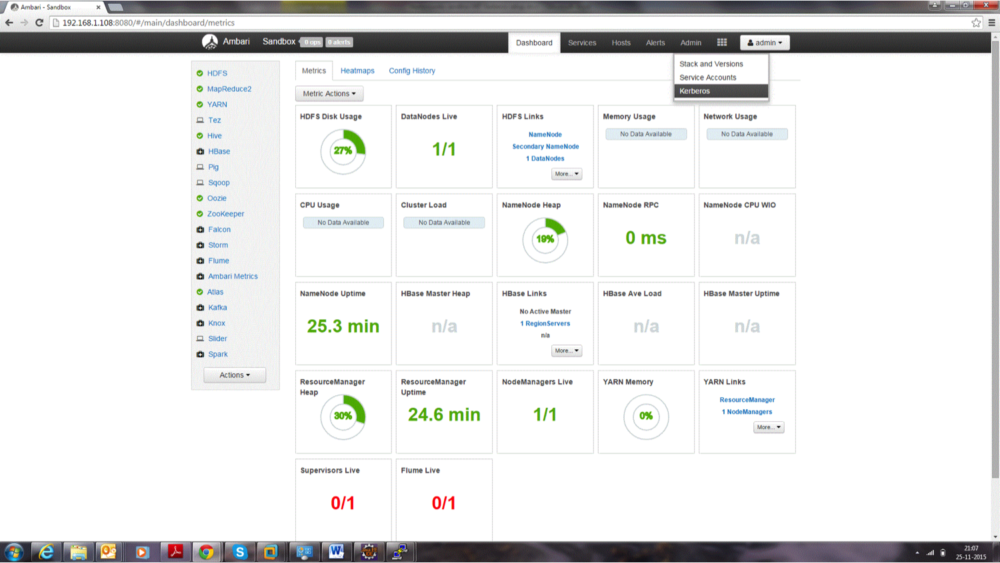

=======================================
Kerberos Installation Example - HDP 2.4
=======================================

+-------------+-----------------------------------------------------------------------------------------------------------------------------------------------------------------------+
| Important   | This document should only be used for DEV/Sandbox purposes. It is useful to help quickly Kerberize your Hortonwroks sandbox so that you can test Kerberos features.   |
+-------------+-----------------------------------------------------------------------------------------------------------------------------------------------------------------------+

Prerequisite
============

Java
====

All client nodes should have java installed on it.

.. code-block:: shell

    $ java version "1.7.0\_80"
    $ Java(TM) SE Runtime Environment (build 1.7.0\_80-b15)
    $ Java HotSpot(TM) 64-Bit Server VM (build 24.80-b11, mixed mode)

    $ echo $JAVA\_HOME
    $ /usr/java/jdk1.7.0\_80

..

Install Java Cryptography Extensions (JCE)
==========================================

.. code-block:: shell

    sudo wget -nv --no-check-certificate --no-cookies --header "Cookie: oraclelicense=accept-securebackup-cookie"
    http://download.oracle.com/otn-pub/java/jce/7/UnlimitedJCEPolicyJDK7.zip
    -O /usr/java/jdk1.7.0\_80/jre/lib/security/UnlimitedJCEPolicyJDK7.zip
    cd /usr/java/jdk1.7.0\_80/jre/lib/security

    sudo unzip UnlimitedJCEPolicyJDK7.zip
    sudo cp UnlimitedJCEPolicy/\* .
    #sudo rm -r UnlimitedJCEPolicy\*

    ls -l

..

Test Java Cryptography Extension
================================

Create a java Test.java and paste below mentioned code in it.

.. code-block:: shell

    $ vi Test.java

    import javax.crypto.Cipher;
    class Test {
    public static void main(String[] args) {
    try {
      System.out.println("Hello World!");
      int maxKeyLen = Cipher.getMaxAllowedKeyLength("AES");
      System.out.println(maxKeyLen);
    } catch (Exception e){
      System.out.println("Sad world :(");
    }
    }
    }

..

Compile:

.. code-block:: shell

    $ javac Test.java

..

Run test. The expected number is: 2147483647.

.. code-block:: shell

    $ java Test

    Hello World!

    2147483647

..

Install Kerberos
================

On a cluster, go to the master node for installation of Kerberos
utilities.

1. Install a new version of the KDC server:

.. code-block:: shell

    yum install krb5-server krb5-libs krb5-workstation

..

2. Using a text editor, open the KDC server configuration file, located by default here:

.. code-block: shell

    vi /etc/krb5.conf

..

3. Change the [realms] as below to sandbox.hortonworks.com . Update KDC and Admin Server Information.

.. code-block: shell

    [logging]
      default = FILE:/var/log/krb5libs.log
      kdc = FILE:/var/log/krb5kdc.log
      admin\_server = FILE:/var/log/kadmind.log

    [libdefaults]
      default\_realm = sandbox.hortonworks.com
      dns\_lookup\_realm = false
      dns\_lookup\_kdc = false
      ticket\_lifetime = 24h
      renew\_lifetime = 7d
      forwardable = true

    [realms]
      sandbox.hortonworks.com = {
      kdc = sandbox.hortonworks.com
      admin\_server = sandbox.hortonworks.com
      }

..

4. Update /var/kerberos/krb5kdc/kdc.conf. Change the [realms] as sandbox.hortonworks.com.

.. code-block:: shell

    [kdcdefaults]
      kdc\_ports = 88
      kdc\_tcp\_ports = 88

    [realms]
      sandbox.hortonworks.com = {
      #master\_key\_type = aes256-cts
      acl\_file = /var/kerberos/krb5kdc/kadm5.acl
      dict\_file = /usr/share/dict/words
      admin\_keytab = /var/kerberos/krb5kdc/kadm5.keytab
      supported\_enctypes = aes256-cts:normal aes128-cts:normal
      des3-hmac-sha1:normal arcfour-hmac:normal des-hmac-sha1:normal
      des-cbc-md5:normal des-cbc-crc:normal
      }

..

5. Update /var/kerberos/krb5kdc/kadm5.acl and replace EXAMPLE.COM with sandbox.hortonworks.com.

.. code-block:: shell

    */admin@sandbox.hortonworks.com \*

..

6. Create the Kerberos Database. Use the utility kdb5\_util to create the Kerberos database. While asking for password , enter password as thinkbig.

.. code-block:: shell

    kdb5\_util create -s

..

7. Start the KDC. Start the KDC server and the KDC admin server.

.. code-block:: shell

    /etc/rc.d/init.d/krb5kdc start
    /etc/rc.d/init.d/kadmin start

..

8. When installing and managing your own MIT KDC, it is very important to set up the KDC server to auto-start on boot.

.. code-block:: shell

    chkconfig krb5kdc on
    chkconfig kadmin on

..

9. Create a KDC admin by creating an admin principal. While asking for password, enter password as thinkbig.

.. code-block:: shell

    kadmin.local -q "addprinc admin/admin"

..

11. Confirm that this admin principal has permissions in the KDC ACL. Using a text editor, open the KDC ACL file:

.. code-block:: shell

    vi /var/kerberos/krb5kdc/kadm5.acl

..

12. Ensure that the KDC ACL file includes an entry so to allow the admin principal to administer the KDC for your specific realm. The file should have an entry:

.. code-block:: shell

    \*/sandbox.hortonworks.com \*

..

13. After editing and saving the kadm5.acl file, you must restart the kadmin process.

.. code-block:: shell

    /etc/rc.d/init.d/kadmin restart

..

14. Create a user in Linux by typing the adduser command shown below. We will use this user to test whether the Kerberos authentication is working or not. We will first run the command hadoop fs –ls / but switching to this user. And we will run the same command again when we enable Kerberos.

.. code-block:: shell

    adduser testUser
    su testUser
    hadoop fs –ls /

..

Install Kerberos on an HDP Cluster
==================================

1. Open Ambari and go to admin tab and select Kerberos.

    |image1|

2. Click on enable Kerberos. Then following screen will appear check all the things as appear. Click next.

    |image2|

3. Put sandbox.hortonworks.com in the KDC tab and click to test the KDC connection. Then in Kadmin again put sandbox.hortonworks.com as host and admin principal as `*admin/admin@sandbox.hortonworks.com* <mailto:admin/admin@sandbox.hortonworks.com>`__, and give the password as exactly created in step 7.

    Leave the advanced Kerberos-env and advanced krb5-conf as it is. And click **Next**.

    |image3|

Download the .csv file and save it.

|image4|

Then do next till end. Finally click on complete.

|image5|

`HDP 2.4 Sandbox Kerberos Setup
Example <http://kylo-docs-test.readthedocs.io/en/latest/KerberosInstallationExample-Cloudera.html>`__

Make sure all services started properly. Kerberos is successfully
installed on the cluster.

KeyTab Generation
=================

Create a keytab file for NiFi user.

.. code-block:: shell

    kadmin.local
    addprinc -randkey nifi@sandbox.hortonworks.com
    xst -norandkey -k /etc/security/keytabs/nifi.headless.keytab
    nifi@sandbox.hortonworks.co
    exit

    chown nifi:hadoop /etc/security/keytabs/nifi.headless.keytab
    chmod 440 /etc/security/keytabs/nifi.headless.keytab

..

[Optional] You can initialize your keytab file using this command:

.. code-block:: shell

  kinit -kt /etc/security/keytabs/nifi.headless.keytab nifi

  >>>>>>> Update
  KerberosInstallation.adoc:docs/latest/security/KerberosInstallation.adoc

..

Make sure all services started properly. Kerberos is successfully installed on the cluster.

.. |image2| image:: media/kerberos-hdp/2.png
   :width: 6.50000in
   :height: 3.65625in
.. |image3| image:: media/kerberos-hdp/3.png
   :width: 6.50000in
   :height: 4.31250in
.. |image4| image:: media/kerberos-hdp/4.png
   :width: 6.50000in
   :height: 3.65625in
.. |image5| image:: media/kerberos-hdp/5.png
   :width: 6.50000in
   :height: 3.65625in
