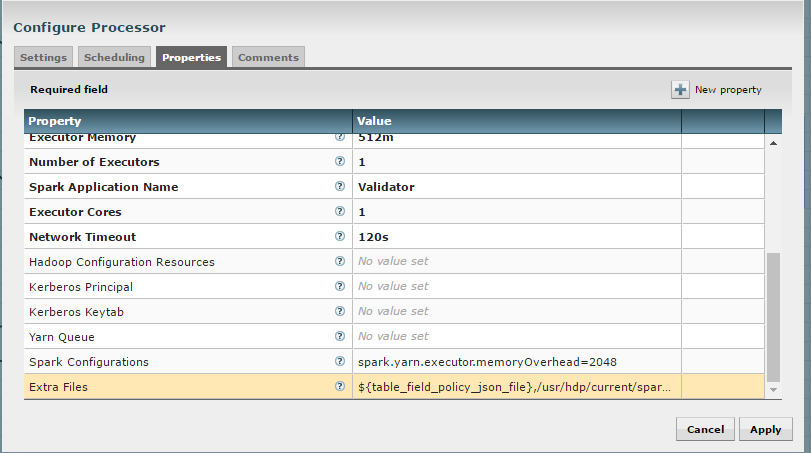

=============================
Configuration Guide
=============================

Overview
========

We are currently adding authentication and authorization support to
Kylo. The goal is to support authentication and authorization seamlessly
between the Think Big applications and the Hortonworks/Cloudera cluster,
keeping in mind that vendors such as MapR and Databricks will need to be
supported in future release.

Authentication
--------------

Kylo supports a pluggable authentication architecture that allows
customers to integrate their existing infrastructure when authenticating
a user.  The pluggability is built around  JAAS LoginModules.  Kylo
supplies LoginModule implementations fort the most common authentication
scenarios, though customers will be able to provide their own modules to
replace or augment the modules provided by Kylo.

JAAS Authentication
~~~~~~~~~~~~~~~~~~~

The JAAS authentication framework provides a means of configuring the
multiple modules that are engaged in an authentication attempt.

Authorization
=============

Authorization within Kylo will use access control lists (ACL) to control
what actions users may perform and what data they may see.  The actions
that a user or group may perform, whether to invoke a function or access
data, are organized into a hierarchy, and privileges may be granted at
any level.

Service-Level Authorization
---------------------------

At the service (functional) level, the actions available to be granted
to a user or group are organized as follows:

   -  Feed Support

         -  Access Feeds

         -  Edit Feeds

         -  Import Feeds

         -  Export Feeds

         -  Administer Feeds

   -  Access Categories

         -  Edit Categories

         -  Administer Categories

         -  Access Templates

         -  Edit Templates

         -  Administer Templates

   -  Access SLAs

         -  Administer SLA's

   -  Access Users/Groups

         -  Access Users

         -  Administer Users

         -  Access Groups

         -  Administer Groups

   -  Wrangle Data

   -  Search

   -  Administer Authorizations

 

Entity-Level Authorization
--------------------------

Feeds
~~~~~

Categories
~~~~~~~~~~

Template
~~~~~~~~

NiFi 1.0 (HDF 2.0) SSL Configuration
=====================================

This link provides additional instruction for enabling SSL for NiFi:

    `*https://docs.hortonworks.com/HDPDocuments/HDF2/HDF-2.0.0/bk\_ambari-installation/content/ch\_enabling-ssl-for-nifi.html* <https://docs.hortonworks.com/HDPDocuments/HDF2/HDF-2.0.0/bk_ambari-installation/content/ch_enabling-ssl-for-nifi.html>`__

Creating a Self-signed Cert
---------------------------

1. Download the NiFi toolkit.

.. code-block:: shell

   `*https://nifi.apache.org/download.html* <https://nifi.apache.org/download.html>`__

..

2. Unzip it to a directory.

.. code-block:: shell

   /opt/nifi/nifi-toolkit-1.0.0

..

3. Go into that directory.

.. code-block:: shell

   cd /opt/nifi/nifi-toolkit-1.0.0/bin

..      

4. Update the "tls-toolkit.sh" file and add the current version of JAVA\_HOME.

   1. Add this line to the start of the script:   

.. code-block:: shell

         export JAVA\_HOME=/opt/java/current

..

      Example screenshot:

      |image1|

5.  Make an SSL directory under /opt/nifi/data as the nifi owner:

.. code-block:: shell

      mkdir /opt/nifi/data/ssl
      chown nifi /opt/nifi/data/ssl

..

6.  Change to that directory and generate certs using the tls-toolkit. 

.. code-block:: shell

      cd /opt/nifi/data/ssl /opt/nifi/nifi-toolkit-1.0.0/bin/tls-toolkit.sh standalone -n 'localhost' -C 'CN=kylo, OU=NIFI' -o .

..

    This will generate 1 client cert and password file along with a
    server keystore and trust store:

    |image2|

    The client cert is the p.12 (PKCS12) file along with its respective
    password. This will be needed later when you add the client cert to
    the browser/computer.

    The directory 'localhost' is for the server side keystore and
    truststore .jks files.

    |image3|

7. Change permissions on files.

.. code-block:: shell

    chown nifi -R /opt/nifi/data/ssl/\*
    chmod 755 -R /opt/nifi/data/ssl/\*

..

8. Merge the generated properties (/opt/nifi/data/ssl/localhost) with the the NiFi configuration properties (/opt/nifi/current/conf/nifi.properties).

   1. Open the /opt/nifi/data/ssl/localhost/nifi.properties file.

   2. Copy the properties, starting with the #Site to Site properties
      through the last NiFi security property (see below).  Note that
      the **bolded lines** shown in the example in step 3 indicate
      fields that must be updated.

      Below is an example.  Do not copy this text directly, as your keystore/truststore passwords will be different!

.. code-block:: shell

    # Site to Site properties
    nifi.remote.input.host=localhost
    nifi.remote.input.secure=true
    nifi.remote.input.socket.port=10443
    nifi.remote.input.http.enabled=true
    nifi.remote.input.http.transaction.ttl=30 sec

    # web properties #
    nifi.web.war.directory=./lib
    nifi.web.http.host=
    nifi.web.http.port=
    **nifi.web.https.host=**
    **nifi.web.https.port=9443**
    nifi.web.jetty.working.directory=./work/jetty
    nifi.web.jetty.threads=200

    # security properties #
    nifi.sensitive.props.key=
    nifi.sensitive.props.key.protected=
    nifi.sensitive.props.algorithm=PBEWITHMD5AND256BITAES-CBC-OPENSSL
    nifi.sensitive.props.provider=BC
    nifi.sensitive.props.additional.keys=

    **nifi.security.keystore=/opt/nifi/data/ssl/localhost/keystore.jks**
    nifi.security.keystoreType=jks
    nifi.security.keystorePasswd=fCrusEdGOKdik7P5UORRegQOILoZTBQ+9kyhf8D+PUU
    nifi.security.keyPasswd=fCrusEdGOKdik7P5UORRegQOILoZTBQ+9kyhf8D+PUU
    **nifi.security.truststore=/opt/nifi/data/ssl/localhost/truststore.jks**
    nifi.security.truststoreType=jks
    nifi.security.truststorePasswd=DHJS0+HIaUMRkhrbqlK/ys5j7iL/ef9mnGJIDRlFokA
    nifi.security.needClientAuth=
    nifi.security.user.authorizer=file-provider
    nifi.security.user.login.identity.provider=
    nifi.security.ocsp.responder.url=
    nifi.security.ocsp.responder.certificate=

..

9. Edit the /opt/nifi/data/conf/authorizers.xml file to add the initial
   admin identity.  This entry needs to match the phrase you used to
   generate the certificates in step 6.

.. code-block:: shell

      <property name="Initial Admin Identity">CN=kylo,
      OU=NIFI</property>

..

    Example Screenshot of file
    |image4|

    For reference:  This will create a record in the /opt/nifi/current/conf/users.xml.  Should you need to regenerate your SSL file with a different CN, you will need to modify the
    users.xml file for that entry.

10. Set the following parameters in application.properties for the NiFi connection. Change the Bolded lines to reflect your correct passwords.

.. code-block:: shell

    nifi.rest.host=localhost
    nifi.rest.https=true
    ### The port should match the port found in the /opt/nifi/current/conf/nifi.properties (nifi.web.https.port)
    nifi.rest.port=9443
    nifi.rest.useConnectionPooling=false
    nifi.rest.truststorePath=/opt/nifi/data/ssl/localhost/truststore.jks
    ##the truststore password below needs to match that found in the nifi.properties file (nifi.security.truststorePasswd)
    **nifi.rest.truststorePassword=UsqLPVksIe/taZbfpVIsYElF8qFLhXbeVGRgB0pLjKE**
    nifi.rest.truststoreType=JKS
    nifi.rest.keystorePath=/opt/nifi/data/ssl/CN=kylo\_OU=NIFI.p12
    ###value found in the .password file /opt/nifi/data/ssl/CN=kylo\_OU=NIFI.password
    **nifi.rest.keystorePassword=mw5ePri**
    nifi.rest.keystoreType=PKCS12

..

Importing the Client Cert on the Mac
------------------------------------

1. Copy the .p12 file that you created above (/opt/nifi/data/ssl/CN=kylo\_OU=NIFI.p12) in step 6 to your Mac.

2. Open Keychain Access.

3. Create a new keychain with a name.  The client cert is copied into this new keychain, which in the example here is named "nifi-cet". If you add it directly to the System, the browser will ask you for the login/pass every time NiFi does a request.

   a. In the left pane, right-click "Keychains" and select "New Keychain".

      |image5|

   b. Give it the name "nifi-cert" and a password.

+------------+------------+
| |image6|   | |image7|   |
+------------+------------+

4. Once the keychain is created, click on it and select File -> import
   Items, and then find the .p12 file that you copied over in step 1.

+------------+------------+
| |image8|   | |image9|   |
+------------+------------+

   Once complete you should have something that looks like this:

   |image10|

Accessing NiFi under SSL
------------------------

Open the port defined in the NiFi.properties above: 9443.

The first Time you connect to NiFi (https://localhost:9443/nifi) you
will be instructed to verify the certificate.  This will only happen
once.

1. Click **OK** at the dialog prompt.

   |image11|

2. Enter the Password that you supplied for the keychain.  This is the password that you created for the keychain in "Importing the Client Cert on the Mac" Step 3b.

   |image12|

3. Click Always Verify.

   |image13|

4. Click AdvancKyloConfiguration.rsted and then Click Proceed.  It will show up as "not private" because it is a self-signed cert.

   |image14|

5. NiFi under ssl.  Notice the User name matches the one supplied via the Certificate that we created:  "CN=kylo, OU=NIFI"

   |image15|
 

TBD Provenance Repo SSL configuration
-------------------------------------

Make the same changes to the /opt/nifi/ext-config/config.properties for
connecting to NiFi, changing the thinkbig.nifi.rest properties to match:

.. code-block:: shell

    thinkbig.nifi.rest.host=localhost
    thinkbig.nifi.rest.https=true
    ### The port should match the port found in the /opt/nifi/current/conf/nifi.properties (nifi.web.https.port)
    thinkbig.nifi.rest.port=9443
    thinkbig.nifi.rest.useConnectionPooling=false
    thinkbig.nifi.rest.truststorePath=/opt/nifi/data/ssl/localhost/truststore.jks
    ##the truststore password below needs to match that found in the nifi.properties file (nifi.security.truststorePasswd)
    **thinkbig.nifi.rest.truststorePassword=UsqLPVksIe/taZbfpVIsYElF8qFLhXbeVGRgB0pLjKE**
    thinkbig.nifi.rest.truststoreType=JKS
    thinkbig.nifi.rest.keystorePath=/opt/nifi/data/ssl/CN=kylo\_OU=NIFI.p12
    ###value found in the .password file /opt/nifi/data/ssl/CN=kylo\_OU=NIFI.password
    **thinkbig.nifi.rest.keystorePassword=mw5ePri**
    thinkbig.nifi.rest.keystoreType=PKCS12

..

TriggerFeed
===========

Trigger Feed Overview
---------------------

In Kylo, the TriggerFeed Processor allows feeds to be configured
in such a way that a feed depending upon other feeds is automatically
triggered when the dependent feed(s) complete successfully.

Obtaining the Dependent Feed Execution Context
----------------------------------------------

|image16|

To get dependent feed execution context data, specify the keys that you
are looking for.   This is done through the "Matching Execution Context
Keys" property . The dependent feed execution context will only be
populated the specified matching keys.

For example:

    Feed\_A runs and has the following attributes in the flow-file as it
    runs:

.. code-block:: shell

     -property.name = "first name"
     -property.age=23
     -feedts=1478283486860
     -another.property= "test"

..

    Feed\_B depends on Feed A and has a Trigger Feed that has "Matching
    Execution Context Keys" set to "property"’

    It will then get the ExecutionContext for Feed A populated with 2
    properties:

.. code-block:: shell

    "Feed\_A":{property.name:"first name", property.age:23}

..

Trigger Feed JSON Payload
-------------------------

The FlowFile content of the Trigger feed includes a JSON string of the
following structure:

.. code-block:: shell

  {
     "feedName": "string",
     "feedId": "string",
     "dependentFeedNames": [
     "string"
   ],

  "feedJobExecutionContexts": {},

  "latestFeedJobExecutionContext": {}

  }

..

JSON structure with  field description:

.. code-block:: shell

  {
     "feedName":"<THE NAME OF THIS FEED>",
     "feedId":"<THE UUID OF THIS FEED>",
     "dependentFeedNames":[<array of the dependent feed names],
     "feedJobExecutionContexts":{<dependent\_feed\_name>:[
  {
  "jobExecutionId":<Long ops mgr job id>,
              "startTime":<millis>,
              "endTime":<millis>,
              "executionContext":{
  <key,value> matching any of the keys defined as being "exported" in
  this trigger feed
              }
           }
        ]
     },
     "latestFeedJobExecutionContext":{
        <dependent\_feed\_name>:{  
          "jobExecutionId":<Long ops mgr job id>,
              "startTime":<millis>,
              "endTime":<millis>,
              "executionContext":{
  <key,value> matching any of the keys defined as being "exported" in
  this trigger feed
              }
  }
  }
  }

..

Example JSON for a Feed:

.. code-block:: shell

  {
     "feedName":"companies.check\_test",
     "feedId":"b4ed909e-8e46-4bb2-965c-7788beabf20d",
     "dependentFeedNames":[
        "companies.company\_data"
     ],
     "feedJobExecutionContexts":{
        "companies.company\_data":[
           {
              "jobExecutionId":21342,
              "startTime":1478275338000,
              "endTime":1478275500000,
              "executionContext":{
              }
           }
        ]
     },
     "latestFeedJobExecutionContext":{
        "companies.company\_data":{
           "jobExecutionId":21342,
           "startTime":1478275338000,
           "endTime":1478275500000,
          "executionContext":{
          }
       }
    }
 }

..

Example Flow
------------

The screenshot shown here is an example of a flow in which the inspection of the payload triggers dependent feed data.

|image17|

The EvaluateJSONPath processor is used to extract JSON content from the flow file.

Refer to the Data Confidence Invalid Records flow for an example:
`*data\_confidence\_invalid\_records.zip* <https://github.com/ThinkBigAnalytics/data-lake-accelerator/blob/master/samples/templates/nifi-1.0/data_confidence_invalid_records.zip>`__

Yarn Cluster Mode Configuration
===============================

Overview
--------

In order for the yarn cluster mode to work to validate the Spark processor, the JSON policy file has to be passed to the cluster. In addition the hive-site.xml file needs to be passed. This should work for
both HDP and Cloudera clusters.

Requirements
============

You must have Kylo installed.

Step 1: Add the data nucleus Jars
=================================

+-----------+---------------------------------------------------------------------+
| **NOTE:** | This step is required only for HDP and is not required on Cloudera. |
+-----------+---------------------------------------------------------------------+

If using Hive in your Spark processors, provide hive jar dependencies
and hive-site.xml so that Spark can connect to the right Hive metastore.
To do this, add the following jars into the “Extra Jars” parameter: 

.. code-block:: shell

    /usr/hdp/current/spark-client/lib (/usr/hdp/current/spark-client/lib/datanucleus-api-jdo-x.x.x.jar,/usr/hdp/current/spark-client/lib/datanucleus-core-x.x.x.jar,/usr/hdp/current/spark-client/lib/datanucleus-rdbms-x.x.x.jar)

..

Step 2: Add the hive-site.xml file
==================================

Specify "hive-site.xml". It should be located in the following location:

    **Hortonworks**

.. code-block:: shell

    /usr/hdp/current/spark-client/conf/hive-site.xml

..

    **Cloudera**

.. code-block:: shell

    /etc/hive/conf.cloudera.hive/hive-site.xml

..

Add this file location to the “Extra Files” parameter. To add multiple files, separate them with a comma.

 |image18|

Step 3: Validate and Split Records Processor
--------------------------------------------

If using the "Validate and Split Records" processor in the
standard-ingest template, pass the JSON policy file as well. 

 |image19|

 

 

 

 

.. |image1| image:: media/kylo-config/KC1.png
   :width: 4.87500in
   :height: 1.91667in
.. |image2| image:: media/kylo-config/KC2.png
   :width: 4.87500in
   :height: 0.67708in
.. |image3| image:: media/kylo-config/KC3.png
   :width: 4.81250in
   :height: 0.50000in
.. |image4| image:: media/kylo-config/KC4.png
   :width: 4.87500in
   :height: 1.63542in
.. |image5| image:: media/kylo-config/KC5.png
   :width: 4.37500in
   :height: 3.16667in
.. |image6| image:: media/kylo-config/KC6.png
   :width: 3.12500in
   :height: 1.43750in
.. |image7| image:: media/kylo-config/KC7.png
   :width: 3.12500in
   :height: 1.92708in
.. |image8| image:: media/kylo-config/KC8.png
   :width: 3.12500in
   :height: 2.41667in
.. |image9| image:: media/kylo-config/KC9.png
   :width: 3.12500in
   :height: 2.15625in
.. |image10| image:: media/kylo-config/KC10.png
   :width: 4.87500in
   :height: 2.62500in
.. |image11| image:: media/kylo-config/KC11.png
   :width: 3.12500in
   :height: 2.32292in
.. |image12| image:: media/kylo-config/KC12.png
   :width: 3.12500in
   :height: 1.35417in
.. |image13| image:: media/kylo-config/KC13.png
   :width: 3.12500in
   :height: 1.41667in
.. |image14| image:: media/kylo-config/KC14.png
   :width: 3.12500in
   :height: 2.32292in
.. |image15| image:: media/kylo-config/KC15.png
   :width: 5.92426in
   :height: 1.91146in
.. |image16| image:: media/kylo-config/KC16.png
   :width: 5.33825in
   :height: 3.07839in
.. |image17| image:: media/kylo-config/KC17.png
   :width: 6.59028in
   :height: 0.76042in
.. |image18| image:: media/kylo-config/KC18.png
   :width: 6.59028in
   :height: 0.76042in

