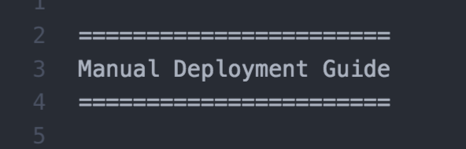

====================
Kylo rST Style Guide
====================

Titles
======

The contents of each rST file begins with a Title, formatted with =
signs above and below the words and spaces in the title.

|image0|

There must be as many = signs as there are words and spaces.

This syntax produces this title in the Kylo Read-the-Docs site:

|image1|

Headings
========

The Kylo documentation uses the following heading syntax to produce the
following outputs:

Heading 1
---------

|image2|

|image3|

Heading 2
---------

|image4|

|image5|

Heading 3
---------

|image6|

Heading 4
---------

|image7|

Boldface
--------

Add two asterisks before and after the word you wish to boldface. For
example:

\*\*Setup Wizard\*\*

Reference a Document within the Kylo Read-the-Docs Site
=======================================================

The :doc: directive can be used to create a link to another document in
the Kylo RTD library:

|image8|

In the Kylo RTD output, this directive produces this (see the link
embedded in the paragraph):

|image9|

When the user clicks the *Setup Wizard Deployment Guide* link, the
document opens in a new tab in the browser.

External Links
==============

External links are done using the raw syntax, which opens the link in a
separate tab, leaving the Read the Docs page open.:

|image10|

That link syntax can be used standalone code, or it can be embedded in
text as in the following example. Either way, it produces the same
output in the Kylo RTD site.

Notice how the above rst syntax displays in the Kylo RTD site.

|image11|

This syntax requires that the link be specified with the following rst
syntax, which is included at the bottom of the rst source file:

|image12|

Bulleted Lists
==============

Bulleted lists may be indented or not, using this sample syntax:

|image13|

The above syntax produces this output:

|image14|

Notes, Tips, Warnings…
======================

A variety of special formats are available through one-word directives,
each of which produces a box (examples) below with a color scheme
determined by the theme. (Note that Kylo uses the RTD Theme.)

Starting flush left, the directive is stated as in this example:

|image15|

This produces the following note:

|image16|

Changing the key word (e.g., note, error, important, tip, waring)
changes the output, as shown in the following examples:

|image17|

|image18|

|image19|

|image20|

Code-Block
==========

Various code-block directives produce different results, highlighting words in ways appropriate to how the code-block is assigned (e.g., shell, properties, javascript, html)

Here is a code-block for standard coding, and the way it displays on the Kylo RTD site:

|image21|

|image22|

And here is code-block for displaying code properties:

|image23|

|image24|

And here is code-block for displaying inline code, as shown below:

|image25|

|image26|

