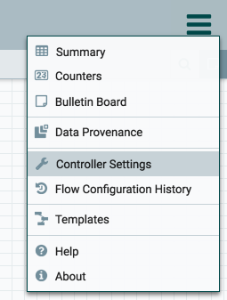
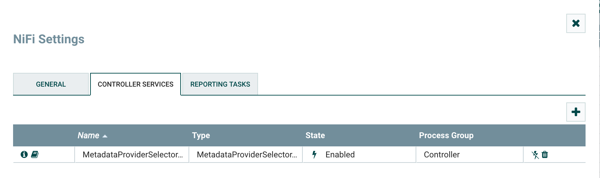
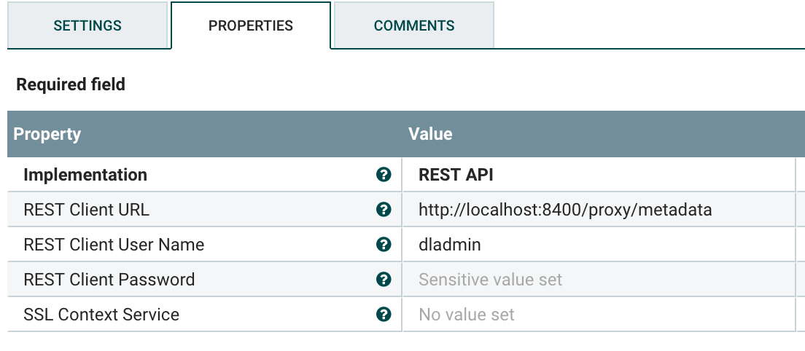
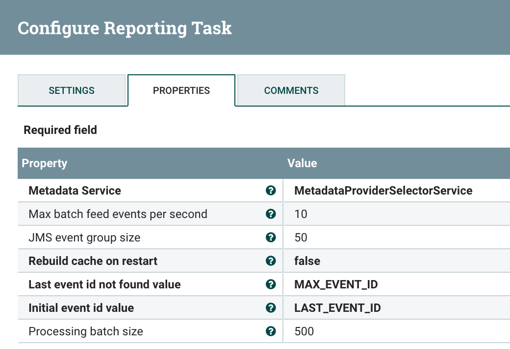
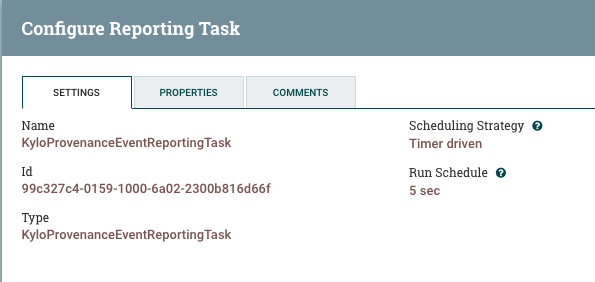

===================================
NiFi Kylo Provenance Reporting Task
===================================

Introduction
============

Kylo now communicates with NiFi via a NiFi Reporting Task.  

Setup the Reporting Task in NiFi
================================

1. To setup the reporting task click the menu icon on the top right and
   click the "Controller Settings" link.

    |image0|

2. From there we need to setup a **Controller Service** before adding
   the Reporting task.  The Controller Service is used to allow NiFi to
   talk to Kylo REST endpoints that gather feed information needed for
   processing NiFi events.  Setup a new **Metadata Provider Selection
   Service** and set the properties to communicate with your Kylo
   instance.

|image1|

|image2|   

3. Next add the reporting task.

|image3|

    A rundown of the various properties can be found by hovering over
    the **?** icon or at the bottom of this page:\ ** Kylo Provenance
    Event Reporting Task Properties.**  

4. Set the schedule on the reporting task.

    It is recommended to set the schedule between 5 and 15 seconds.  On
    this interval the system will run and query for all events that
    haven’t been processed. 

    |image4|

     

Kylo Provenance Event Reporting Task Properties
===============================================

+------------------------------------+---------------------+---------------------------------------------------------------------------------------------------------------------------------------------------------------------------+----------------------------------------------------------------------------------------------------------------------------------------------------------------------------------------------------------------------------------------------------------------------------------------------------------------------------------+
| **Name**                           | **Default Value**   | **Allowable Values**                                                                                                                                                      | **Description**                                                                                                                                                                                                                                                                                                                  |
+------------------------------------+---------------------+---------------------------------------------------------------------------------------------------------------------------------------------------------------------------+----------------------------------------------------------------------------------------------------------------------------------------------------------------------------------------------------------------------------------------------------------------------------------------------------------------------------------+
| Metadata Service                   |                     | Controller Service API:                                                                                                                                                   | Think Big metadata service                                                                                                                                                                                                                                                                                                       |
|                                    |                     | MetadataProviderService                                                                                                                                                   |                                                                                                                                                                                                                                                                                                                                  |
|                                    |                     | Implementation:                                                                                                                                                           |                                                                                                                                                                                                                                                                                                                                  |
|                                    |                     | `MetadataProviderSelectorService <http://localhost:8079/nifi-docs/components/com.thinkbiganalytics.nifi.v2.core.metadata.MetadataProviderSelectorService/index.html>`__   |                                                                                                                                                                                                                                                                                                                                  |
+------------------------------------+---------------------+---------------------------------------------------------------------------------------------------------------------------------------------------------------------------+----------------------------------------------------------------------------------------------------------------------------------------------------------------------------------------------------------------------------------------------------------------------------------------------------------------------------------+
| Max batch feed events per second   | 10                  |                                                                                                                                                                           | The maximum number of events/second for a given feed allowed to go through to Kylo. This is used to safeguard Kylo against a feed that starts acting like a stream                                                                                                                                                               |
|                                    |                     |                                                                                                                                                                           | Supports Expression Language: true                                                                                                                                                                                                                                                                                               |
+------------------------------------+---------------------+---------------------------------------------------------------------------------------------------------------------------------------------------------------------------+----------------------------------------------------------------------------------------------------------------------------------------------------------------------------------------------------------------------------------------------------------------------------------------------------------------------------------+
| JMS event group size               | 50                  |                                                                                                                                                                           | The size of grouped events sent over to Kylo. This should be less than the Processing Batch Size                                                                                                                                                                                                                                 |
|                                    |                     |                                                                                                                                                                           | Supports Expression Language: true                                                                                                                                                                                                                                                                                               |
+------------------------------------+---------------------+---------------------------------------------------------------------------------------------------------------------------------------------------------------------------+----------------------------------------------------------------------------------------------------------------------------------------------------------------------------------------------------------------------------------------------------------------------------------------------------------------------------------+
| Rebuild cache on restart           | false               |                                                                                                                                                                           | Should the cache of the flows be rebuilt every time the Reporting task is restarted? By default, the system will keep the cache up to date; however, setting this to true will force the cache to be rebuilt upon restarting the reporting task.                                                                                 |
|                                    |                     |                                                                                                                                                                           | Supports Expression Language: true                                                                                                                                                                                                                                                                                               |
+------------------------------------+---------------------+---------------------------------------------------------------------------------------------------------------------------------------------------------------------------+----------------------------------------------------------------------------------------------------------------------------------------------------------------------------------------------------------------------------------------------------------------------------------------------------------------------------------+
| Last event id not found value      | KYLO                | KYLO                                                                                                                                                                      | If there is no minimum value to start the range query from (i.e. if this reporting task has never run before in NiFi) what should be the initial value?"                                                                                                                                                                         |
|                                    |                     |                                                                                                                                                                           |                                                                                                                                                                                                                                                                                                                                  |
|                                    |                     | ZERO                                                                                                                                                                      | KYLO: It will attempt to query Kylo for the last saved id and use that as the latest id                                                                                                                                                                                                                                          |
|                                    |                     |                                                                                                                                                                           |                                                                                                                                                                                                                                                                                                                                  |
|                                    |                     | MAX\_EVENT\_ID                                                                                                                                                            | ZERO: this will get all events starting at 0 to the latest event id.                                                                                                                                                                                                                                                             |
|                                    |                     |                                                                                                                                                                           |                                                                                                                                                                                                                                                                                                                                  |
|                                    |                     |                                                                                                                                                                           | MAX\_EVENT\_ID: this is set it to the max provenance event. This is the default setting                                                                                                                                                                                                                                          |
+------------------------------------+---------------------+---------------------------------------------------------------------------------------------------------------------------------------------------------------------------+----------------------------------------------------------------------------------------------------------------------------------------------------------------------------------------------------------------------------------------------------------------------------------------------------------------------------------+
| Initial event id value             | LAST\_EVENT\_ID     | LAST\_EVENT\_ID                                                                                                                                                           | Upon starting the Reporting task what value should be used as the minimum value in the range of provenance events this task should query?                                                                                                                                                                                        |
|                                    |                     |                                                                                                                                                                           |                                                                                                                                                                                                                                                                                                                                  |
|                                    |                     | KYLO                                                                                                                                                                      | LAST\_EVENT\_ID: will use the last event successfully processed from this task. This is the default setting.                                                                                                                                                                                                                     |
|                                    |                     |                                                                                                                                                                           |                                                                                                                                                                                                                                                                                                                                  |
|                                    |                     | MAX\_EVENT\_ID                                                                                                                                                            | KYLO: It will attempt to query Kylo for the last saved id and use that as the latest id                                                                                                                                                                                                                                          |
|                                    |                     |                                                                                                                                                                           |                                                                                                                                                                                                                                                                                                                                  |
|                                    |                     |                                                                                                                                                                           | MAX\_EVENT\_ID will start processing every event > the Max event id in provenance. This value is evaluated each time this reporting task is stopped and restarted. You can use this to reset provenance events being sent to Kylo. This is not the ideal behavior so you may lose provenance reporting. Use this with caution.   |
+------------------------------------+---------------------+---------------------------------------------------------------------------------------------------------------------------------------------------------------------------+----------------------------------------------------------------------------------------------------------------------------------------------------------------------------------------------------------------------------------------------------------------------------------------------------------------------------------+
| Processing batch size              | 500                 |                                                                                                                                                                           | The maximum number of events to process in a given interval. If there are more events than this number to process in a given run of this reporting task it will partition the list and process the events in batches of this size to increase throughput to Kylo.                                                                |
|                                    |                     |                                                                                                                                                                           | Supports Expression Language: true                                                                                                                                                                                                                                                                                               |
+------------------------------------+---------------------+---------------------------------------------------------------------------------------------------------------------------------------------------------------------------+----------------------------------------------------------------------------------------------------------------------------------------------------------------------------------------------------------------------------------------------------------------------------------------------------------------------------------+

