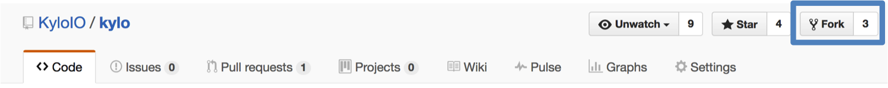

====================
Contributing to Kylo
====================

Introduction
============

We gladly welcome contributions to help make Kylo better! This document
describes our process for accepting contributions and the guidelines we
adhere to as a team. Please take a moment to review before submitting a
pull request.

Why Contribute
==============

Think Big originally developed Kylo based on experience gained on over 150 big data projects. Many of the best improvements came from exercising the technology in the field on the huge variety of
situations faced by customers. Contributing to Kylo allows you to influence the roadmap and evolution of Kylo and contribute back to the community at large.

Reporting Issues
================

We monitor `Group Groups <https://groups.google.com/forum/#!forum/kylo-community>`__
for questions. If you’re not sure about something then please search on `Group
Groups <https://groups.google.com/forum/#!forum/kylo-community>`__ first and
ask a new question if necessary. Bug reports, feature requests, and pull
requests can be submitted to our
`JIRA <https://kylo-io.atlassian.net/>`__ for tracking. If you find an
issue:

1. Search in
   `JIRA <https://kylo-io.atlassian.net/projects/KYLO/issues/?filter=allissues>`__
   to see if the issue has already been reported. You can add to the
   existing discussion or see if someone else is already working on
   it.

2. If the issue has been fixed then try reproducing the issue using the
   latest *master* branch.

3. If the issue persists then try to isolate the cause and create a new
   JIRA.

   -  For bug reports, please include a description of the issue, the
      steps to reproduce, the expected results, and the actual
      results.

   -  For feature requests, please give as much detail as possible
      including a design document if available.

Introducing New Functionality
=============================

Before contributing new functionality or bug fixes please consider how
these changes may impact other people using Kylo, and whether these
changes can be considered overall enhancements or merely enhancements
needed by your particular project. New functionality can be introduced
either as a plugin or through a pull request.

Plugin
------

Plugins are the preferred way of adding, swapping, or enhancing
functionality that is only relevant to specific users. Our components
and services have well-defined interfaces that can be extended by adding
a new JAR to the *plugin* directory. Create a new Spring ``@Configuration``
class to add your classes to the Spring context.

A separate git repository should be used for your plugins. You can
reference Kylo’s API artifacts in Maven.

Pull Request
------------

Changes that apply to every Kylo user should be submitted as a pull
request in GitHub. You should do your work in a fork of Kylo and submit
a request to pull in those changes. Don't forget to confirm the target
branch (master or point release) before submitting the request. Please
continue reading for instructions on creating a pull request.

Development Guidelines
======================

We adhere to the following guidelines to ensure consistency in our code:

-  Source code should be formatted according to our IntelliJ or Eclipse
   formatter. Formatter markers in comments are enabled but should be used
   sparingly.

   +  To import our standard IntelliJ formatter:

     - Download the template from here: :download:`thinkbig-googlestyle-intellij-v2-1.xml<../media/kylo-contributing/thinkbig-googlestyle-intellij-v2-1.xml>`.
     - Preferences -> Editor -> Code Style -> Manage
     - Select "Import" and choose the downloaded preferences file
     - Make sure the "scheme" shows thinkbig-googlestyle-intellij-vX.Y

   +  To import our standard Eclipse formatter:

     - Download the template from here: :download:`thinkbig-googlestyle-eclipse-v2-1.xml<../media/kylo-contributing/thinkbig-googlestyle-eclipse-v2-1.xml>`.
     - Preferences -> Java -> Code Style -> Formatter
     - Select "Import" and choose the downloaded preferences file
     - Make sure the "Active Profile" shows thinkbig-googlestyle-eclipse-v2-1.xml

-  Public API methods should be documented. Use Swagger annotations for
   REST endpoints.

-  Ensure tests are passing for the modified classes. New tests should
   use JUnit and Mockito.

-  Prefer to throw runtime exceptions instead of checked exceptions.

-  Dependency versions should be declared in the root pom and can be
   overridden using pom properties.

-  Module names should be in all lowercase. Words should be singular and
   separated by a hyphen. For example, kylo-alert is preferred over
   kylo-alerts.

-  Logging should use SLF4j:

.. code-block:: java

   private static final Logger log = LoggerFactory.getLogger(MyClass.class);

.. _id1:

Pull Requests
=============

To get started go to GitHub and fork the `Kylo <https://github.com/KyloIO/kylo>`__ repository.

|image0|

This will create a copy of the repository under your personal GitHub
account. You will have write permissions to your repository but not to
the official Kylo repository.

Before you start
----------------

The easiest way to contribute code is to create a separate branch for
every feature or bug fix. This will allow you to make separate pull
requests for every contribution. You can create your branch off
our *master* branch to get the latest code, or off a *release*
branch if you need more stable code.

.. code-block:: bash

   git clone https://github.com/<your-username>/kylo.git
   cd kylo
   git checkout -b my-fix-branch master

Every change you commit should refer to a `JIRA
issue <https://kylo-io.atlassian.net/>`__ that describes the feature
or bug. Please open a JIRA issue if one does not already exist.

Committing your change
----------------------

Ensure that your code has sufficient unit tests and that all unit tests
pass.

Your commit message should reference the JIRA issue and include a
sentence describing what was changed. An example of a good commit
message is "PC-826 Support for schema discovery of Parquet files."

.. code-block:: bash

   git commit -a -m "<my-commit-message>"
   git push origin my-fix-branch

Submitting a pull request
-------------------------

Once you are ready to have us add your changes to the Kylo repository,
go to your repository in GitHub and select the branch with your changes.
Then click the *New pull request* button. 

|image1|

GitHub will generate a diff for your changes and determine if they can
be merged back into Kylo. If your changes cannot be
automatically merged, please try rebasing your changes against the
latest *master* branch.

.. code-block:: bash

   git fetch --all
   git rebase origin/master
   git push --force-with-lease origin my-fix-branch

We will review your code and respond with any necessary changes before
pulling in your changes. After your pull request is merged you can
safely delete your branch and pull in the changes from the official
Kylo repository.

.. |image1| image:: ../media/kylo-contributing/2_new-pull-request.png
