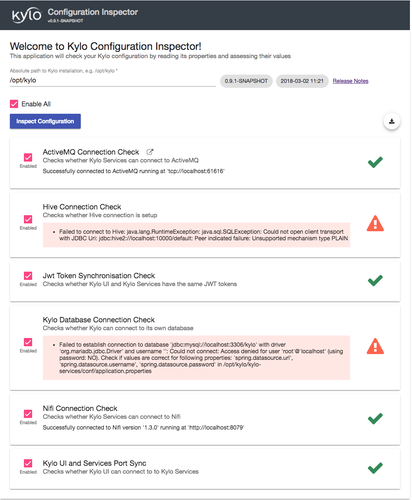

===========================
Configuration Inspector App
===========================

Overview
========

Configuration Inspector App is a standalone application, separate from Kylo UI and Services and its purpose is to check whether Kylo UI and Kylo Services are configured correctly or not.
It comes with a number of Configuration Inspections out-of-the-box and is designed to be easily extensible.

Here is a screenshot of how it may look like:

|image0|

Run Application
===============

Inspector App is distributed with Kylo. It is installed as a service and can be found in ``<KYLO_INSTALL_PATH>/kylo-install-inspector`` directory.
You can start/stop/restart Inspector App service in the following way:

.. code-block:: shell

    service kylo-install-inspector start
    service kylo-install-inspector stop
    service kylo-install-inspector restart

..

Once the service is running, open your browser and find Inspector App at ``http://localhost:8099``.
Find the logs in ``/var/log/kylo-install-inspector``.

Download Report
===============

Click the circular "Download Report" button closer to the right top corner just above the Inspections list to download and share the inspection report produced by Inspector App.

Add Custom Configuration Inspections
====================================

- Extend ``Inspection`` or ``AbstractInspection`` class found in ``kylo-install-inspector-api`` module. At minimum you will need to implement three methods where the one which does the work looks like this: ``public InspectionStatus inspect(Configuration configuration)``. Via ``Configuration`` class you get access to Kylo UI and Services properties, e.g. ``Configuration.getServicesProperty(String propertyName)``. You can either directly @Inject Kylo classes into your Inspections or you first create Spring configuration which defines the beans, e.g. see |NifiConnectionInspectionExample| and |NifiConnectionInspectionConfigurationExample| which uses custom Spring configuration to get ``JerseyClient`` which can talk to Nifi.
- Package your custom Inspections into a ``jar``
- Add your jar and its dependencies to Inspector App classpath, i.e. drop them into ``/opt/kylo/kylo-install-inspector/inspections`` directory.
- Run Inspector App as usual

.. |NifiConnectionInspectionExample| raw:: html

   <a href="https://github.com/Teradata/kylo/blob/bfcf0a5f2a56b3a45bea7cd3d4e298692bb3c697/install/install-inspector/install-inspector-app/src/main/java/com/thinkbiganalytics/install/inspector/inspection/NifiConnectionInspection.java#L174" target="_blank">NifiConnectionInspection</a>

.. |NifiConnectionInspectionConfigurationExample| raw:: html

   <a href="https://github.com/Teradata/kylo/blob/bfcf0a5f2a56b3a45bea7cd3d4e298692bb3c697/install/install-inspector/install-inspector-app/src/main/java/com/thinkbiganalytics/install/inspector/inspection/NifiConnectionInspectionConfiguration.java" target="_blank">NifiConnectionInspectionConfiguration</a>

.. |IgnoredByInspectorAppExample| raw:: html

   <a href="https://github.com/Teradata/kylo/blob/bfcf0a5f2a56b3a45bea7cd3d4e298692bb3c697/install/install-inspector/install-inspector-app/src/main/java/com/thinkbiganalytics/install/inspector/inspection/NifiConnectionInspectionConfiguration.java#L32" target="_blank">@IgnoredByInspectorApp</a>

