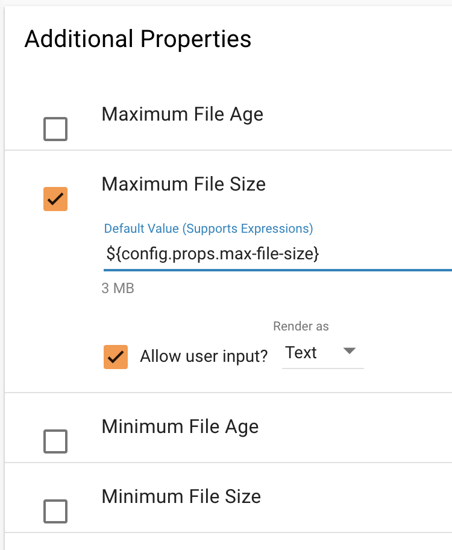
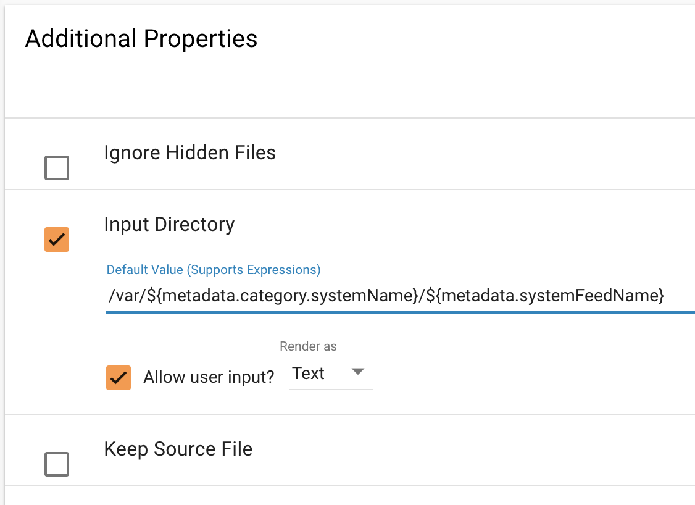
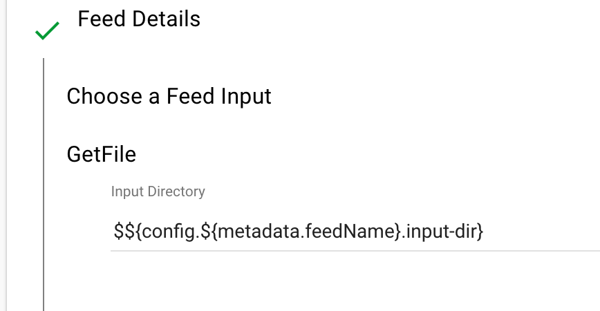

========================
Configuration Properties
========================

Overview
========

This guide provides details on how to configure Kylo Templates and Feeds with properties from different sources.
The sources can be the following:

    1. Configuration from application.properties
    2. Configuration from Feed Metadata
    3. Configuration from Nifi environment variables

There are two property resolution options:

    1. Design-time resolution
    2. Runtime resolution

1. Configuration Sources
------------------------

1.1 Configuration from application.properties
~~~~~~~~~~~~~~~~~~~~~~~~~~~~~~~~~~~~~~~~~~~~~

When creating Kylo feeds and templates one can refer to configuration properties which appear in
``/opt/kylo/kylo-services/conf/application.properties`` file. Property names must begin with word ``config.`` and they
should be referenced by following notation in Kylo UI ``${config.<property-name>}``

Here is an example of how we use this in ``application.properties``

.. code-block:: properties

    config.hive.schema=hive
    config.props.max-file-size=3 MB

..

Here is how you would refer to ``config.props.max-file-size`` in Kylo template:

|image1|

There is a special property naming convention available for Nifi Processors and Services in ``application.properties`` too.

For Processor properties two notations are available:

    1. ``nifi.<processor_type>.<property_key>``
    2. ``nifi.all_processors.<property_key>``

where ``<processor_type>`` and ``<property_key>`` should be all lowercase with spaces replaced by underscores.
Here is an example of how to set 'Spark Home' and 'Driver Memory' properties on all 'Execute Spark Job' Processors:

.. code-block:: properties

    nifi.executesparkjob.sparkhome=/usr/hdp/current/spark-client
    nifi.executesparkjob.driver_memory=1024m

..

Here is an example of how to set Kerberos configuration for all processors which support it:

.. code-block:: properties

    nifi.all_processors.kerberos_principal=nifi
    nifi.all_processors.kerberos_keytab=/etc/security/keytabs/nifi.headless.keytab

..

For Services use following notation: ``nifi.service.<service_name>.<property_name>``.
Anything prefixed with ``nifi.service`` will be used by the UI. Replace spaces in Service and Property names with underscores
and make it lowercase. Here is an example of how to set 'Database User' and 'Password' properties for MySql Service:

.. code-block:: properties

    nifi.service.mysql.database_user=root
    nifi.service.mysql.password=hadoop

..

1.2 Configuration from Feed Metadata
~~~~~~~~~~~~~~~~~~~~~~~~~~~~~~~~~~~~

When creating Kylo feeds and templates you can also refer to Feed Metadata, i.e. set property values based on known
information about the feed itself. These properties start with word 'metadata', e.g. ``${metadata.<property-name>}``

Here is how you would refer to Category name and Feed name in Kylo template:

|image2|

1.3 Configuration from Nifi environment variables
~~~~~~~~~~~~~~~~~~~~~~~~~~~~~~~~~~~~~~~~~~~~~~~~~

TODO - Help us complete this section

2. Property Resolution Options
------------------------------

2.1 Design-time Resolution
~~~~~~~~~~~~~~~~~~~~~~~~~~

These properties will be resolved at design-time during Feed creation from Template. They use the following notation ``${property-name}``.
If you had ``property-name=value`` in application.properties and ``${property-name}`` in Template then static ``value`` would be placed
into Processor field in Nifi on Feed creation.

You can also provide nested properties or properties which refer to other properties ``${property-name2.${property-name1}}``
If you had ``property-name1=value1`` and ``property-name2.value1=value2`` in application.properties and
``${property-name1.${property-name2}}`` in Template then static ``value2`` would be placed into Processor field in Nifi on Feed creation.

.. note:: This type of resolution is great for properties which do not support Nifi's Expression Language.

2.2 Runtime or Partial Resolution
~~~~~~~~~~~~~~~~~~~~~~~~~~~~~~~~~

If you don't want to resolve properties at design time and would rather take advantage of property resolution at runtime by Nifi's
Expression Language then you can still refer to properties in Kylo Feeds and Template, just escape them with a dollar sign ``$`` like so:
``$${config.${metadata.feedName}.input-dir}``. Notice the double dollar sign at the start. This property will be resolved at
design-time to ``${config.<feed-name>.input-dir}`` and will be substituted at runtime with a value from ``application.properties`` file.
So if you had a feed called ``users`` and ``config.users.input-dir=/var/dropzone/users`` in ``application.properties`` then at
runtime the feed would take its data from ``/var/dropzone/users`` directory.

|image3|

.. note:: This type of resolution is great for creating separate configurations for multiple feeds created from the same template

