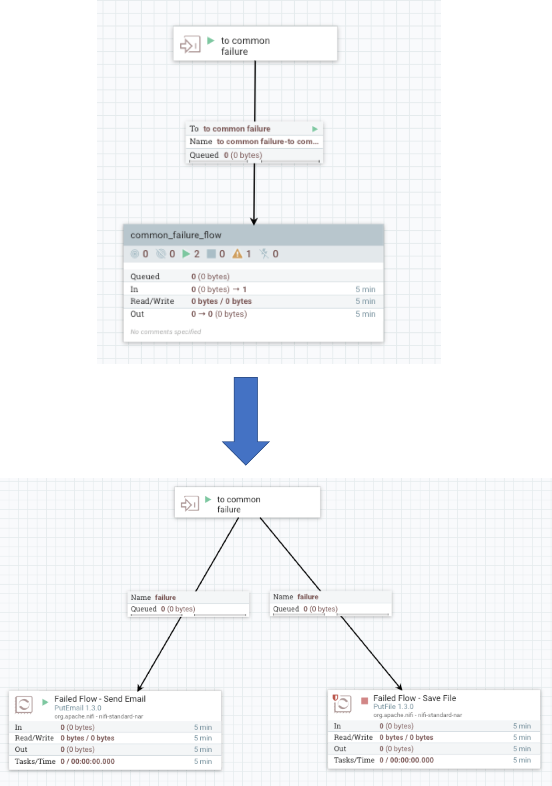
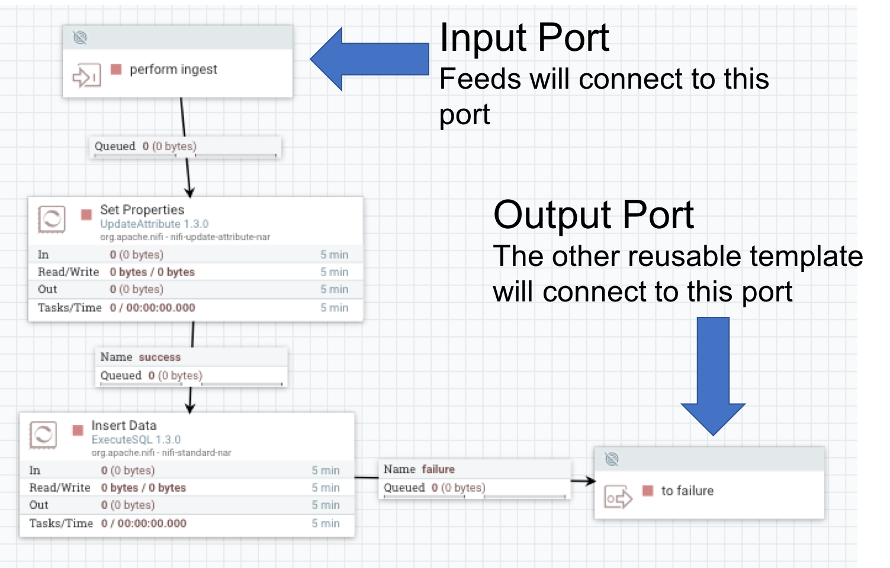
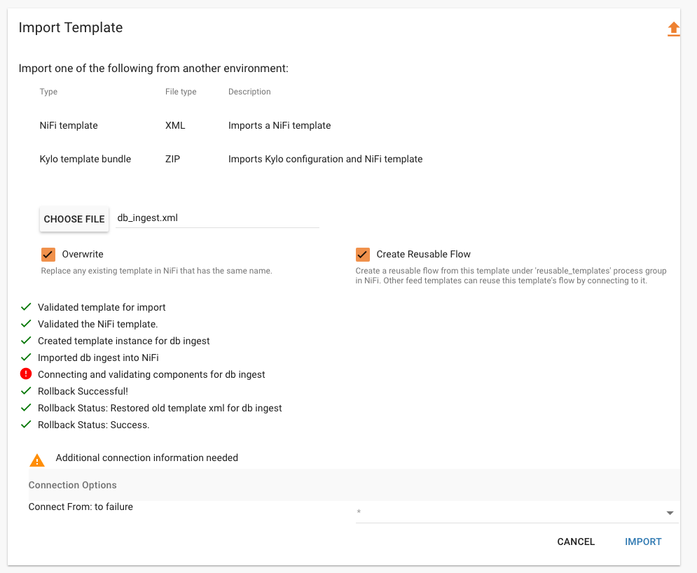
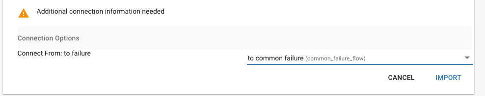
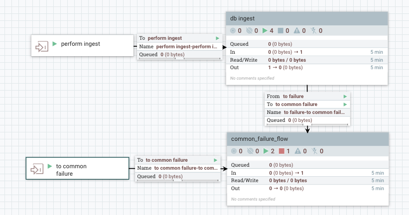

Connecting Reusable Templates
=============================

As of Kylo 0.9.0, you can have reusable flows reference other reusable flows.  This allows for you to develop a common flow that is shared among feeds.  For example you may wish to handle all feed failures the same and thus want to route all flows to the same failure template.

Pre-requisites
--------------
 1. In order to have a reusable template that is able to connect to another reusable template, that flow needs to have 1 or more `output ports`.
 2. Kylo needs to have another reusable template registered that it can connect to.

Example
-------
1. Below is a sample reusable template, `common failure` that is registered in Kylo.  This will be the flow that we connect to.
|image0|

2. For the flow other flow we need to add an `output port` so Kylo can make the connection when registering the reusable template.  Below is an example template.
|image1|

3.  When you register the second reusable template with the output port you will be prompted to make the connection to the output port.
|image2|

4. Make the connection and then import.
|image3|

5. Kylo will connect the two flows together
|image4|

**Note**:
You can always re-register any of the reusable templates and Kylo will recreate the connections, allowing you to add/modify/update the output ports and connections

