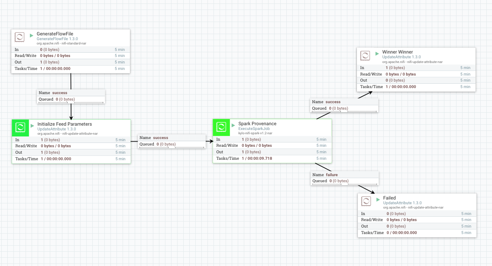
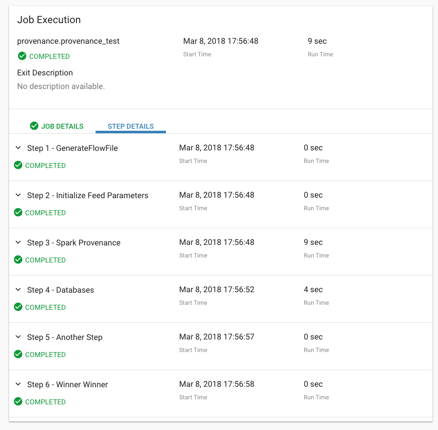
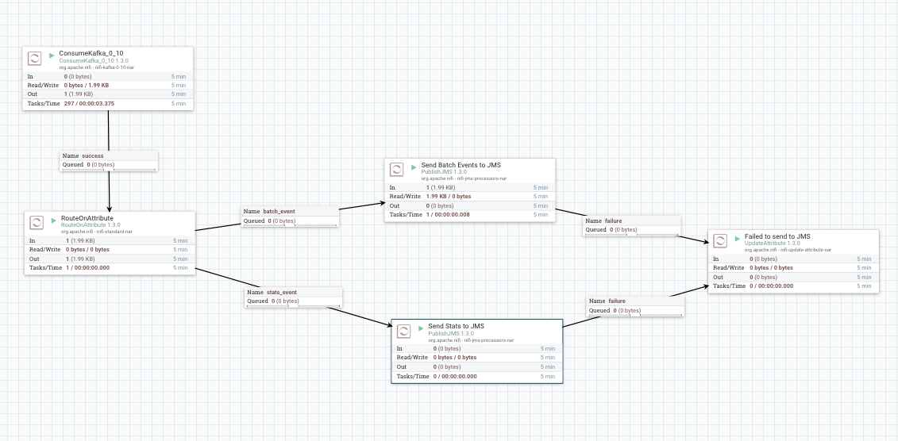

Custom Provenance Events
========================

You can use Kylo's `Provenance API <https://github.com/Teradata/kylo/tree/master/integrations/provenance>`_ to create custom Provenance Events that result in Jobs/Steps in Kylo Operations Manager.

The API allows you to programmatically create Provenance events.
Kylo ships with 3 implementations:
  - `provenance-jms <https://github.com/Teradata/kylo/tree/master/integrations/provenance/provenance-jms>`_ - A JMS implementation
  - `provenance-kafka <https://github.com/Teradata/kylo/tree/master/integrations/provenance/provenance-kafka>`_ - A Kafka implementation
  - `provenance-rest <https://github.com/Teradata/kylo/tree/master/integrations/provenance/provenance-rest>`_ - A REST implementation

There is also a `sample Spark application <https://github.com/Teradata/kylo/tree/master/samples/provenance-samples/spark-provenance-app>`_ that uses this api

Example Usage
-------------
 1) Add the provenance api implementation as a dependency.
  To create a new Provenance event you need to include one of the kylo-provenance implementation's in your project

 .. code-block:: xml

    <dependency>
      <groupId>com.thinkbiganalytics.kylo.integrations</groupId>
      <artifactId>kylo-provenance-jms</artifactId>
      <version>0.9.1-SNAPSHOT</version>
    </dependency>

    <dependency>
      <groupId>com.thinkbiganalytics.kylo.integrations</groupId>
      <artifactId>kylo-provenance-kafka</artifactId>
      <version>0.9.1-SNAPSHOT</version>
    </dependency>

    <dependency>
      <groupId>com.thinkbiganalytics.kylo.integrations</groupId>
      <artifactId>kylo-provenance-rest</artifactId>
      <version>0.9.1-SNAPSHOT</version>
    </dependency>

 ..

 2) An example Program might look like the following.  Complete example code can be found `here <https://github.com/Teradata/kylo/blob/master/samples/provenance-samples/spark-provenance-app/src/main/java/com/example/spark/provenance/SparkProvenance.java>`_.

  .. code-block:: java

   //Get the proper ProvenanceService based upon some configuration
   ProvenanceEventService provenanceEventService = ProvenanceServiceFactory.getProvenanceEventService(params);

   try {
       //Store all the events we want to send to the api in a list
       List<ProvenanceEventRecordDTO> events = new ArrayList<>();

       //build an event using the ProvenanceEventDtoBuilder
       ProvenanceEventRecordDTO event = new ProvenanceEventDtoBuilder(params.getFeedName(),params.getFlowFileId(),componentName)
                .jobFlowFileId(params.getJobFlowFileId())
                .startTime(System.currentTimeMillis())
                .startingEvent(false)
                .build();

          /// do some work

          //record the end time and some attributes to be displayed on the step in Operations Manager
          event.getAttributeMap().put("databases", df.toJSON().collectAsList().toString());
          event.setEventTime(System.currentTimeMillis());

          //add the event to the list
          events.add(event);

          // when ready send the events off to the api to be processed
          provenanceEventService.sendEvents(events);
    } finally {
        //When done close the connection to the service
        provenanceEventService.closeConnection();
    }

  ..

Spark Kafka Example
-------------------
1) build and copy the `spark-provenance-app <https://github.com/Teradata/kylo/tree/master/samples/provenance-samples/spark-provenance-app>`_
2) copy this and make available to NiFi (i.e. copy  it to the ``/opt/nifi/data/lib/app``)

   .. code-block:: properties

     ln -s /opt/nifi/data/lib/app/kylo-spark-provenance-app-0.9.1-SNAPSHOT-jar-with-dependencies.jar  kylo-spark-provenance-app-with-dependencies.jar

   ..

3) Import the `Sample Spark App with Provenance <https://github.com/Teradata/kylo/blob/master/samples/templates/nifi-1.0/sample_spark_app_with_provenance.template.zip>`_ template
   This is an example template that will call the ``spark-provenance-app`` in step 1 and write out 2 additional steps/provenance events

4) Import the `kafka_provenance_to_jms <https://github.com/Teradata/kylo/blob/master/samples/templates/nifi-1.0/kafka_provenance_to_jms.feed.zip>`_ feed.  kafka_provenance_to_jms.feed.zip
   This is a system wide template that is listening to 2 kafka topics for batch and streaming data and publish the events to JMS.

   |image2|

5) Create a feed using the ``Sample Spark App with Provenance`` template.
   Note this is a Spark2 application so set the spark home property accordingly

   |image0|

 - The ``Sample Spark App with Provenance`` Feed is below and only has 4 processors in the template and thus will only create 4 steps for the job execution in Kylo.
    - GenerateFlowFile
    - Initialize Feed Parameters
    -  Spark Provenance
    - Winner Winner

 - The actual `Spark application <https://github.com/Teradata/kylo/blob/master/samples/provenance-samples/spark-provenance-app/src/main/java/com/example/spark/provenance/SparkProvenance.java>`_  has provenance code that will create 2 additional steps after the Spark Provenance step for each job.
    - Databases
    - Another Step

    |image1|

