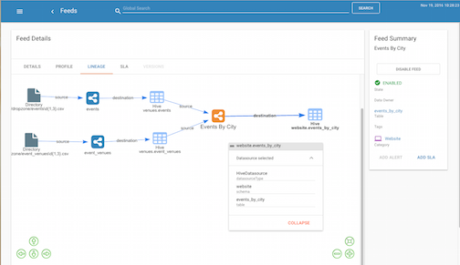
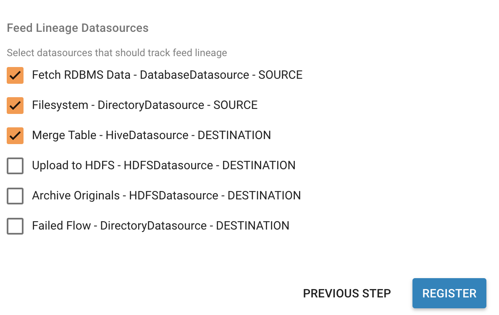

==========================
Feed Lineage Configuration
==========================

Introduction
============

Feeds track and display dependencies to other feeds and also their connections through their datasources.

The Lineage view on the Feed Details page is an interactive canvas that allows the user to analyze and inspect the feeds relationships.

The Designer must indicate NiFi processors that represent a source or sink to be tracked. The following guide describes how lineage is tracked and the role of designers.

|image0|

Feed Connections
================

Connected by Preconditions
==========================

When a feed depends upon another feed(s) via a precondition (a
TriggerFeed), then it will be assigned as "depends on" relationship in
the Feed Lineage graph.

Connected through Datasources
=============================

Feeds are also connected through their datasources.  If FeedA writes to
a table and FeedB uses that same table as its source than it will be
connected.

Getting Started
===============

In order to get your feed to see its lineage you will need to do 2
things.

1. Assign the datasources to the template.  See the
   section \ **Registering Datasources with a Template** below. 

2. Save the Feed.  Once the template has been registered you will need
   to save the feed.  Go to the feed details.  Click the Pencil icon on
   any section.  Click **Save**.

How it works
============

Datasource Definitions
----------------------

NiFi processors and their properties are defined as datasources in the
system.  These definitions are stored in the Kylo metadata repository
and they can be registered 2 ways.

Registration on Startup
-----------------------

Kylo read the file
"`*datasource-definitions.json* `__"
found in the classpath on startup and will update the datasource
definitions.  This will be in the /opt/kylo/kylo-services/conf
directory and can be referenced on git
here: \ `*datasource-definitions.json* <https://github.com/kyloio/kylo/blob/master/services/service-app/src/main/resources/datasource-definitions.json>`__.
 Kylo ships with many of the NiFi processors defined.

Registration via REST
---------------------

| If you need to update or add new datasource definitions there is a
  REST endpoint that allows you to post the new definition data.
| `*http://localhost:8400/api-docs/index.html#!/feed-manager-feeds/updateDatasourceDefinitions* <http://localhost:8400/api-docs/index.html#!/feed-manager-feeds/updateDatasourceDefinitions>`__

To list the metadata store of defined datasources you can use this REST
call

`*http://localhost:8400/proxy/metadata/datasource/datasource-definitions* <http://localhost:8400/proxy/metadata/datasource/datasource-definitions>`__ 

Datasource Definition Structure
-------------------------------

A datasource definition is defined with the following attributes in
JSON:

.. code-block:: shell

  {
  "processorType": "The Path to the NiFi processor Class Name",
  "datasourcePropertyKeys":["Array of NiFi Property Names that identify Uniqueness"],
  "datasourceType":"A Common String identifying the Type. See the section Datasource Types below",
  "connectionType":"Either SOURCE or DESTINATION",
  "identityString":"<optional> <supports expressions> A string identifying uniqueness.
  You reference any 'datasourcePropertyKey' above via expressions ${key}
  (see the example GetFile below), If not defined it will use all the 'datasourcePropertyKeys' for its identityString",
  "description":"<optional> <supports expressions> A string describing this source",
  "title":"<optional> <supports expressions> A Title that will be displayed on the Feed Lineage page.
  If not supplied it will use the 'identityString' property"
  }

..

Example for the GetFile processor in NiFi:

.. code-block:: shell

  {
  "processorType": "org.apache.nifi.processors.standard.GetFile",
  "datasourcePropertyKeys":["Input Directory","File Filter"],
  "datasourceType":"DirectoryDatasource",
  "connectionType":"SOURCE",
  "identityString":"${Input Directory}/${File Filter}",
  "description":" Directory or File source"
  }

..

Datasource Types
----------------

A datasource is made unique by using its 'identityString' and its 'datasourceType'. The predefined types shipping with Kylo are:

  - "HiveDatasource"
  - "JMSDatasource"
  - "KafkaDatasource"
  - "DirectoryDatasource"
  - "HDFSDatasource"
  - "S3Datasource"
  - "FTPDatasource"
  - "HBaseDatasource"
  - "HTTPDatasource"
  - "DatabaseDatasource"

Refer to the datasource-definitions.json file for more details. 

Registering Datasources with a Template
=======================================

Templates need to be configured to identify the datasources that it
should track.  When registering a template that last step will show the
available datasources it found in your flow.  Kylo reads the template
and then matches each processor with the datasource definition (see
above).  You will then need to select the datasources you wish to track.

Note: If using the "Data Ingest" template it has already been updated to
track the 3 main datasources  (GetFile, GetTableData, MergeTable).  You
will need to reimport the data-ingest.zip or re-register the template
and select those datasources for tracking.

This step is necessary because you may have a variety of processors in
the flow that match a processor type in the datasource definition (i.e.
PutFile for failed flows), but those don't define the true destination of
the flow.

|image1|

Styling the Feed Lineage User Interface
=======================================

Feed Lineage uses a JavaScript
framework \ `*http://visjs.org/* <http://visjs.org/>`__  to build the
interactive canvas.

If needed you can adjust the styles of the feeds and each type of
datasource.  Kylo reads styles on startup from the
"`*datasource-styles.json* <https://github.com/kyloio/kylo/blob/master/services/service-app/src/main/resources/datasource-styles.json>`__"
This file can be found in /opt/kylo/kylo-services/conf.  Styles
are not stored in the metadata.  They are read from this file on
startup.  You can alter styles using the REST endpoint below, but to
persist it for the next time you will want to update this JSON file.

`*http://localhost:8400/api-docs/index.html#!/feed-manager-feeds/updateFeedLineageStyles* <http://localhost:8400/api-docs/index.html#!/feed-manager-feeds/updateFeedLineageStyles>`__

 

 

 

 

