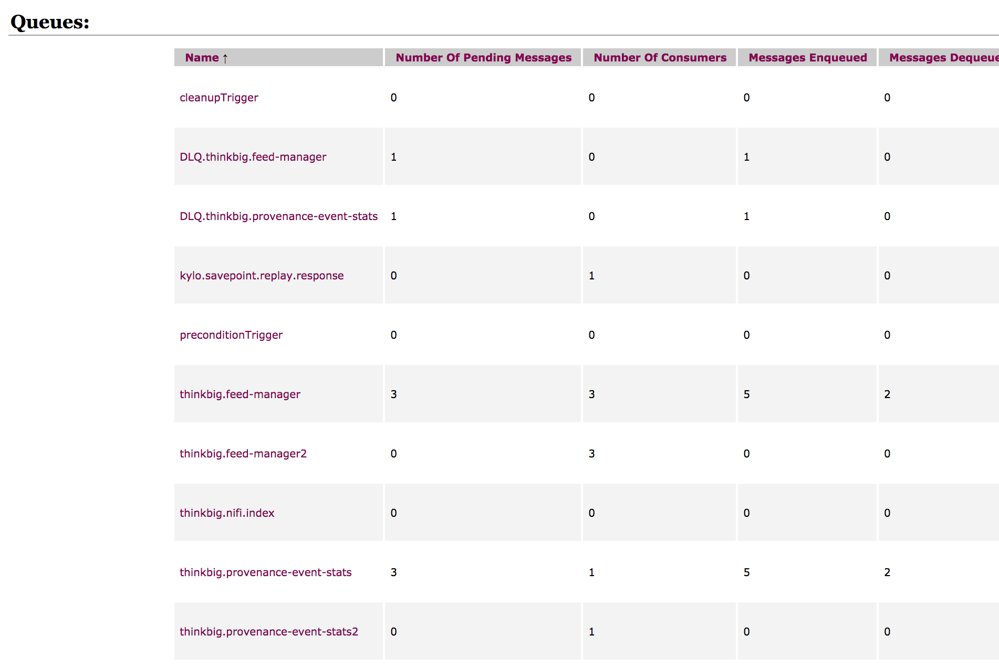

=============
JMS Providers
=============

Introduction
============

Kylo supports pluggable JMS implementations. There are two JMS implementations supported out-of-the-box: ActiveMQ and Amazon SQS.
Both Kylo and Nifi should be configured with the same JMS implementation.

Kylo Configuration
==================

ActiveMQ
--------

ActiveMQ profile is selected by default. If you switched away from ActiveMQ and now want to restore default Kylo settings you can
edit ``/opt/kylo/kylo-services/conf/application.properties`` and select ActiveMQ JMS implementation by adding ``jms-activemq`` profile to
``spring.profiles.include`` property, e.g.

  .. code-block:: properties

    spring.profiles.include=[other profiles],jms-activemq

  ..

In addition to selected profile, ActiveMQ configuration properties should be provided in ``/opt/kylo/kylo-services/conf/application.properties``.
Redelivery processing properties are now available for configuration. If Kylo receives provenance events and they have errors or are unable to attach NiFi feed information
(i.e. if NiFi goes down and Kylo doesnt have the feed information in its cache) then the JMS message will be returned for redelivery based upon the following parameters.
Refer to the ActiveMQ documentation, http://activemq.apache.org/redelivery-policy.html, for assigning these values

  .. code-block:: properties

    jms.activemq.broker.url=tcp://localhost:61616
    #jms.activemq.broker.username=admin
    #jms.activemq.broker.password=admin
    ##Redeliver policy for the Listeners when they fail (http://activemq.apache.org/redelivery-policy.html)
    #jms.maximumRedeliveries=100
    #jms.redeliveryDelay=1000
    #jms.maximumRedeliveryDelay=600000L
    #jms.backOffMultiplier=5
    #jms.useExponentialBackOff=false

  ..

Dead Letter Queue Strategy
~~~~~~~~~~~~~~~~~~~~~~~~~~
When a queue fails to process a message it will retry based upon the `redelivery strategy` (configured above) and then send the message to the Dead Letter Queue (DLQ).
By default there is an `ActiveMQ.DLQ` queue that all messages will go to.
It is recommened you change this for the Kylo queues so they each go to their respective DLQ.

To do this you need to modify the `activemq.xml` file (/opt/activemq/current/conf/activemq.xml) and add the policy entries to describe the DLQ strategy.
Below is an example:

.. code-block:: xml

    <destinationPolicy>
      <policyMap>
        <policyEntries>
          <policyEntry topic=">" >
            <!-- The constantPendingMessageLimitStrategy is used to prevent
                 slow topic consumers to block producers and affect other consumers
                 by limiting the number of messages that are retained
                 For more information, see:
                 http://activemq.apache.org/slow-consumer-handling.html
            -->
            <pendingMessageLimitStrategy>
              <constantPendingMessageLimitStrategy limit="1000"/>
            </pendingMessageLimitStrategy>
          </policyEntry>

          <policyEntry queue="thinkbig.feed-manager">
            <deadLetterStrategy>
              <!--
                Use the prefix 'DLQ.' for the destination name, and make
                the DLQ a queue rather than a topic
              -->
              <individualDeadLetterStrategy queuePrefix="DLQ." useQueueForQueueMessages="true"/>
            </deadLetterStrategy>
          </policyEntry>
          <policyEntry queue="thinkbig.provenance-event-stats">
            <deadLetterStrategy>
              <!--
                Use the prefix 'DLQ.' for the destination name, and make
                the DLQ a queue rather than a topic
              -->
              <individualDeadLetterStrategy queuePrefix="DLQ." useQueueForQueueMessages="true"/>
            </deadLetterStrategy>
          </policyEntry>
        </policyEntries>
      </policyMap>
    </destinationPolicy>

..

In case of an error then the above code block will send the messages to separate DLQ queues (see screenshot below)

|image0|

Refer to the ActiveMQ docs for more info: http://activemq.apache.org/message-redelivery-and-dlq-handling.html

ActiveMQ Cluster
~~~~~~~~~~~~~~~~
If you have ActiveMQ setup as a cluster you need to change the broker URL to support the Active MQ failover syntax.

1. Update the kylo-services/conf/application.properties and change the jms.activemq.broker.url to include the `failover` protocol with the clustered amq urls:

  .. code-block:: shell

    jms.activemq.broker.url=failover:(tcp://localhost:61616, tcp://other amq url)

  ..

2. do the same for the nifi /opt/nifi/ext-config/config.properties

  .. code-block:: shell

    jms.activemq.broker.url=failover:(tcp://localhost:61616, tcp://other amq url)

  ..

3. make sure the NiFi JMS controller services use the failover protocol with the similar url as above

Refer to the ActiveMQ docs for more information: http://activemq.apache.org/failover-transport-reference.html

Amazon SQS
----------

ActiveMQ profile is selected by default. But you can switch over to Amazon SQS by replacing ``jms-activemq`` profile with ``jms-amazon-sqs`` in
``/opt/kylo/kylo-services/conf/application.properties``, e.g.

  .. code-block:: properties

    spring.profiles.include=[other profiles],jms-amazon-sqs

  ..

In addition to that Amazon SQS specific properties should be provided in ``/opt/kylo/kylo-services/conf/application.properties``.

  .. code-block:: properties

    sqs.region.name=eu-west-1

  ..

Amazon SQS uses ``DefaultAWSCredentialsProviderChain`` class to look for AWS credentials in the following order:

- Environment Variables - AWS_ACCESS_KEY_ID and AWS_SECRET_KEY
- Java System Properties - aws.accessKeyId and aws.secretKey
- Credential profiles file at the default location (~/.aws/credentials) shared by all AWS SDKs and the AWS CLI
- Instance profile credentials delivered through the Amazon EC2 metadata service

For example, add your AWS credentials to ``/home/kylo/.aws/credentials``

  .. code-block:: shell

    [default]
    aws_access_key_id=...
    aws_secret_access_key=...

  ..

Nifi Configuration
==================

Active MQ
---------

Select ``jms-activemq`` profile and provide ActiveMQ specific configuration properties in ``/opt/nifi/ext-config/config.properties``, e.g.

  .. code-block:: properties

    spring.profiles.active=jms-activemq

    jms.activemq.broker.url=tcp://localhost:61616
    #jms.activemq.broker.username=admin
    #jms.activemq.broker.password=admin
    ##Redeliver policy for the Listeners when they fail (http://activemq.apache.org/redelivery-policy.html)
    #jms.maximumRedeliveries=100
    #jms.redeliveryDelay=1000
    #jms.maximumRedeliveryDelay=600000L
    #jms.backOffMultiplier=5
    #jms.useExponentialBackOff=false

  ..

Refer to the ActiveMQ Cluster above for additional settings if you are running with an ActiveMQ cluster.

Amazon SQS
----------

Select ``jms-amazon-sqs`` profile and provide Amazon SQS specific configuration properties in ``/opt/nifi/ext-config/config.properties``, e.g.

  .. code-block:: properties

    spring.profiles.active=jms-amazon-sqs

    sqs.region.name=eu-west-1

  ..

Amazon SQS uses ``DefaultAWSCredentialsProviderChain`` class to look for AWS credentials in the following order:

- Environment Variables - AWS_ACCESS_KEY_ID and AWS_SECRET_KEY
- Java System Properties - aws.accessKeyId and aws.secretKey
- Credential profiles file at the default location (~/.aws/credentials) shared by all AWS SDKs and the AWS CLI
- Instance profile credentials delivered through the Amazon EC2 metadata service

For example, add your AWS credentials to ``/home/nifi/.aws/credentials``

  .. code-block:: shell

    [default]
    aws_access_key_id=...
    aws_secret_access_key=...

  ..

There are four places where standard Kylo feeds need updating in Nifi to route JMS messages via Amazon SQS instead of ActiveMQ.
Replace JMS processors with their Amazon SQS equivalents. Replace PublishJMS processors with PutSQS processors and
ConsumeJMS processors with GetSQS processors in following feeds:

- reusable_templates -> standard-ingest

    - Register Index (PublishJMS)

    - Update Index (PublishJMS)

- system

    - index_schema_service -> Receive Schema Index Request (ConsumeJMS)

    - index_text_service -> Receive Index Request (ConsumeJms)

