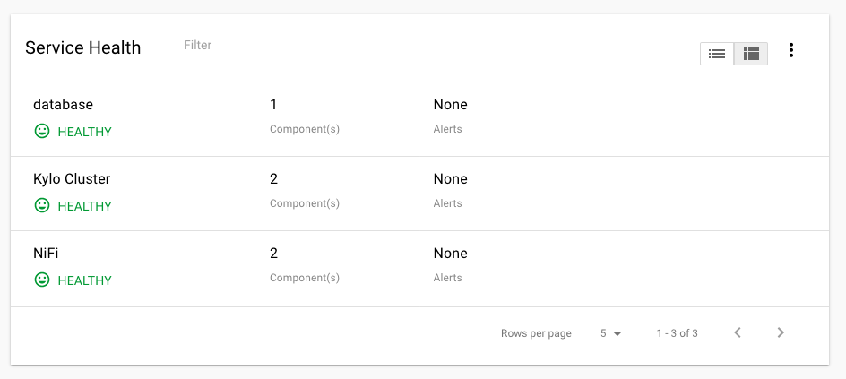
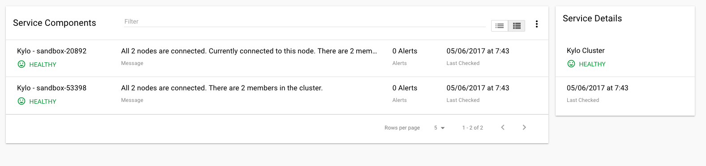
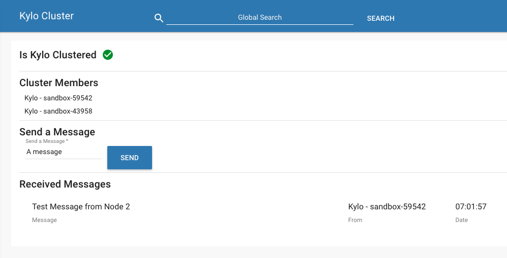
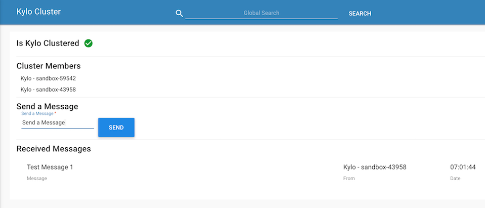

Clustering Kylo
===============

Kylo Clustering is now available starting with version v0.8.1.

Kylo uses jgroups, http://jgroups.org/index.html, for cluster configuration.  This is chosen because Kylo's metadata engine, Modeshape (http://modeshape.jboss.org/) uses jgroups internally for its cluster management.

Two jgroups configuration files are needed to be setup (One for ModeShape and one for Kylo)

ModeShape Configuration
~~~~~~~~~~~~~~~~~~~~~~~
1. Update the metadata-repository.json file and add the "clustering" section

   .. code-block:: javascript
   
     "clustering": {
        "clusterName":"kylo-modeshape-cluster",
        "configuration":"modeshape-jgroups-config.xml",
        "locking":"db"
    },

   ..

   Make sure the file you referenced in the "configuration" parameter is in the `/opt/kylo/kylo-services/conf` folder.  Refer to the sample files for setting up a jgroups configuration at `/opt/kylo/setup/config/kylo-cluster`.
   Note if working in Amazon AWS, refer to the "s3" jgroups configuration.  Both modeshape and kylo jgroups files should use S3_PING, not TCPPING or MPING, to perform node discovery.

Kylo Configuration
~~~~~~~~~~~~~~~~~~

We also have another jgroups configuration setup for Kylo nodes.  We cannot use the ModeShape cluster configuration since that is internal to ModeShape.

1. Create a similar jgroup-config.xml file and add it to the `/opt/kylo/kylo-services/conf` file.  Refer to the sample files for setting up a jgroups configuration at `/opt/kylo/setup/config/kylo-cluster`.
Generally, the modeshape and kylo jgroup config files only differ in the port that they are configured to listen on.  Ensure the value of the "TCP bind_port" attribute are different between this xml file and the ModeShape xml file

2. Add a property to the kylo-services/conf/application.properties to reference this file

 .. code-block:: properties

  kylo.cluster.jgroupsConfigFile=kylo-cluster-jgroups-config.xml

 ..

3. Startup Kylo

  When starting up you should see 2 cluster configurations in the logs.  One for the modeshape cluster and one for the kylo cluster

  .. code-block:: text

        -------------------------------------------------------------------
        GMS: address=Kylo - MUSSR186054-918-31345, cluster=kylo-modeshape-cluster, physical address=127.0.0.1:7800
        -------------------------------------------------------------------
  ..

  .. code-block:: text

        -------------------------------------------------------------------
        GMS: address=Kylo - MUSSR186054-918-31345, cluster=internal-kylo-cluster, physical address=127.0.0.1:7900
        -------------------------------------------------------------------
        2017-05-04 06:17:06 INFO  pool-5-thread-1:JGroupsClusterService:120 - Cluster membership changed: There are now 1 members in the cluster. [Kylo - MUSSR186054-918-31345]
        2017-05-04 06:17:06 INFO  pool-5-thread-1:JGroupsClusterService:155 - *** Channel connected Kylo - MUSSR186054-918-31345,[Kylo - MUSSR186054-918-31345]
        2017-05-04 06:17:06 INFO  pool-5-thread-1:NifiFlowCacheClusterManager:205 - on connected 1 members exist.  [Kylo - MUSSR186054-918-31345]
  ..

Quartz Scheduler Configuration
~~~~~~~~~~~~~~~~~~~~~~~~~~~~~~
When running in clustered mode you need to configure the Quartz SLA scheduler to be backed by the database and run it in clustered mode.
Do the following:

1. Download and extract the Quartz distribution to a machine. http://d2zwv9pap9ylyd.cloudfront.net/quartz-2.2.3-distribution.tar.gz  You just need this to get the database scripts.

2. Run the Quartz database scripts for your database found in the `docs/dbTables`

3. Create a `quartz.properties` file and put it in the `/opt/kylo/kylo-services/conf` folder.  Refer to a sample file `/opt/kylo/setup/kylo-cluster/quartz-cluster-example.properties`

   a. Do not specify datasource connection information in this file.  The system will use the default `spring.datasource` property information found in the `application.properties` for the database connection

Service Monitoring
~~~~~~~~~~~~~~~~~~
You can monitor the health of the kylo cluster by adding the `kylo-service-monitor-kylo-cluster.jar` to the `/opt/kylo/kylo-services/plugins` folder.

1. Copy the file in the `/opt/kylo/setup/plugins/kylo-service-monitor-kylo-cluster-VERSION.jar` to the /opt/kylo/kylo-services/plugins` folder

2. Add a new property to the application.properties to indicate the expected number of nodes you are running in your cluster.  Below is an example expecting 2 nodes in the cluster

 .. code-block:: properties

  kylo.cluster.nodeCount=2

 ..

3. Now a new *Kylo Cluster* service will appear in the Kylo dashboard and show you cluster health status

|image0|

|image1|

Testing - (as of Kylo 0.8.4)
~~~~~~~~~~~~~~~~~~~~~~~~~~~~
Starting with Kylo 0.8.4 you can test your cluster configuration in the Kylo application.

1. Start your Kylo Cluster (both services and ui on all your nodes)

2. In a new web browser (i.e. Chrome), connect to a specific node in your cluster.  Go to this webpage `http://localhost:8400/index.html#!/admin/cluster` (replace localhost and port with the direct host and port)

    - This page will show you Cluster information and allow you to send/receive test messages

3. In a new web browser (i.e. Firefox), connect to another node in your cluster.  Follow the steps above and connect to a different node/port.

4. Send a message from one of the nodes.  You should see the message appear in the other web browser.  See screenshots below.

 The screenshots below are from a 2 node Kylo cluster.
    - Node 1: `kylo-sandbox-43958`
    - Node 2: `kylo-sandbox-59542`

 Screenshot from `Node 1: kylo-sandbox-43958`
|image2|

 Screenshot from `Node 2: kylo-sandbox-59542`
|image3|

 - If this page correctly shows your cluster members, but fails to send the message or receive it follow the `Troubleshooting` tips below.  Most likely cause of this is the system parameter `-Dava.net.preferIPv4Stack=true` needs to be configured.

 - If the cluster is not configured correctly this page will indicate and provide you with information on troubleshooting.

Troubleshooting
~~~~~~~~~~~~~~~

-  If you are having issues identifying if the clustering is working you can modify the log4j.properties and have it show cluster events.  This is especially useful for modeshape.
   Note: by doing this logs will be very verbose, so its recommended this is only done for initial setup/debugging

  .. code-block:: properties

    log4j.logger.org.modeshape.jcr.clustering.ClusteringService=DEBUG
    log4j.logger.org.jgroups=DEBUG

  ..

- If you get a `Network is unreachable` error, below, you may need to do the following:

   - Network unreachable error

        .. code-block:: text

            SEVERE: JGRP000200: failed sending discovery request
            java.io.IOException: Network is unreachable
                at java.net.PlainDatagramSocketImpl.send(Native Method)
                at java.net.DatagramSocket.send(DatagramSocket.java:693)
                at org.jgroups.protocols.MPING.sendMcastDiscoveryRequest(MPING.java:295)
                at org.jgroups.protocols.PING.sendDiscoveryRequest(PING.java:62)
                at org.jgroups.protocols.PING.findMembers(PING.java:32)
                at org.jgroups.protocols.Discovery.findMembers(Discovery.java:244)
        ..

   - Modify the  `/opt/kylo/kylo-services/bin/run-kylo-services.sh`

   - Add -Djava.net.preferIPv4Stack=true

        .. code-block:: shell

          java $KYLO_SERVICES_OPTS -Djava.net.preferIPv4Stack=true -cp /opt/kylo/kylo-services/conf ....

        ..

- If you get a `No subject alternative DNS  name` error, this could be because you are using periods in your S3 bucket name.  To remedy, use a bucket without periods in the name. 

        .. code-block:: text

            java.security.cert.CertificateException: No subject alternative DNS name matching my.kyloha.bucket.s3.amazonaws.com found.
                at sun.security.util.HostnameChecker.matchDNS(HostnameChecker.java:204)
                at sun.security.util.HostnameChecker.match(HostnameChecker.java:95)
                at sun.security.ssl.X509TrustManagerImpl.checkIdentity(X509TrustManagerImpl.java:455)
                at sun.security.ssl.X509TrustManagerImpl.checkIdentity(X509TrustManagerImpl.java:436)
                at sun.security.ssl.X509TrustManagerImpl.checkTrusted(X509TrustManagerImpl.java:200)
                at sun.security.ssl.X509TrustManagerImpl.checkServerTrusted(X509TrustManagerImpl.java:124)
                at sun.security.ssl.ClientHandshaker.serverCertificate(ClientHandshaker.java:1496)

- Multicast

    - Enabling multicast is done via the `<MPING .. />` xml node in the jgroups-configuration xml file.  Multicast may not work in your environment.  If you have issues you can remove the `<MPING ../>` node and ensure your host names are configured propertly in the `<TCPPING ../>` node.  Refer to the jgroups documentation around MPING for more information:  http://jgroups.org/manual-3.x/html/protlist.html#d0e4760

- Running the Multicast test program

   - Run the following to test 2 node communication.  The below was taken from http://www.jgroups.org/manual/html/ch02.html#ItDoesntWork

   1. Stop kylo-services on both nodes

   2. On 1 node run the code below to act as a receiver.  Replace the ``bind_addr`` and ``port`` arguments with your specific values

      .. code-block:: shell

         java -Djava.net.preferIP4Stack=true  -cp  /opt/kylo/kylo-services/conf:/opt/kylo/kylo-services/lib/*:/opt/kylo/kylo-services/plugin/* org.jgroups.tests.McastReceiverTest -bind_addr 127.0.0.1 -port 7900
      ..

   3.  On another node run the code below to act as a sender. Replace the ``bind_addr`` and ``port`` arguments to match the values above

       .. code-block:: shell

          java -Djava.net.preferIP4Stack=true -cp  /opt/kylo/kylo-services/conf:/opt/kylo/kylo-services/lib/*:/opt/kylo/kylo-services/plugin/* org.jgroups.tests.McastSenderTest -bind_addr 127.0.0.1 -port 7900
       ..

      As a Sender you will get a prompt.  Type in some string and then verify its received on the other node.

      Sender:

       .. code-block:: shell

         org.jgroups.tests.McastSenderTest -bind_addr 127.0.0.1 -port 7900
         Socket #1=0.0.0.0/0.0.0.0:7900, ttl=32, bind interface=/127.0.0.1
         > this is a test message

       ..

      Receiver:

       .. code-block:: shell

         this is a test message [sender=127.0.0.1:7900]
       ..

