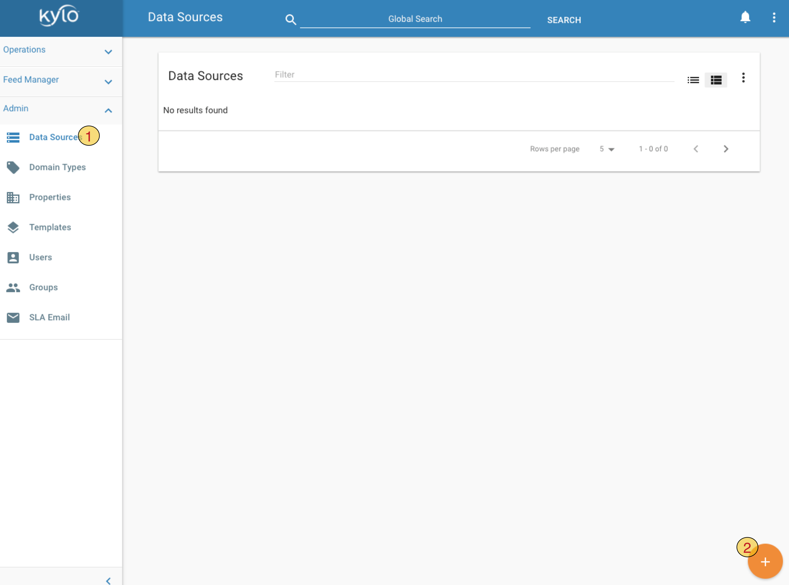
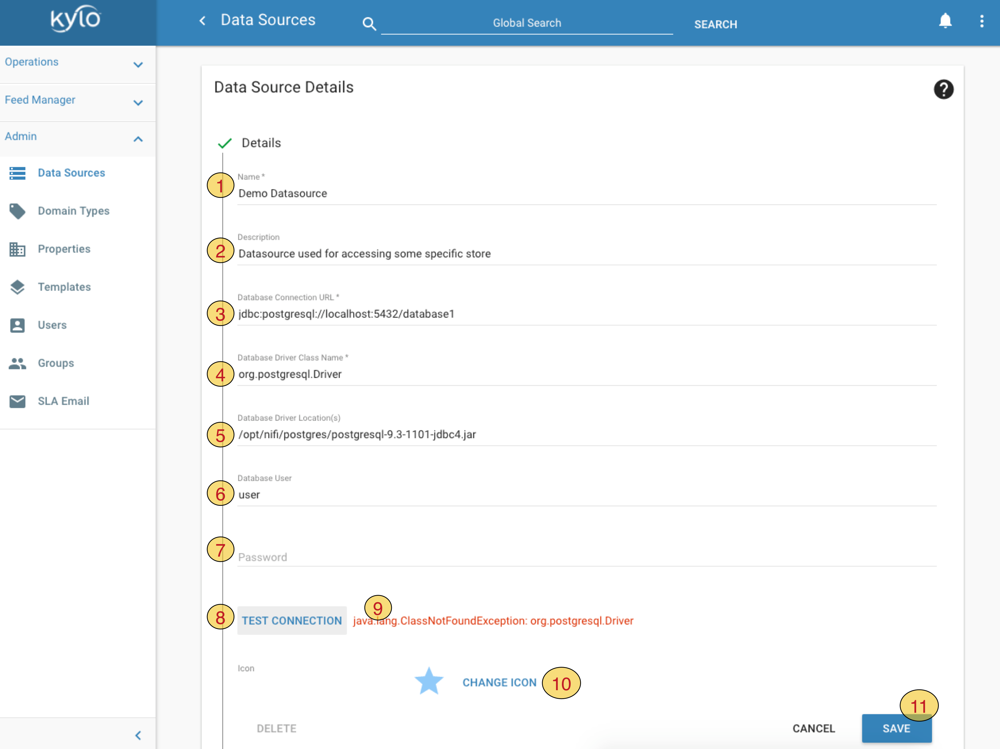

======================
Kylo Datasources Guide
======================

Introduction
============

Kylo can manage the creation and usage of Nifi RDBMS data source configurations, through a simple `Data Source UI <http://localhost:8400/index.html#!/datasources>`_.

To create a new Data Source:
|image1|

1. Click on ``Data Sources`` link in left-hand panel
2. Click on orange ``+`` button to add a new Data Source

Provide following details for the Data Source
|image2|

1.  ``Name`` - data source name. This name will be given to Controller Service in Nifi. This name can be used in application.properties to automatically provide the rest of the properties, e.g. ``Password``, `just like you would for other Nifi Controller Services <ConfigurationProperties.html#setting-controller-service-properties>`_
2.  ``Description`` - any description
3.  ``Datasource Connection URL`` - JDBC connection string. In this example we used Postgres connection string, you should of course replace this with connection string for your JDBC source
4.  ``Datasource Driver Class Name`` - JDBC driver classname for the type of your store
5.  ``Datasource Driver Location`` - this currently refers only to a location readable by Nifi. However refer to following table for complete list of locations and permissions where driver jar is expected by Kylo

    +----------------------------------+---------------------------------------------------------------------------------------------------+--------------------+
    | Location                         | Purpose                                                                                           | Accessible by user |
    +==================================+===================================================================================================+====================+
    | $NIFI_HOME/data/lib or           | Needed by Nifi for the DBCPConnectionPool.                                                        | nifi               |
    | any path accessible by NiFi      | The path might be erased at Nifi upgrade time.                                                    |                    |
    +----------------------------------+---------------------------------------------------------------------------------------------------+--------------------+
    | $KYLO_HOME/kylo-services/plugin  | Needed by Kylo in the schema discovery (Data Ingestion). Need to restart Kylo if added post-start | kylo               |
    +----------------------------------+---------------------------------------------------------------------------------------------------+--------------------+
    | $KYLO_HOME/kylo-services/lib     | Needed by Kylo wrangler (Visual Query / Data Transformation)                                      | kylo               |
    +----------------------------------+---------------------------------------------------------------------------------------------------+--------------------+

6.  ``Datasource User`` - user name which will be used to access data
7.  ``Password`` - password for datasource user
8.  ``Test Connection`` - Kylo will create and test a new connection. Note that currently this only validates Kylo's access to data store and does not validate Nifi's access.
9.  Kylo will display error messages here if connection test fails
10. ``Change Icon`` to select an icon for your data source
11. ``Save``

Spark configuration
-------------------
While using the Visual Query / Data Transformation, you will need to make available the datasource jar.
Recommended is to keep the datasource jar with the application (Kylo/Nifi), and pass it along to spark.

Depending on the Spark setup (server mode or the others), you will need to do different changes.

Server mode / Sandbox
~~~~~~~~~~~~~~~~~~~~~

- edit `$KYLO_HOME/kylo-services/bin/run-kylo-spark-shell.sh`

- update `KYLO_DRIVER_CLASS_PATH` with the path to the datasource jar (can be under $NIFI_HOME)

OR (not so recommended)

- update/append `$SPARK_HOME/conf/spark-defaults.conf` with the path value. Values can be appended with ":" .This file should be referenced by spark-submit, or it's referenced by `/opt/kylo/kylo-services/bin/run-kylo-spark-shell.sh`, which passes the values like `spark-submit ... --driver-class-path /path-to-oracle-jdbc/:/path-to-other-jars/`

Non-server mode
~~~~~~~~~~~~~~~

- edit `$KYLO_HOME/kylo-services/spark.properties`

- add to `spark.shell.sparkArgs` the `--jar /path-to-datasource-jdbc/`

You can find more `information here <../common-config/KyloSparkProperties.html>`_

Configuration examples
======================

Oracle
------

::

    Database Connection URL = jdbc:oracle:thin:@oracle:1521
    Database Driver Class Name =  oracle.jdbc.OracleDriver
    User = <user>
    Password = <password>
    Database Driver Location = /opt/nifi/oracle/oracle-jdbc.jar (needs to be accesible by Nifi)

..

.. note:: Oracle tables are only in UPPERCASE

MariaDB / MySQL
----------------

::

    Database Connection URL = jdbc:mariadb://mariadb:3306	
    Database Driver Class Name =  org.mariadb.jdbc.Driver
    User = <user>
    Password = <password>
    Database Driver Location = /opt/nifi/mysql/maria-jdbc.jar (needs to be accesible by Nifi)

..

(OPT) Specify the password in the Kylo application properties file
Update /opt/kylo/kylo-services/conf/application.properties with
nifi.service.<datasource_name>.password=<password>

Performance considerations while importing data
===============================================

Consider to use the Sqoop import processor for `performance gains <../tips-tricks/TroubleshootingandTips.html#gettabledata-vs-importsqoop-processor>`_

