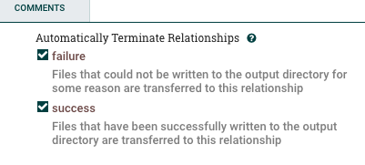
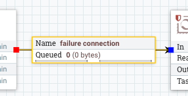

====================
Kylo Templates Guide
====================

Templates facilitate the creation of data flows. They can be:

- normal (1 template for the whole flow)

- reusable (1 reusable template and 1 flow template)

.. important::
   More on `reusable flows here <../tips-tricks/KyloBestPractices.html#use-reusable-flows>`_

Setup templates
===============

Import Kylo template
--------------------

1. Import template from file

2. Select file

3. Select overwrite + replace the reusable template option

4. Register the template

.. note::
   The following sections apply only if you didn't import yet a template in Kylo, or are lacking a Kylo template archive.

Import reusable template
-------------------------

1. Import template from file.

.. warning::
   You can't import the reusable template from NiFi environment, as it has input/output ports which need to be connected.

2. Select file and select overwrite + replace the reusable template option

3. Register the template

Import flow template
--------------------

1. Import template from NiFi environment (as we want to customize it)

2. Enable/Customize the available fields (steps 2 - 4)

3. Under `Connection Options` (step 5) - connect the output ports from the flow template to the input ports from reusable template

4. Customize the `Feed Lineage Datasources`

5. Register the template

Update template
===============

1. Remember the template name <template_name> from NiFi

2. Create a new flow from the template <template_name>

3. Modify your flow for <template_name>

4. Delete <template_name> in NiFi template registry

5. Save flow with name <template_name>

6. In Kylo (if exists), from the Template menu, go through the edit wizard (click on the template name), so that it's reinitialized properly

Indicating Flow Failures
========================

When Data is sent to Kylo Operations Manager it indicates if the flow file has been successful or has failed.  Failures are indicated two ways

1. When the flow file passes through an 'Auto terminate on failure' relationship.
   In a processor in NiFi if you check the box 'Auto terminate on failure'  and the flow file passes through this relationships and fails it will send the failure message to Kylo Operations Manager and fail the job/step.

   |auto_terminate_failure_image|

2. If the NiFi connection has the word 'failure' in it and the flow files pass through that connection.  The 'failure' connection name will be automatically applied by NiFi if you have a 'failure' relationship between your two processors. You can right click on a connection and edit it and change the name to include the word 'failure' if you want to always ensure that flow files which travel along that path fail the job in Kylo.

   |failure_connection_image|

Additionally if you manually 'Empty the Queue' in NiFi it will fail those corresponding jobs in Kylo.

Available templates
===================

Kylo provides some ready to be used templates in the `Kylo repository <https://github.com/Teradata/kylo/tree/master/samples/templates>`_

Data Ingest
-----------

Data Ingest template is used to import data from with various formats (CSV, JSON, AVRO, Parquet, ORC) into Hive tables.

S3
**
:doc:`../how-to-guides/S3DataIngestTemplate`

JSON
****

There is a limitation with the JSON file format:

1. Ensure 'skip header' is turned OFF. This will allow all of the JSON data in file to be processed. Otherwise the first record will be skipped.

2. Ensure that this jar file is provided to the Validator step via the 'Extra JARs' parameter (HDP location shown for reference): /usr/hdp/current/hive-webhcat/share/hcatalog/hive-hcatalog-core.jar. Otherwise, an exception will be thrown: "java.lang.ClassNotFoundException Class org.apache.hive.hcatalog.data.JsonSerDe not found"

3. The JSON data in the file should be on one row per line. 

Example:
.. code-block::

    {"id":"978-0641723445","cat":["book","hardcover"],"name":"The Lightning Thief","author":"Rick Riordan","series_t":"Percy Jackson and the Olympians","sequence_i":1,"genre_s":"fantasy","inStock":true,"price":12.50,"pages_i":384} {"id":"978-1423103349","cat":["book","paperback"],"name":"The Sea of Monsters","author":"Rick Riordan","series_t":"Percy Jackson and the Olympians","sequence_i":2,"genre_s":"fantasy","inStock":true,"price":6.49,"pages_i":304}

..

Data Transformation
-------------------

Data Transformation is used to transform/wrangle data with various operations from Spark ML.

Several tables can be taken from a data source and be joined, denormalized or transformed together, to result a new data table.

Accesing S3 and other distributed filesystems
*********************************************

:doc:`../how-to-guides/AccessingS3fromtheDataWrangler`

Repository
==========
Repository allows automatic import of templates and feeds via Kylo UI by going to Admin -> Repository. Repository is a directory where templates and feeds (.zip files) are located. Kylo must have read/write access to repository location so that templates/feeds can be imported or published. Kylo monitors all the repositories for any new template or feed and displays them in UI.

Import Template
---------------
- Go to Admin -> Repository
- Select the repository from drop down
- Click 'Import' to import or update the template.

Publish Template
----------------
- Open any of the registered templates. 
- Click on Publish.
- Select the repository to publish to.
- Go to Admin -> Repository to verify the template has been published.

Configure multiple repositories
-------------------------------
Edit repositories.json under kylo-services/config folder to configure multiple repositories. Modifying this file requires kylo-services restart.
::
    {"name": "Repository name", "readOnly": false, "location": "sample/feeds", "icon":"", "type":"FileSystem"}

Above is an example line from repositories.json file.
- name: Name of repository to be displayed on UI.
- readOnly: Templates can be imported from this repository, but cannot be published here.
- location: directory reachable by Kylo.
- icon: Icon to represent the repository.
- type: Templates or feeds will be read from filesystem. Only filesystem is supported as of now, more possibilities may be added in the future.

Updates and update comments
---------------------------
- When a user has modified a registered template, they can can now enter a brief description of the change before saving the template. When the user logs in to Kylo UI, a notification is displayed in top right corner if any of the registered templates have an update available.
- The 'Registered templates' view in Kylo UI now shows 'Update available' notification when a new update is available for the template.
- In repository, when an update is available, clicking on 'View updates' shows when and what has changed in the template.

An internal cache is maintained to track template updates. In cluster mode, this cache needs to be refreshed. Add expire.repository.cache=true in application.properties to enable this cache auto refresh.
