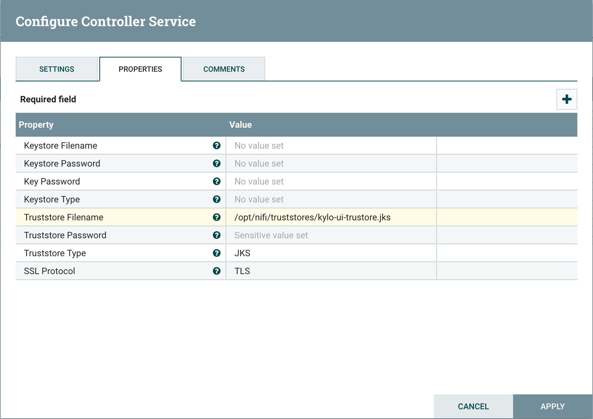
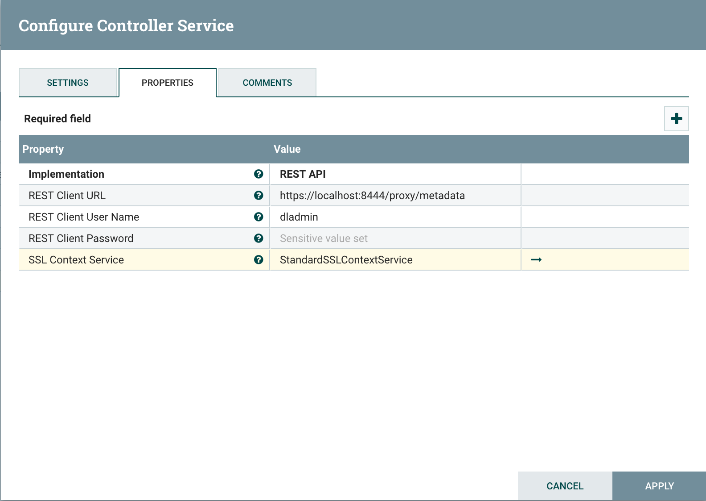

===============
Kylo UI and SSL
===============

Overview
--------

This guide provides details on what configuration changes are required to enable Kylo UI to use SSL.
Broadly the changes will be two-fold:

    1. Changes to Kylo UI
    2. Changes to Nifi

1. Changes to Kylo UI
---------------------

1.1 Create Self-Signed Certificate in a Keystore
~~~~~~~~~~~~~~~~~~~~~~~~~~~~~~~~~~~~~~~~~~~~~~~~

Lets assume you are in a development mode and you want to try out Kylo UI on SSL. You will need a
self-signed certificate which is stored in a keystore. Make note of kylo-ui.jks path, we will refer
to it in following section when updating Kylo UI properties.

If you are in production you would have your certificate issued by a trusted certificate authority.
You can then import it to your keystore.

.. code-block:: shell

    mkdir /opt/kylo/ssl

    # Generate keys and keystore
    keytool -genkeypair -alias kylo-ui -dname cn=kylo-ui -validity 10000 -keyalg RSA -keysize 2048 -keystore kylo-ui.jks -keypass changeit -storepass changeit

    # Create certificate sign request
    keytool -certreq -alias kylo-ui -file localhost.csr -keystore kylo-ui.jks -keypass changeit -storepass changeit

    # Create certificate
    keytool -gencert -alias kylo-ui -infile localhost.csr -outfile localhost.crt -ext SubjectAlternativeName=dns:localhost -keystore kylo-ui.jks -keypass changeit -storepass changeit

    # Import certificate into keystore
    keytool -importcert -alias kylo-ui -file localhost.crt -keystore kylo-ui.jks -keypass changeit -storepass changeit

    chown -R kylo /opt/kylo/ssl
..

1.2 Kylo UI Application Properties
~~~~~~~~~~~~~~~~~~~~~~~~~~~~~~~~~~

Add following properties to /opt/kylo/kylo-ui/conf/application.properties. Change port to your liking and
update path to keystore 'kylo-ui.jks' we generated in previous section.

.. code-block:: shell

    server.ssl.enabled=true
    server.port=8444
    server.ssl.key-store=/opt/kylo/ssl/kylo-ui.jks
    server.ssl.key-store-password=changeit
    server.ssl.key-store-type=jks
    server.ssl.key-alias=kylo-ui

..

1.3 Restart Kylo UI
~~~~~~~~~~~~~~~~~~~

You can now restart Kylo UI and browse to https://localhost:8444/ops-mgr/index.html .
Note protocol an port number have changed from default configuration and now are HTTPS and 8444 respectively.
Since we are using a self-signed certificate expect browsers to complain about inadequate security, but
that's ok for development purposes.

.. code-block:: shell

    service kylo-ui restart

..

2. Changes to Nifi
------------------

2.1 Import Kylo UI's Certificate into a Truststore
~~~~~~~~~~~~~~~~~~~~~~~~~~~~~~~~~~~~~~~~~~~~~~~~~~

You can either import Kylo UI's certificate 'localhost.crt' we generated at step `1.1 Create Self-Signed Certificate in a Keystore`_
into a new truststore or, if you are in a hurry, simply re-use Kylo UI's keystore as Nifi's truststore.

Lets create a new truststore and import the cert to keep things clean. Make sure 'nifi' user has access to this truststore, e.g.
keep the truststore in /opt/nifi/data/ssl directory which belongs to 'nifi' user.

.. code-block:: shell

    mkdir /opt/nifi/data/ssl

    # Import certificate into keystore
    keytool -importcert -alias kylo-ui -file localhost.crt -keystore kylo-ui-truststore.jks -keypass changeit -storepass changeit

    chown -R nifi /opt/nifi/data/ssl

..

2.2 Setup StandardSSLContextService in Nifi
~~~~~~~~~~~~~~~~~~~~~~~~~~~~~~~~~~~~~~~~~~~

There are two places where you need to add StandardSSLContextService in Nifi. One on root level next to all other controller services
and one in controller services next to Kylo Reporting Task. See :doc:`NiFiKyloProvenanceReportingTask` on what Reporting Task is.

Set following properties on SSL Context Service:

:Truststore Filename: /opt/nifi/data/ssl/kylo-ui-truststore.jks
:Truststore Password: changeit
:Truststore Type: JKS

|image1|

2.3 Update MetadataProviderSelectorService
~~~~~~~~~~~~~~~~~~~~~~~~~~~~~~~~~~~~~~~~~~

Just like StandardSSLContextService you will need to update two instances of MetadataProviderSelectorService, one at root level and
one next to Kylo Reporting Task.

Set following properties on MetadataProviderSelectorService, making sure host and port correspond to where Kylo UI is running:

:REST Client URL: https://localhost:8444/proxy/metadata
:SSL Context Service: StandardSSLContextService

|image2|

