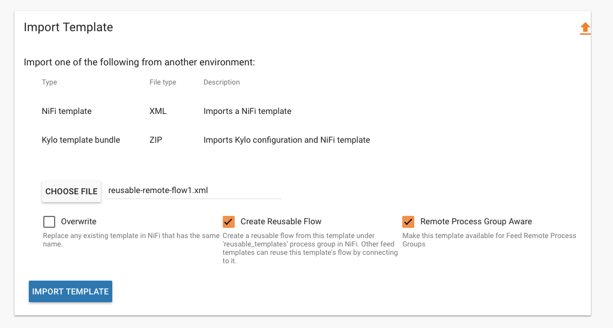
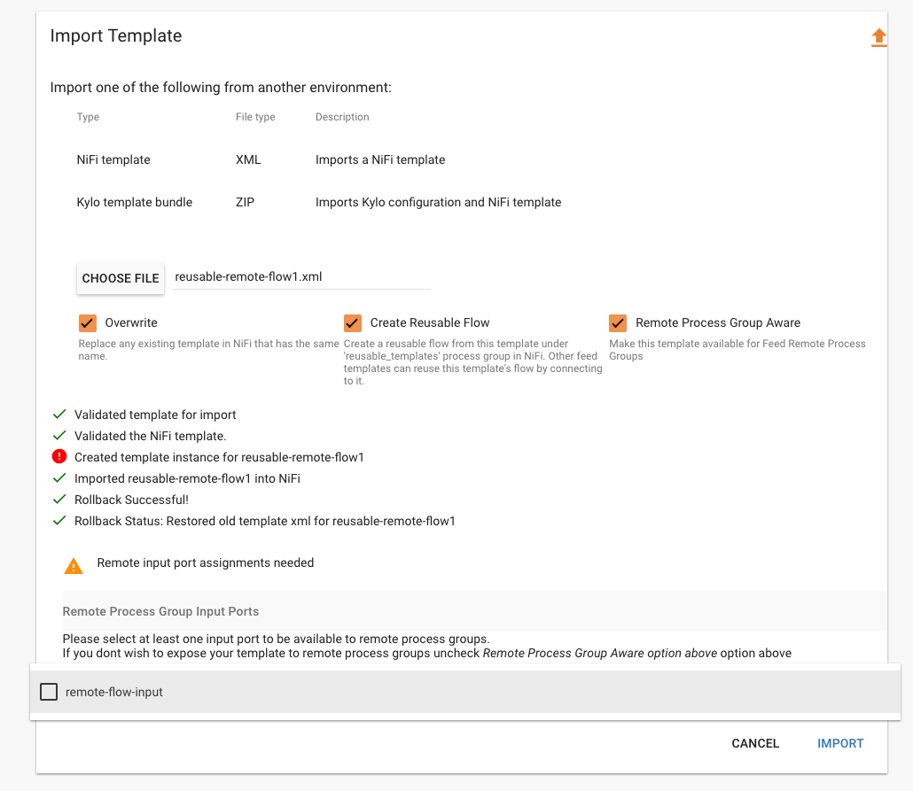
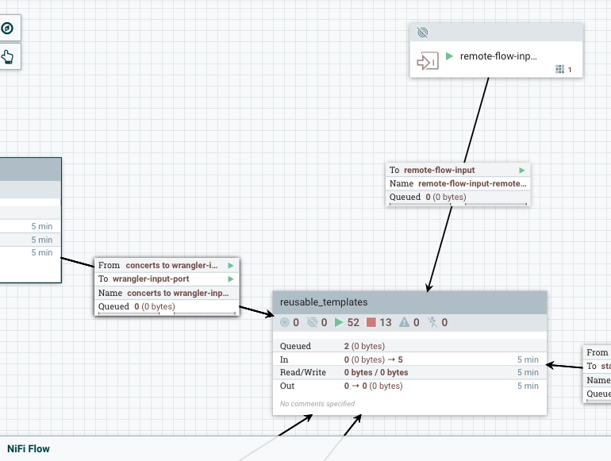
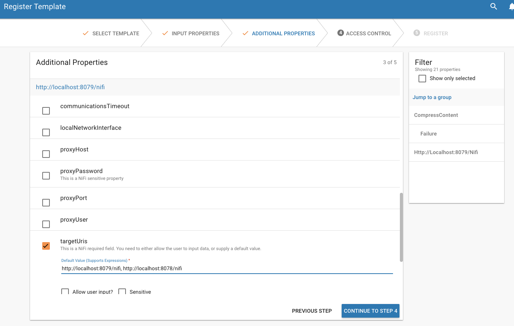
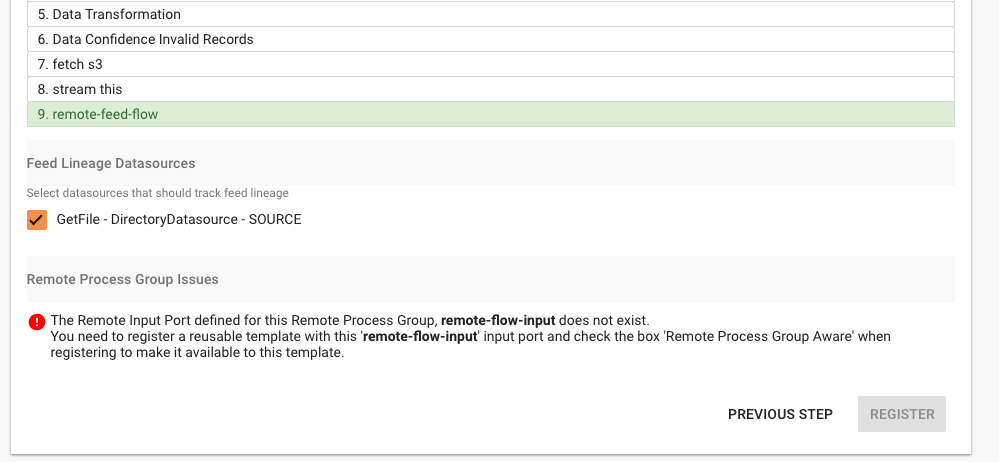
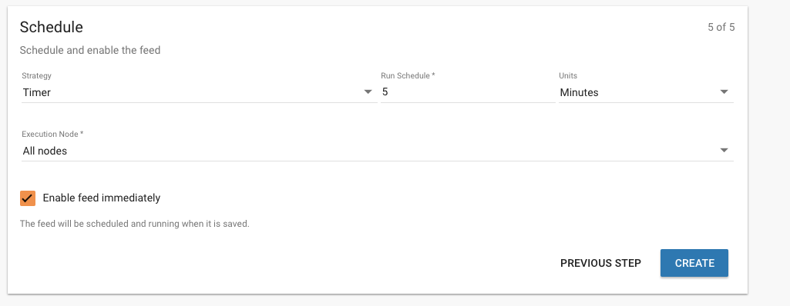

Remote Process Groups
=====================
Kylo supports Remote Process Groups starting with Kylo 0.9.1.  Remote Process Group's allow flows to transfer data from one NiFi instance to another.  This is useful when you want to parallelize leverage more processing in your NiFi Cluster.

Kylo allows you to link a given Feed Template http://kylo.readthedocs.io/en/latest/tips-tricks/KyloBestPractices.html#template-re-use that has a Remote Process Group to any reusable template http://kylo.readthedocs.io/en/latest/tips-tricks/KyloBestPractices.html#reusable-flows in your NiFi cluster.

Flows that use `Remote Process Group's` require two templates
 1. A reusable flow with an Input Port
 2. A feed template that contains the Remote Process Group. Once registered with Kylo this template will be able to transfer its running flow data to another NiFi node

Remote Process Group configuration options exist with you either have NiFi clustered, or if you set the following `kylo-services/conf/application.properties` property to true:

  .. code-block:: properties

    # By default Kylo will allow you to use Remote Process groups and reusable flows only in a NiFi clustered environment.
    # Set this property to true if you want to use kylo with remote process groups in a non NiFi clustered environment.
    # This will provide additional options when registering the reusable template in kylo.
    kylo.template.remote-process-groups.enabled=true

  ..

If you have a NiFi clustered or the property aboe set to true then when you register a `Reusable Template` you will see a third option `Remote Process Group Aware` appear when you are importing the template.
NiFi Remote Process Groups work by connecting the Remote Process Group to a specific `Input Port` that is located on the root NiFi Flow canvas.
When you check this box Kylo will import the flow, create the reusable instance, and also create the Remote Input Port on the root NiFi Flow canvas that connect to this reusable flow instance.

|image1|

Upon importing the reusable template you will be prompted to select the input ports from the flow that you wish to make available for the Remote Process Group(s) in the feed templates.

|image2|

The Input Port's you select will be created as Remote Input Ports on the root NiFi Flow canvas and connect into this reusable template

|image3|

Once you have the reusable template created with the Remote Input Port you can then import the feed template with the Remote Process Group that connects to the Remote Input Port.
During registration of the Feed Template the `Additional Inputs` step will have your Remote Process Group(s) visible and let you modify the properties.  This is where you can change the targetUris, username, transport protocol, etc.

|image4|

When you are registering the template it will validate to ensure it is able to make the connection from the Remote Process Group(s) to its connecting input port.
If it's not able to make the connection it will notify you with an error message.

|image5|

Now that the two templates are registered and wired to communicate with each other you can start creating feeds.

|image6|

Useful Links
~~~~~~~~~~~~
Please refer to the following links to obtain more information about Remote Process Groups

https://community.hortonworks.com/articles/16461/nifi-understanding-how-to-use-process-groups-and-r.html

