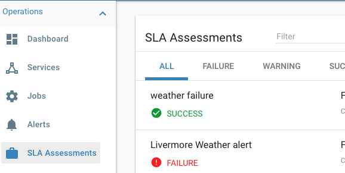
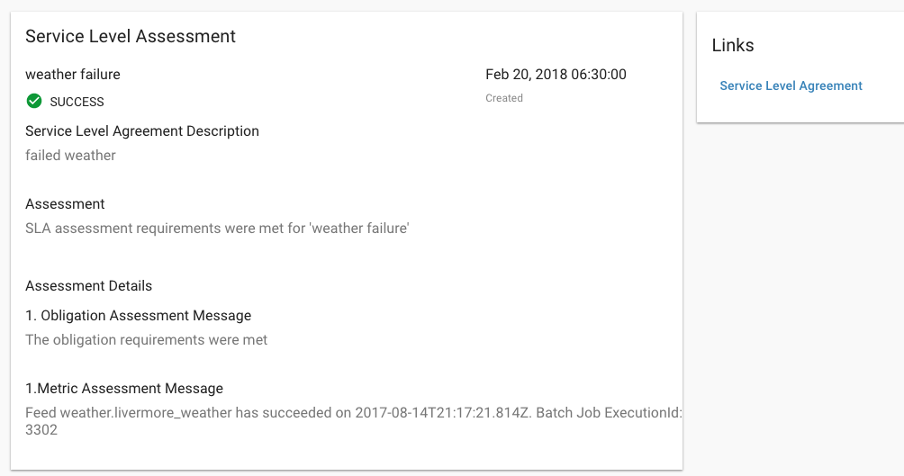
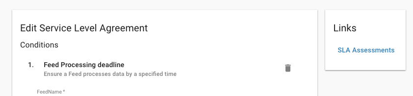
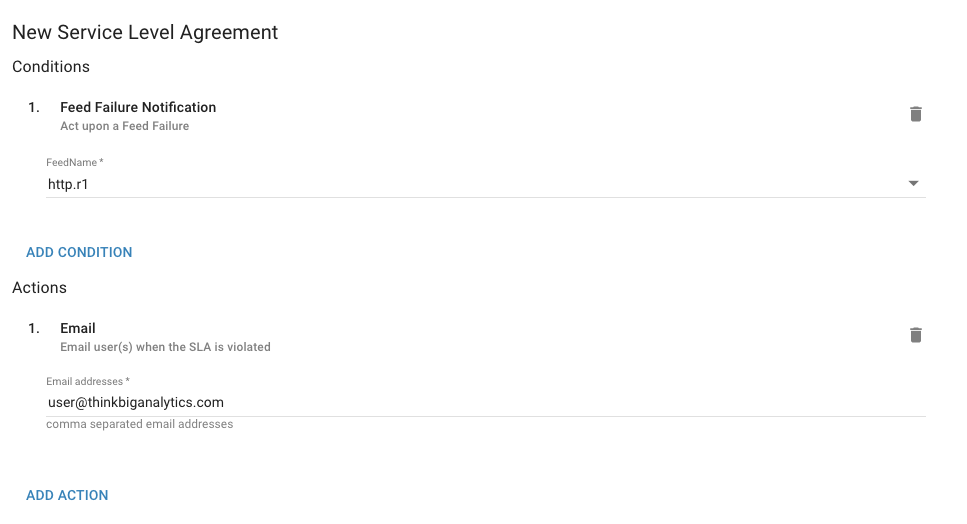
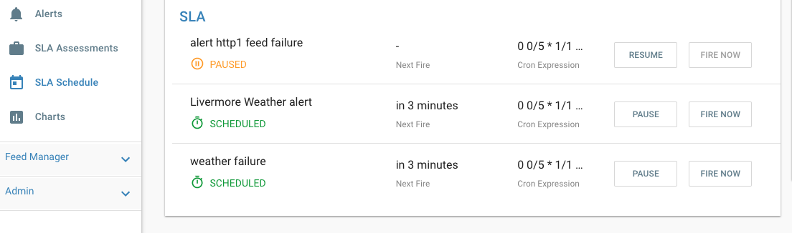
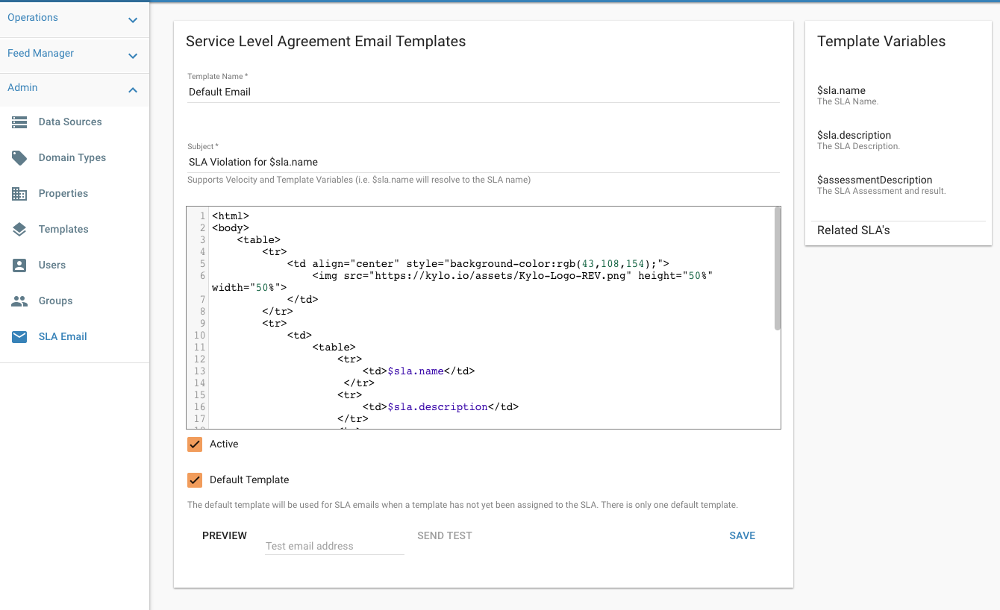
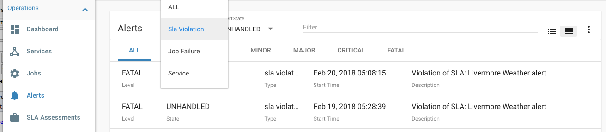

Service Level Agreements (SLA)
==============================

Creating a new SLA
------------------

There are two ways you can create an SLA

The feed SLA tab
~~~~~~~~~~~~~~~~
 1. Click on a Feed
 2. Click on the SLA Tab
 3. Click Add SLA

The SLA side navigation link
~~~~~~~~~~~~~~~~~~~~~~~~~~~~
1. Click on the SLA link
2. Click the (+) to add a new SLA

An SLA is made up of 3 parts, ``Conditions`` and ``Actions``, and a ``Description``  Both the ``Conditions`` and ``Actions`` are plugins to Kylo and you can develop your own custom ones.  To learn more view the :ref:`Developer Guide <dev_guide>` below.

.. _conditions:

Conditions
``````````
   An SLA starts with 1 or more conditions.  These are things you wish Kylo to Check or do as part of your SLA.  If any of these conditions are violated then the :ref:`Actions <actions>` associated with this SLA will get called.
   Kylo comes with 2 default conditions  (again you can create new ones via a plugin)
     - Feed Processing Deadline
         This allows you to select a feed and define when you expect data to arrive for that feed in the form of a cron expression (i.e. Every day at 12pm).  If Kylo doesnt get data for the feed by the specified time then it will be an SLA violation and Kylo will call the associated actions.
         **Note:** For help in writing cron expressions refer to the website http://cronmaker.com.

      - Feed Failure Notification
          This allows you to be notified if a feed fails.  When a failure is detected it is considered a violation of the SLA and will call the associated actions


  **Note:** You can chain multiple conditions together.  An SLA with multiple conditions will only fire its respective Actions if all the conditions are met.


.. _actions:

Actions
```````
     Actions are called if the :ref:`conditions <conditions>` are met.  The default action is to always generate an :ref:`alert <sla_alerts>` in operations manager.  Additional actions can be added.  Kylo comes with 2 default actions.  **Note:** These need to be installed by the Kylo administrator into the ``kylo-services/plugin`` folder.  (again you can create new/custom SLA actions via a plugin)

     - Email
         Kylo will send an email to a user or set of users.  Details can be found :ref:`here <sla_email>`.

     - Jira
         Kylo will create a JIRA issue.

.. _description:

Description
```````````
  All SLA's require a name and description.  These fields are auto populated based upon the users Conditions/Actions, however you are free to change this to whatever you like.


SLA Schedule
------------

  All SLA's are assessed the same schedule.  This is defined in the kylo-services application.properties file, defaulting to every 5 minutes.

  .. code-block:: properties

    ## how often should SLAs be checked
    sla.cron.default=0 0/5 * 1/1 * ? *

  ..

 You always choose to manually assess an SLA in Kylo -> Operations -> SLA Schedule and click the ``Fire Now`` button

  |image4|

SLA Assessment
--------------
When an SLA is assessed, it will use/derive values that define the uniqueness of that assessment and determine if it is a new violation to generate an alert and email or not.

For example the ``Feed Processing Deadline`` condition identifies the uniqueness by the feed, and the expected date.

Kylo will assess the SLA and see if it passes/fails.
 - If it fails the SLA it will determine if the failure is new based upon the unique properties resolved for that SLA (as described above)
 - If this failure is new it will create the new Alert and then call the SLA violation actions (i.e. email, jira, etc).
 - If the failure already has an alert associated with it that is Unhandled it will not generate a new alert/violation.

All assessments are persisted in Kylo's metastore and can be queried from the ``SLA Assessments`` link, or from the ``SLA``.

   |image0|

   |image2|


Clicking into an assessment lets you see its details and why it failed/succeeded.  Each assessment also lets you navigate back to the actual SLA from the right panel.

   |image1|


.. _sla_alerts:

Alerts
------

All SLA violations will generate an alert in Kylo.  Alerts can be viewd under the Operations section and filtered to just show ``SLA Violation`` alerts.

  |image6|

Clicking into an alert shows its detail and lets you navigate back to the assessment that generated this alert.


.. _sla_email:

SLA Email
---------

Installation and Configuration
~~~~~~~~~~~~~~~~~~~~~~~~~~~~~~

     If you use the kylo rpm installation the email plugin can be found in the ``/opt/kylo/setup/plugins/sla-email``.
     1. Copy the kylo-sla-email-VERSION.jar to the ``/opt/kylo/kylo-services/plugin`` folder
     2. Copy and configure the ``sla.email.properties`` to the ``/opt/kylo/kylo-services/conf`` folder.   Below is an example set of properties that connects to gmail.  Modify this file with your email settings

        .. code-block:: properties

            sla.mail.protocol=smtp
            sla.mail.host=smtp.gmail.com
            sla.mail.port=587
            sla.mail.smtpAuth=true
            sla.mail.starttls=true
            ## optional properties
            ##sla.mail.sslEnable=true
            ##sla.mail.smptAuthNtmlDomain=
            ##replace value below with a valid email address. this is the from email that will appear when a user receives a sla violation email
            sla.mail.from=sla-violation@thinkbiganalytics.com
            ##replace value below with a valid email address that will use the sla.mail.host above
            sla.mail.username=user@gmail.com
            ##replace with a valid password for the email address assigned above
            sla.mail.password=
            ## debug flag
            sla.mail.debug=false
        ..

      3.  Once you do this and modify the jar/properties a restart of kylo-services is required.  It will then be available as an Action when creating the SLA

       |image3|


Email Templates
~~~~~~~~~~~~~~~
     As of Kylo 0.8.4.1 SLA email templates can be customized in Kylo using the Admin -> SLA Email.

    |image5|

    This lets you craft an email template.  Assessment variables will be injected into the email.  You can preview in the browser and also send a test email to verify the template prior to saving.

.. _dev_guide:

Developer Guide
---------------
SLA Conditions and Actions are pluggable and Kylo lets you create your own by writing a Java Plugin.
Details on how to do this can be found here: https://github.com/Teradata/kylo/tree/master/core/sla

You can also use the default sla-email plugin provided by Kylo as an example:
https://github.com/Teradata/kylo/tree/master/plugins/sla-email














