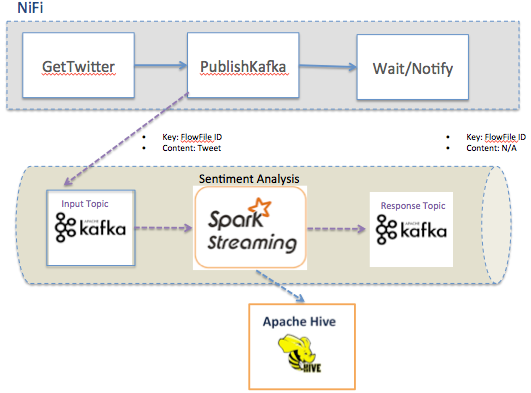
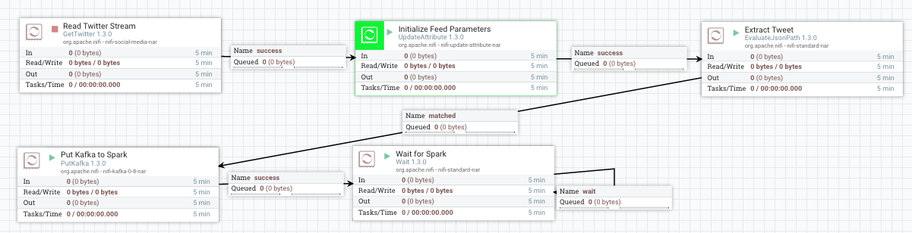

========================================================
Twitter Sentiment with Kafka and Spark Streaming Tutorial
========================================================

About
~~~~~

This tutorial will enable Kylo to perform near real-time sentiment analysis for tweets. Our Kylo template will enable user self-service to configure new feeds for sentiment analysis. The user will simply enter the list of twitter keywords to analyze (e.g. famous list of music artists).  Tweets will be classified as positive, negative, or neutral based on analysis of the text. The tweet and sentiment results will be written to Hive. We will be able to monitor the streaming process in the Kylo Ops Manager module and explore the results.  

How it Works
~~~~~~~~~~~~

Once the user configures the new feed in Kylo, a pipeline will be generated in Apache NiFi.  Tweet text will be extracted and published to a Kafka topic. A Spark streaming job will consume the message tweet from Kafka, performs sentiment analysis using an embedded machine learning model and API provided by the `Stanford NLP project
<https://stanfordnlp.github.io/CoreNLP>`_. The Spark streaming job then inserts result into Hive and publishes a Kafka message to a Kafka response topic.  

In order to track processing though Spark, Kylo will pass the NiFi flowfile ID as the Kafka message key.  Kylo passes the FlowFile ID to Spark and Spark will return the message key on a separate Kafka response topic.  The latter utilizes the new Notify and Wait processors in NiFi 1.3.0+ which we will introduce with this tutorial. 

Prerequisites
~~~~~~~~~~~~~~~~

The Kylo sandbox contains everything needed to run this tutorial but you will need to create a Twitter account and application in order to connect to Twitter. You will specifically need the access and secret tokens and keys for your Twitter application.

1. Download the latest `Kylo sandbox
<https://kylo.io/quickstart.html>`_.

2. Create a `twitter application
<http://docs.inboundnow.com/guide/create-twitter-application/>`_.  

Starter template
~~~~~~~~~~~~~~~~

A starter template for using the processor is provided at:

.. code-block:: shell

    samples/templates/nifi-1.0/template-starter-sqoop-import.xml

..

Configuration
~~~~~~~~~~~~~

For use with Kylo UI, configure values for the two properties (**nifi.service.<controller service name in NiFi>.password**, **config.sqoop.hdfs.ingest.root**) in the below section in the properties file: **/opt/kylo/kylo-services/conf/application.properties**

.. code-block:: shell

    ### Sqoop import
    # DB Connection password (format: nifi.service.<controller service name in NiFi>.password=<password>
    #nifi.service.sqoop-mysql-connection.password=hadoop
    # Base HDFS landing directory
    #config.sqoop.hdfs.ingest.root=/sqoopimport

..

.. note:: The **DB Connection password** section will have the name of the key derived from the controller service name in NiFi. In the above snippet, the controller service name is called **sqoop-mysql-connection**.

Drivers
~~~~~~~

Sqoop requires the JDBC drivers for the specific database server in order to transfer data. The processor has been tested on MySQL, Oracle, Teradata and SQL Server databases, using Sqoop v1.4.6.

The drivers need to be downloaded, and the .jar files must be copied over to Sqoop’s /lib directory.

As an example, consider that the MySQL driver is downloaded and available in a file named: **mysql-connector-java.jar.**

This would have to be copied over into Sqoop’s /lib directory, which may be in a location similar to: **/usr/hdp/current/sqoop-client/lib.**

The driver class can then be referred to in the property **Source Driver** in **StandardSqoopConnectionService** controller service
configuration. For example: **com.mysql.jdbc.Driver.**

.. tip:: Avoid providing the driver class name in the controller service configuration. Sqoop will try to infer the best connector and driver for the transfer on the basis of the **Source Connection String** property configured for **StandardSqoopConnectionService** controller service.

Passwords
~~~~~~~~~

The processor's connection controller service allows three modes of providing the password:

1. Entered as clear text
2. Entered as encrypted text
3. Encrypted text in a file on HDFS

For modes (2) and (3), which allow encrypted passwords to be used, details are provided below:

Encrypt the password by providing the:

a. Password to encrypt

b. Passphrase

c. Location to write encrypted file to

The following command can be used to generate the
encrypted password:

.. code-block:: shell

  #!/bin/bash

  #extract script file then shift remaining args will be pased to scala script
  arg_count="$#"
  command=$1
  app_name=$2
  scala_file=$3
  shift 3
  arguments=$@

  export SPARK_MAJOR_VERSION=2
  spark_regex=".*SparkSubmit.*\s$app_name.*"

  start() {
      if [ "$arg_count" -lt 10 ]; then
         echo "Illegal parameters. Usage ./stream-submit-kafka.sh start sentiment-app path/to/script.scala {window secs} {hive table} {twitter keywords,comma-delim} {kafka read topic} {kafka write topic} {broker} {zookeeper} {kafka group}
         echo "Example: ./stream-submit-kafka.sh start sentiment-app /opt/spark-receiver/sentiment-job-kafka.scala 15 sentiment_17 @ArianaGrande,@justinbieber,@MileyCyrus topicC topicB sandbox.kylo.io:6667 sandbox.kylo.io:2181 groupA
         exit 1
      fi
     echo "Starting process $app_name with $arguments"
     if pgrep -f "$spark_regex" > /dev/null
     then
         echo "$app_name already running"
     else
         nohup spark-shell --name "$app_name" --master local[2] --deploy-mode client \
          --queue default \
          --driver-memory 4G --executor-memory 4G \
          -i <(echo 'val args = "'$arguments'".split("\\s+")' ; cat $scala_file) &> $app_name.out &
     fi
  }

  stop() {
      if [ "$arg_count" -lt 2 ]; then
         echo "Illegal parameters. Usage ./stream-submit.sh kill appName"
         exit 1
      fi
      if pgrep -f "$spark_regex" > /dev/null
      then
         echo "Killing $app_name"
         pkill -f "$spark_regex"
      else
         echo "$app_name not running"
     fi
  }

  status() {
      if [ "$arg_count" -lt 2 ]; then
         echo "Illegal parameters. Usage ./stream-submit.sh status appName"
         exit 1
      fi

     if pgrep -f "$spark_regex" > /dev/null
          then echo "$app_name running"
          else echo "$app_name not running"
     fi
  }
    
  case "$command" in
      status)
          status
      ;;
      start)
          start
      ;;
      stop)
          stop
      ;;
      restart)
         echo "Restarting $app_name"
         stop
         sleep 2
         start
         echo "$app_name started"
      ;;
       *)
         echo $"Usage: $0 {start|stop|restart|status|"
         exit 1
  esac
  exit 0

..

The above utility will output a base64 encoded encrypted password, which can be entered directly in the controller service configuration
via the **SourcePassword** and **Source Password Passphrase** properties (mode 2).

The above utility will also output a file on disk that contains the encrypted password. This can be used with mode 3 as described below:

Say, the file containing encrypted password is named: **/user/home/sec-pwd.enc.**

Put this file in HDFS and secure it by restricting permissions to be only read by **nifi** user.

Provide the file location and passphrase via the **Source Password File** and **Source Password Passphrase** properties in
the **StandardSqoopConnectionService** controller service configuration.

During the processor execution, password will be decrypted for modes 2 and 3, and used for connecting to the source system.

TriggerFeed
-----------

Trigger Feed Overview
~~~~~~~~~~~~~~~~~~~~~

In Kylo, the TriggerFeed Processor allows feeds to be configured
in such a way that a feed depending upon other feeds is automatically
triggered when the dependent feed(s) complete successfully.

Obtaining the Dependent Feed Execution Context
~~~~~~~~~~~~~~~~~~~~~~~~~~~~~~~~~~~~~~~~~~~~~~

|image16|

To get dependent feed execution context data, specify the keys that you
are looking for. This is done through the "Matching Execution Context
Keys" property. The dependent feed execution context will only be
populated the specified matching keys.

For example:

    Feed_A runs and has the following attributes in the flow-file as it
    runs:

.. code-block:: properties

     -property.name = "first name"
     -property.age=23
     -feedts=1478283486860
     -another.property= "test"

..

    Feed_B depends on Feed A and has a Trigger Feed that has "Matching
    Execution Context Keys" set to "property".

    It will then get the ExecutionContext for Feed A populated with 2
    properties:

.. code-block:: shell

    "Feed_A":{property.name:"first name", property.age:23}

..

Trigger Feed JSON Payload
~~~~~~~~~~~~~~~~~~~~~~~~~

The FlowFile content of the Trigger feed includes a JSON string of the
following structure:

.. code-block:: javascript

  {
    "feedName":"string",
    "feedId":"string",
    "dependentFeedNames":[
        "string"
        ],
        "feedJobExecutionContexts":{

        },
        "latestFeedJobExecutionContext":{

        }
   }

..

JSON structure with a field description:

.. code-block:: javascript

  {
     "feedName":"<THE NAME OF THIS FEED>",
     "feedId":"<THE UUID OF THIS FEED>",
     "dependentFeedNames":[<array of the dependent feed names],
     "feedJobExecutionContexts":{<dependent_feed_name>:[
  {
  "jobExecutionId":<Long ops mgr job id>,
              "startTime":<millis>,
              "endTime":<millis>,
              "executionContext":{
  <key,value> matching any of the keys defined as being "exported" in
  this trigger feed
              }
           }
        ]
     },
     "latestFeedJobExecutionContext":{
        <dependent_feed_name>:{  
          "jobExecutionId":<Long ops mgr job id>,
              "startTime":<millis>,
              "endTime":<millis>,
              "executionContext":{
  <key,value> matching any of the keys defined as being "exported" in
  this trigger feed
              }
  }
  }
  }

..

Example JSON for a Feed:

.. code-block:: javascript

  {
     "feedName":"companies.check_test",
     "feedId":"b4ed909e-8e46-4bb2-965c-7788beabf20d",
     "dependentFeedNames":[
        "companies.company_data"
     ],
     "feedJobExecutionContexts":{
        "companies.company_data":[
           {
              "jobExecutionId":21342,
              "startTime":1478275338000,
              "endTime":1478275500000,
              "executionContext":{
              }
           }
        ]
     },
     "latestFeedJobExecutionContext":{
        "companies.company_data":{
           "jobExecutionId":21342,
           "startTime":1478275338000,
           "endTime":1478275500000,
          "executionContext":{
          }
       }
    }
 }

..

Example Flow
~~~~~~~~~~~~

The screenshot shown here is an example of a flow in which the inspection of the payload triggers dependent feed data.

|image17|

The EvaluateJSONPath processor is used to extract JSON content from the flow file.

Refer to the Data Confidence Invalid Records flow for an example:
|data_confidence_invalid_records_link|

.. |data_confidence_invalid_records_link| raw:: html

   <a href="https://github.com/KyloIO/kylo/blob/master/samples/templates/nifi-1.0/data_confidence_invalid_records.zip" target="_blank">https://github.com/KyloIO/kylo/blob/master/samples/templates/nifi-1.0/data_confidence_invalid_records.zip</a>

