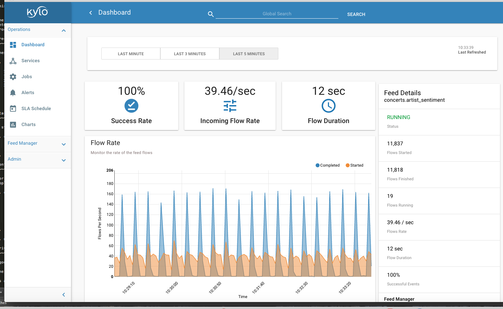

========================================================
Twitter Sentiment with Kafka and Spark Streaming Tutorial
========================================================

About
~~~~~

This advanced tutorial will enable Kylo to perform near real-time sentiment analysis for tweets. Our Kylo template will enable user self-service to configure new feeds for sentiment analysis. The
user will simply enter the list of twitter keywords to analyze (e.g. famous list of music artists).  Tweets will be classified as positive, negative, or neutral based on analysis of the text. The tweet and sentiment results will be written to Hive. We will be able to monitor the streaming process in the Kylo Ops Manager module and explore the results.

How it Works
~~~~~~~~~~~~

Once the user configures the new feed in Kylo, a pipeline will be generated in Apache NiFi.  The tweet text will be extracted and published to a Kafka topic. A Spark streaming job will consume the
message tweet from Kafka, performs sentiment analysis using an embedded machine learning model and API provided by the `Stanford NLP project
<https://stanfordnlp.github.io/CoreNLP>`_. The Spark streaming job then inserts result into Hive and publishes a Kafka message to a Kafka response topic monitored by Kylo to complete the flow.

In order to track processing though Spark, Kylo will pass the NiFi flowfile ID as the Kafka message key.  Kylo passes the FlowFile ID to Spark and Spark will return the message key on a separate Kafka response topic.  The latter utilizes the new Notify and Wait processors in NiFi 1.3.0+ which we will introduce with this tutorial. 

Prerequisites
~~~~~~~~~~~~~

1. Download the latest `Kylo sandbox <https://kylo.io/quickstart.html>`_. This tutorial requires NiFi 1.3.

2. Install/enable Kafka (if needed)

3. Create a `twitter application account
<http://docs.inboundnow.com/guide/create-twitter-application>`_.  and document your consumer key/secret and access token/secret pairs.

4. Download Stanford `corenlp libraries
<https://stanfordnlp.github.io/CoreNLP>`_. The specific library files are shown in the Spark configuration section (below). This tutorial used v3.7.0.

5. Download and build this useful `Twitter Sentiment analysis utility
<https://github.com/vspiewak/twitter-sentiment-analysis>`_. The specific library files needed are shown in the Spark configuration section (below).

Configuration
~~~~~~~~~~~~~

Your Twitter consumer key/secret and access token/secret pairs are needed in order to provision the template with the correct Twitter credentials.  Add the following block to your Kylo application
.properties file (typically located in /opt/kylo/kylo-services/conf/application.properties). Note that Kylo will automatically injects these properties into the NiFi pipeline when a new feed is
provisioned:

.. code-block:: shell

    ### Twitter
    nifi.gettwitter.consumer_key={REPLACE_WITH_YOUR_TWITTER_CONSUMER_KEY}
    nifi.gettwitter.consumer_secret={REPLACE_WITH_YOUR_TWITTER_CONSUMER_SECRET}
    nifi.gettwitter.access_token={REPLACE_WITH_YOUR_TWITTER_ACCESS_TOKEN}
    nifi.gettwitter.access_secret={REPLACE_WITH_YOUR_TWITTER_ACCESS_SECRET}

..

Restart Kylo after applying changes to the property file.

Spark Configuration
~~~~~~~~~~~~~~~~~~~

The following JARs need to be available on the Spark2 classpath. There are different ways to achieve this but one way is to simply modify the /etc/spark2/conf/spark-defaults.conf as shown here:

.. code-block:: shell

    # Add to /etc/spark2/conf/spark-defaults.conf
    spark.driver.extraClassPath /path/to/lib.jar:/path/to/lib2.jar:/path/to/lib3.jar

..

The extra classpath libraries needed will depend on your specific Hadoop and Kafka installation. The following are required jar files for readability:

.. code-block:: shell

    # From local machine
    kafka-clients-0.10.0.2.5.5.0-157.jar
    kafka-streams-0.10.0.2.5.5.0-157.jar
    spark-examples_2.11-2.0.2.2.5.5.0-157.jar
    spark-streaming-kafka-0-10_2.11-2.1.1.jar
    spark-streaming_2.11-2.0.2.2.5.5.0-157.jar
    ejml-0.23.jar

    # From github.com/vspiewak/
    twitter-sentiment-analysis_3.7.0.jar (must be built from source)
    jsonic-1.2.0.jar (available in lib)
    langdetect.jar (available in lib)

    # From Stanford NLP
    stanford-corenlp-3.7.0-models-english.jar
    stanford-parser-3.7.0.jar
    stanford-corenlp-3.7.0.jar

..

Twitter Sentiment template
~~~~~~~~~~~~~~~~~~~~~~~~~~

The feed template for this tutorial is provided in Kylo github. This template will allow you to create a feed to monitor tweets based on keywords and write the sentiment results to a Hive table.
`Download and import the Twitter Sentiment template <https://github.com/Teradata/kylo/blob/master/samples/templates/nifi-1.0/twitter_sentiment.template.zip>`_. into the Kylo
templates UI.

..

Kafka response feed
~~~~~~~~~~~~~~~~~~~

This system feed will monitor a Kafka topic for flowfile ids that have been processed by our Spark job.

`Download and import the Kafka Notifier feed <https://github.com/Teradata/kylo/blob/master/samples/feeds/nifi-1.3/kafka_notifier_service.feed.zip>`_. into the Kylo
feeds.

..

Scripts
~~~~~~~

Create the following shell scripts in /opt/spark-receiver/ and ensure NiFi has execute permissions on the files:

1. The following shell script will start/stop our streaming application.  It will only start the application if it is not currently running.  Name the file: stream-submit-kafka.sh

.. code-block:: shell

  #!/bin/bash

  #extract script file then shift remaining args will be pased to scala script
  arg_count="$#"
  command=$1
  app_name=$2
  scala_file=$3
  shift 3
  arguments=$@

  export SPARK_MAJOR_VERSION=2
  spark_regex=".*SparkSubmit.*\s$app_name.*"

  start() {
      if [ "$arg_count" -lt 10 ]; then
         echo "Illegal parameters. Usage ./stream-submit-kafka.sh start sentiment-app path/to/script.scala {window secs} {hive table} {twitter keywords,comma-delim} {kafka read topic} {kafka write topic} {broker} {zookeeper} {kafka group}
         echo "Example: ./stream-submit-kafka.sh start sentiment-app /opt/spark-receiver/sentiment-job-kafka.scala 15 sentiment_17 @ArianaGrande,@justinbieber,@MileyCyrus topicC topicB sandbox.kylo.io:6667 sandbox.kylo.io:2181 groupA
         exit 1
      fi
     echo "Starting process $app_name with $arguments"
     if pgrep -f "$spark_regex" > /dev/null
     then
         echo "$app_name already running"
     else
         nohup spark-shell --name "$app_name" --master local[2] --deploy-mode client \
          --queue default \
          --driver-memory 4G --executor-memory 4G \
          -i <(echo 'val args = "'$arguments'".split("\\s+")' ; cat $scala_file) &> $app_name.out &
     fi
  }

  stop() {
      if [ "$arg_count" -lt 2 ]; then
         echo "Illegal parameters. Usage ./stream-submit.sh kill appName"
         exit 1
      fi
      if pgrep -f "$spark_regex" > /dev/null
      then
         echo "Killing $app_name"
         pkill -f "$spark_regex"
      else
         echo "$app_name not running"
     fi
  }

  status() {
      if [ "$arg_count" -lt 2 ]; then
         echo "Illegal parameters. Usage ./stream-submit.sh status appName"
         exit 1
      fi

     if pgrep -f "$spark_regex" > /dev/null
          then echo "$app_name running"
          else echo "$app_name not running"
     fi
  }
    
  case "$command" in
      status)
          status
      ;;
      start)
          start
      ;;
      stop)
          stop
      ;;
      restart)
         echo "Restarting $app_name"
         stop
         sleep 2
         start
         echo "$app_name started"
      ;;
       *)
         echo $"Usage: $0 {start|stop|restart|status|"
         exit 1
  esac
  exit 0

..

2. The following Scala script is our sentiment analysis Spark job.  Please name the file: sentiment-job-kafka.scala

.. code-block:: scala

    import java.util.HashMap

    import org.apache.spark.examples.streaming._
    import kafka.serializer.StringDecoder

    import org.apache.spark.streaming._
    import org.apache.spark.streaming.kafka010._
    import org.apache.spark.SparkConf

    import org.apache.kafka.clients.consumer.ConsumerRecord
    import org.apache.kafka.common.serialization._
    import org.apache.spark.streaming.kafka010._
    import org.apache.spark.streaming.kafka010.LocationStrategies.PreferConsistent
    import org.apache.spark.streaming.kafka010.ConsumerStrategies.Subscribe

    import java.util.HashMap

    import org.apache.kafka.clients.producer.{KafkaProducer, ProducerConfig, ProducerRecord}

    import org.apache.spark.SparkConf
    import org.apache.spark.streaming._
    import java.io._

    import java.nio.charset.StandardCharsets
    import scala.collection.mutable.ListBuffer

    import org.apache.spark.rdd.RDD
    import org.apache.spark.sql.SQLContext
    import org.apache.spark.storage.StorageLevel
    import org.apache.spark.streaming.{Seconds, StreamingContext, Time}
    import com.github.vspiewak.util._
    import edu.stanford.nlp.sentiment._
    import java.io.IOException
    import java.util.Properties

         case class TweetRecord(time: Integer, topic: String, sentiment: String, tweet: String)

         val durationSecs = args(0).toLong
         val tableName = args(1)
         val keywords = args(2)
         val readerTopic = args(3)
         val writerTopic = args(4)
         val brokers = args(5)
         val zookeeper = args(6)
         val group = args(7)
         println("durationSecs: " + durationSecs)
         println("tableName: " + tableName)
         println("keywords: " + keywords)

         val bKeywords = sc.broadcast(keywords.split(","))

         val clientParams = Map[String, Object](
          "bootstrap.servers" -> brokers,
          "zookeeper.connect" -> zookeeper,
          "key.deserializer" -> classOf[StringDeserializer],
          "value.deserializer" -> classOf[StringDeserializer],
          "group.id" -> group,
          "auto.offset.reset" -> "latest",
          "enable.auto.commit" -> (false: java.lang.Boolean)
         )

        val producerProps =  new java.util.Properties()

        producerProps.put("bootstrap.servers", brokers)
        producerProps.put("zookeeper.connect", zookeeper)
        producerProps.put("key.serializer", classOf[StringSerializer])
        producerProps.put("value.serializer", classOf[StringSerializer])
        producerProps.put("key.deserializer", classOf[StringDeserializer])
        producerProps.put("value.deserializer", classOf[StringDeserializer])

        StreamingExamples.setStreamingLogLevels()

        val producer = new KafkaProducer[String, String](producerProps)

        spark.sql("CREATE TABLE IF NOT EXISTS "+tableName+" (`time` int, `topic` string, `sentiment` string, `tweet` string)")

        // Create direct kafka stream with brokers and topics
        // Create context with specified batch interval
        @transient val ssc = new StreamingContext(sc, Seconds(durationSecs))

        val topics = Array(readerTopic)
        @transient val tweetStream = KafkaUtils.createDirectStream[String, String](
             ssc,
             PreferConsistent,
             Subscribe[String, String](topics, clientParams)
        )

       @transient val uuids = tweetStream.map(_.key)

       @transient val tweetStreamMapped = tweetStream.map { record: org.apache.kafka.clients.consumer.ConsumerRecord[String,String] =>
                                         val tweet = record.value
                                         println(tweet)
                                         // Create record for each match so tweets with multiple matches will be counted multiple times
                                         val keywords = bKeywords.value
                                         val matches = keywords.filter { (term) => (tweet.contains(term)) }
                                         val matchArray =  matches.map { (keyword) => (keyword, tweet) }
                                         // Convert to listbuffer so we can flatten
                                         val matchLB = ListBuffer(matchArray: _ *)
                                         matchLB.toList
                                    }.
                                    flatMap(identity).
                                    map { (tuple) =>
                                            val topic = tuple._1
                                            val tweet = tuple._2
                                            // Clean hashtags, emoji's, hyperlinks, and twitter tags which can confuse the model. Replace @mention with generic word Foo
                                            val tweet_clean = tweet.replaceAll("(\\b\\w*RT)|[^a-zA-Z0-9\\s\\.\\,\\!,\\@]", "").replaceAll("(http\\S+)","").replaceAll("(@\\w+)","Foo").replaceAll("^(Foo)","")
                                            try {
                                                val sentiment = SentimentAnalysisUtils.detectSentiment(tweet_clean).toString.toLowerCase
                                                (topic, sentiment,tweet)

                                            } catch {
                                                 case e: IOException => e.printStackTrace(); (tuple._1, "unknown", tweet)
                                            }
                                }

        println("Writing results to Hive "+tableName)
        tweetStreamMapped.foreachRDD { (rdd: RDD[(String, String, String)], time: org.apache.spark.streaming.Time) => rdd.map( t => TweetRecord(( time.milliseconds / 1000).toInt, t._1, t._2, t._3) )
                                                                                .toDF()
                                                                                .filter("sentiment is not null")
                                                                                .write
                                                                                .insertInto(tableName)
                              }
      println("Sending results to Kafka topic:"+writerTopic)
       uuids.foreachRDD { rdd =>
         rdd.collect().foreach { key =>
            producer.send( new ProducerRecord[String, String](writerTopic, key, "done"))
         }
       }

        ssc.start()
        ssc.awaitTermination()

        ssc.stop()

..

Create your feed
~~~~~~~~~~~~~~~~

After importing the template in Kylo, you are ready to create a feed. Create a new feed and select 'Sentiment Analysis'.  Now provide the keywords as comma separated strings. Note that because the
Twitter account used by the template is a free account, you are limited to filtering on specific keywords.  This template has hardcoded a set of keywords of common twitter accounts: @katyperry,
@justinbieber,@taylorswift13,@rihanna,@realDonaldTrump. Your feed may include any subset or combination of these.  You can alter the superset of keywords in the template.  If you have a full Twitter
account, you could use the Firehose endpoint and then perform your filtering in Spark.

Monitor your feed in Kylo
~~~~~~~~~~~~~~~~~~~~~~~~~

From the Ops Manager, your feed will appear as a Streaming feed.

|image1|

