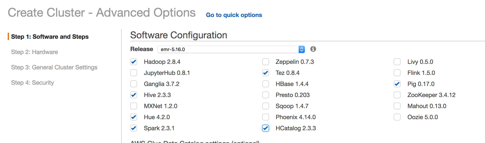
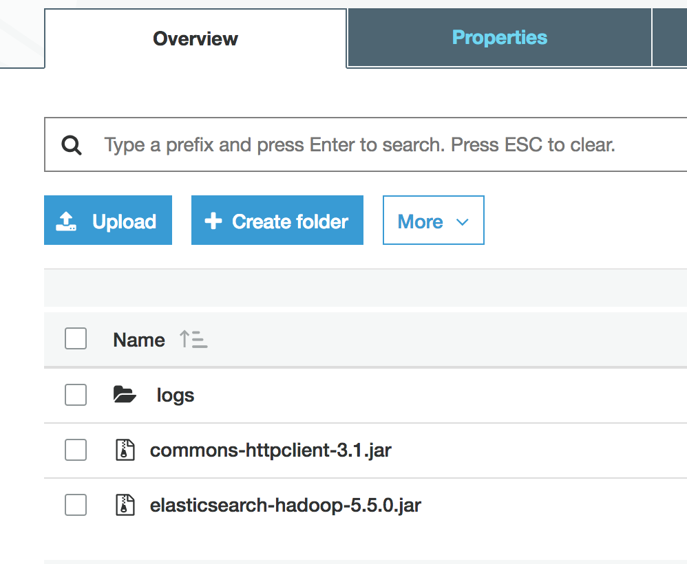
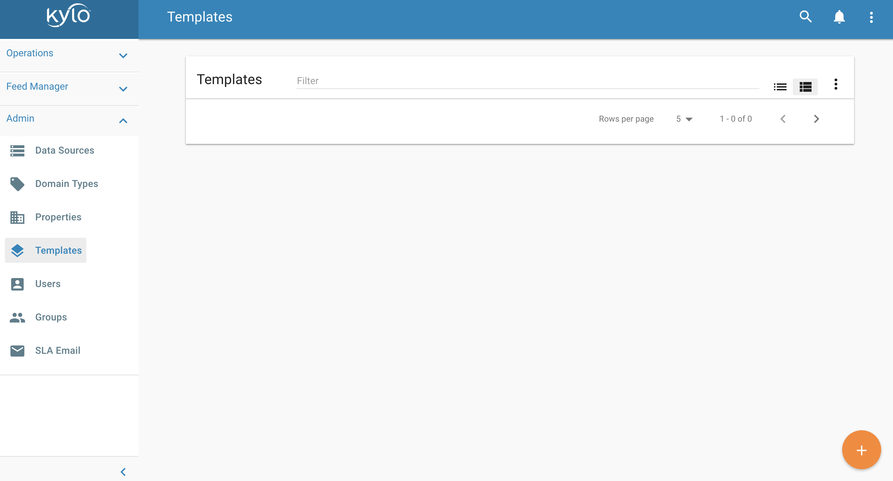
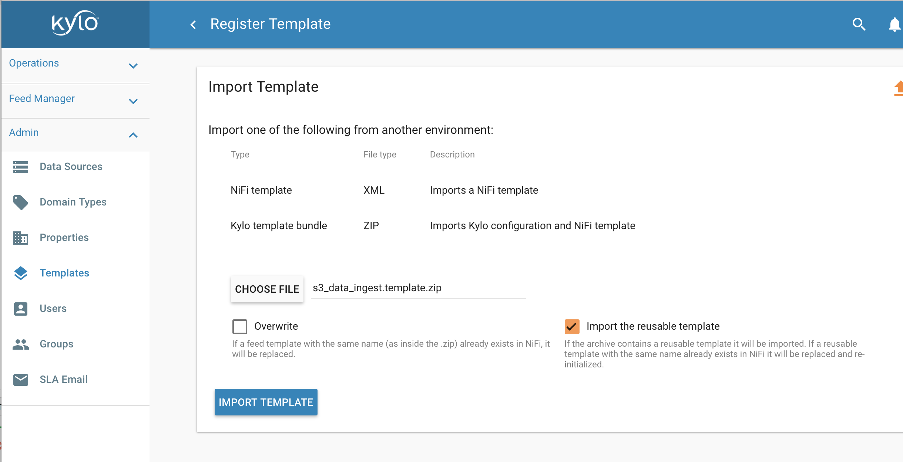
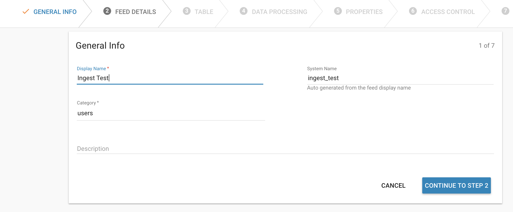
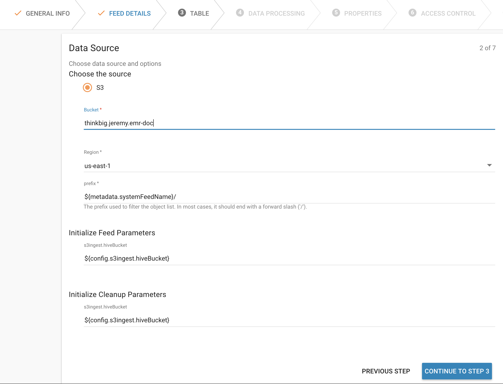

================================================
EMR Persistent Cluster Kylo Installation Guide
================================================

About
=====

The Kylo team provides two ways to deploy Kylo with EMR:

 1. Deploy Kylo to an edge node with an existing persistent EMR cluster. There is an S3 ingest template that will ingest data in S3 and land data in S3 which allows you to avoid passing data through NiFi.
 2. Deploy the Kylo enterprise EMR plugin which is a set of Nifi processors, Nifi templates and scripts that are designed to aid in the management of an EMR cluster to provide the ability to start, stop or check status of and EMR cluster from within Nifi. In conjunction with a modified S3 Standard Ingest Template, Kylo effectively provides an ephemeral cluster that can be as large as needed for processing and the permanence and the reliability of storing all resources in S3.

This guide provides instructions on how to configure Kylo to communicate with a persistent EMR cluster (Option #1). If you are interested in
learning more about the EMR enterprise plugin please |Teradata_support_link|

This guide will help you do you following:

 1. Create an EMR persistent cluster (At this time we used EMR 5.15)
 2. Create an EMR edge node that can communicate with the cluster.
 3. Install the Kylo stack
 4. Install the S3 Ingest template to land data in S3 rather than HDFS

Creating an EMR edge node is challenging and there weren't any good instructions at the
time of this writing. The Kylo team recommends installing Kylo on edge nodes rather than
on a master node of a cluster.

Let get started !!

Create an EMR Cluster
=====================

You can either create a new EMR cluster or leverage an existing EMR cluster that you have. This section provides an example on how to spin up an EMR cluster

1. Create an S3 bucket for your EMR cluster. It must be in the same region as the EMR cluster

2. Create a folder in the S3 bucket called "logs".

3. Click the button to create an EMR cluster

4. Go to the advanced settings and make sure Hadoop, Hive, Spark, Tez, and HCatalog are chosen

|create_emrcluster_options_image|

5. Choose the hardware to meet your requirements

|emr_hardware_config_image|

6. For logging, choose the S3 bucket and folder you created. For example, s3://my.bucket/logs/

7. Complete the rest of the steps and create the EMR cluster

Create a Kylo EMR edge node
===========================

The next step is to create a new CentOS EC2 instance to install Kylo on. Make sure to create it in the same VPC and Subnet as the EMR cluster

1. Go to the EC2 page and click on "Launch Instance" in the same region you created the EMR cluster in.

2. Under "AWS Marketplace" choose the "CentOS 7 (x86_64) - with Updates HVM" AMI.

3. Make sure to choose at least 8 vCPUs and 16GB RAM

4. Create the EC2 instance in the same VPC as the EMR cluster

5. Finish creating and launching your EC2 instance

Configure Security Groups
=========================

For this installation we will open up all ports between the EMR master, slave, and Kylo edge node. If you prefer to open up
only the required ports please see the :doc:`dependencies page <../installation/Dependencies>`

1. Modify the Master and Slave security groups to allow access from the Kylo EC2 instance.
2. Modify the security group for the Kylo edge node to allow access from the master and slave nodes

Install Kylo on Edge Node
=========================

1. SSH into the edge node and su to the root user
2. Run the following commands

.. code-block:: console

    yum install -y wget
    wget http://bit.ly/2KDX4cy -O /opt/kylo-0.9.1.1.rpm
    useradd -r -m -s /bin/bash nifi && useradd -r -m -s /bin/bash kylo && useradd -r -m -s /bin/bash activemq
    cat /etc/passwd (verify the users were created)
    rpm -ivh /opt/kylo-0.9.1.1.rpm

..

Copy EMR libraries to Edge Node
===============================

To make the edge node work with the EMR cluster we need to copy some configuration files and library folders over

.. code-block:: console

    # Run the below commands as root

    mkdir -p /usr/lib/spark
    mkdir -p /usr/lib/hive-webhcat/share/hcatalog
    vi  /etc/profile.d/spark.sh
        export SPARK_HOME=/usr/lib/spark
        export PATH=$SPARK_HOME/bin:$PATH
        export HADOOP_CONF_DIR=/etc/hadoop/conf
        export SPARK_CONF_DIR=/etc/spark/conf

    source /etc/profile.d/spark.sh
    mkdir -p /etc/hadoop/conf
    chown -R kylo:kylo /etc/hadoop/conf
    mkdir -p /etc/spark/conf
    chown -R kylo:kylo /etc/spark/conf
    mkdir -p /usr/share/aws /usr/lib/sqoop /usr/lib/hadoop-yarn /usr/lib/hadoop-mapreduce /usr/lib/hadoop-hdfs /usr/lib/hadoop
    chown kylo:kylo /usr/share/aws /usr/lib/sqoop /usr/lib/hadoop-yarn /usr/lib/hadoop-mapreduce /usr/lib/hadoop-hdfs /usr/lib/hadoop

    export MASTER_PRIVATE_IP=<MASTER_NODE_IP_ADDRESS>
    export PEM_FILE=/home/centos/.ssh/id_rsa
    scp -i /home/centos/.ssh/id_rsa hadoop@$MASTER_PRIVATE_IP:/etc/hadoop/conf/core-site.xml /etc/hadoop/conf
    scp -i /home/centos/.ssh/id_rsa hadoop@$MASTER_PRIVATE_IP:/etc/hadoop/conf/yarn-site.xml /etc/hadoop/conf
    scp -i /home/centos/.ssh/id_rsa hadoop@$MASTER_PRIVATE_IP:/etc/hadoop/conf/hdfs-site.xml /etc/hadoop/conf
    scp -i /home/centos/.ssh/id_rsa hadoop@$MASTER_PRIVATE_IP:/etc/hadoop/conf/mapred-site.xml /etc/hadoop/conf

    rsync -avz --delete -e "ssh -o StrictHostKeyChecking=no -o ServerAliveInterval=10 -i $PEM_FILE" hadoop@$MASTER_PRIVATE_IP:'/usr/lib/spark/*' /usr/lib/spark
    rsync -avz --delete -e "ssh -o StrictHostKeyChecking=no -o ServerAliveInterval=10 -i $PEM_FILE" hadoop@$MASTER_PRIVATE_IP:'/usr/lib/sqoop/*' /usr/lib/sqoop
    rsync -avz --delete -e "ssh -o StrictHostKeyChecking=no -o ServerAliveInterval=10 -i $PEM_FILE" hadoop@$MASTER_PRIVATE_IP:'/usr/lib/hadoop/*' /usr/lib/hadoop
    rsync -avz --delete -e "ssh -o StrictHostKeyChecking=no -o ServerAliveInterval=10 -i $PEM_FILE" hadoop@$MASTER_PRIVATE_IP:'/usr/lib/hadoop-yarn/*' /usr/lib/hadoop-yarn
    rsync -avz --delete -e "ssh -o StrictHostKeyChecking=no -o ServerAliveInterval=10 -i $PEM_FILE" hadoop@$MASTER_PRIVATE_IP:'/usr/lib/hadoop-mapreduce/*' /usr/lib/hadoop-mapreduce
    rsync -avz --delete -e "ssh -o StrictHostKeyChecking=no -o ServerAliveInterval=10 -i $PEM_FILE" hadoop@$MASTER_PRIVATE_IP:'/usr/lib/hadoop-hdfs/*' /usr/lib/hadoop-hdfs
    rsync -avz --delete -e "ssh -o StrictHostKeyChecking=no -o ServerAliveInterval=10 -i $PEM_FILE" hadoop@$MASTER_PRIVATE_IP:'/usr/share/aws/*' /usr/share/aws

    rsync -avz --delete -e "ssh -o StrictHostKeyChecking=no -o ServerAliveInterval=10 -i $PEM_FILE" hadoop@$MASTER_PRIVATE_IP:'/etc/spark/conf/*' /etc/spark/conf

    echo "spark.hadoop.yarn.timeline-service.enabled false" >> /etc/spark/conf/spark-defaults.conf

    # You might need to ls for this file on the master node since the version could be different
    scp -o StrictHostKeyChecking=no -o ServerAliveInterval=10 -i $PEM_FILE hadoop@$MASTER_PRIVATE_IP:/usr/lib/hive-hcatalog/share/hcatalog/hive-hcatalog-core-2.3.3-amzn-1.jar /usr/lib/hive-webhcat/share/hcatalog/hive-hcatalog-core.jar

..

Install MariaDB
===============

.. code-block:: console

    # Run the following commands as root

    yum install -y zip unzip mariadb mariadb-server lsof
    systemctl enable mariadb
    systemctl start mariadb

    # Note: Replace <PASSWORD> with the root password you want to use
    printf "\nY\n<PASSWORD>\n<PASSWORD>\nY\nY\nY" | mysql_secure_installation

    # Test that the password works
    mysql -p

..

Install Java 8
==============

.. code-block:: console

    yum install -y java-1.8.0-openjdk-devel

    vi /etc/profile.d/java.sh
        export JAVA_HOME=/etc/alternatives/java_sdk_1.8.0
        export PATH=$JAVA_HOME/bin:$PATH

    source /etc/profile.d/java.sh
..

Run the Kylo setup wizard
=========================

Next we will run the Kylo setup wizard to install NiFi, ActiveMQ, and Elasticsearch

.. code-block:: console

    # run the following as root

    # Install everything. Choose yes to allow Kylo to manage the database and choose option #1 for the Java install
    /opt/kylo/setup/setup-wizard.sh

..

Test Spark on the edge node
===========================

We want to test that spark words from the command line before running it from Kylo

.. code-block:: console

    # You should ls to verify the JAR path
    ls /usr/lib/spark/examples/jars/spark-examples_ <HIT TAB>
    spark-submit --class org.apache.spark.examples.SparkPi --master yarn --driver-memory 512m --executor-memory 512m --executor-cores 1 /usr/lib/spark/examples/jars/spark-examples_2.11-2.3.1.jar 10

    # Check the Yarn UI to verify it was successful
    http://<MASTER_NODE>:8088/cluster
..

Open up permissions to the mnt folders
======================================

Temporary files are written to the /mnt and /mnt1 folders when the ingest template is processing

.. code-block:: console

    chmod 777 /mnt
    mkdir /mnt1
    chmod -R 777 /mnt1

..

Prepare the EMR cluster
=======================

1. Create the kylo and nifi users on the EMR Master Node

.. code-block:: console

    # Run as root on the master node
    useradd -r -m -s /bin/bash nifi
    useradd -r -m -s /bin/bash kylo

..

2. Create the Kylo and NiFi users in HDFS

.. code-block:: console

    su - hdfs
    hdfs dfs -mkdir /user/kylo
    hdfs dfs -chown kylo:kylo /user/kylo
    hdfs dfs -mkdir /user/nifi
    hdfs dfs -chown nifi:nifi /user/nifi
    hdfs dfs -ls /user

..

Edit the Kylo Properties Files
==============================

1. Retrieve the hive metastore password on the EMR master node

.. code-block:: console

    cat /etc/hive/conf/hive-site.xml | grep -B 5 -A 5 Password

..

2. Modify the Kylo properties files

.. code-block:: properties

    vi /opt/kylo/kylo-services/conf/application.properties

        spring.datasource.username=root
        spring.datasource.password=<ROOT_PASSWORD_FROM_STEPS_ABOVE>

        security.auth.file.groups=file:///opt/kylo/groups.properties

        metadata.datasource.username=${spring.datasource.username}
        metadata.datasource.password=${spring.datasource.password}

        hive.datasource.url=jdbc:hive2://<MASTER_DNS_NAME>:10000/default
        hive.datasource.username=hive

        hive.metastore.datasource.url=jdbc:mysql://<MASTER_DNS_NAME>:3306/hive
        hive.metastore.datasource.username=hive
        hive.metastore.datasource.password=<PASSWORD_FROM_GREP_ABOVE>

        modeshape.datasource.username=${spring.datasource.username}
        modeshape.datasource.password=${spring.datasource.password}

        nifi.service.mysql.database_user=root
        nifi.service.mysql.password=<PASSWORD>

        nifi.service.kylo_mysql.database_user=root
        nifi.service.kylo_mysql.password=<PASSWORD>

        nifi.service.hive_thrift_service.database_connection_url=jdbc:hive2://<MASTER_DNS_NAME>:10000/default

        nifi.service.kylo_metadata_service.rest_client_password=<KYLO_ADMIN_PASSWORD>

        nifi.executesparkjob.sparkhome=/usr/lib/spark
        nifi.executesparkjob.sparkmaster=yarn-cluster

        config.spark.validateAndSplitRecords.extraJars=/usr/lib/hive-webhcat/share/hcatalog/hive-hcatalog-core.jar,/usr/lib/spark/jars/datanucleus-api-jdo-3.2.6.jar,/usr/lib/spark/jars/datanucleus-core-3.2.10.jar,/usr/lib/spark/jars/datanucleus-rdbms-3.2.9.jar
        nifi.executesparkjob.extra_jars=/usr/lib/spark/jars/datanucleus-api-jdo-3.2.6.jar,/usr/lib/spark/jars/datanucleus-core-3.2.10.jar,/usr/lib/spark/jars/datanucleus-rdbms-3.2.9.jar
        nifi.executesparkjob.extra_files=$nifi{table_field_policy_json_file},/etc/spark/conf/hive-site.xml
        config.spark.version=2

..

3. Modify spark.properties

.. code-block:: properties

    vi /opt/kylo/kylo-services/conf/spark.properties

    spark.shell.deployMode = cluster
    spark.shell.master = yarn
    spark.shell.registrationUrl=http://<KYLO_EDGE_DNS_NAME>:8400/proxy/v1/spark/shell/register
..

Start Kylo and NiFi
===================

1. Start up Kylo and NiFi

.. code-block:: console

    service nifi start

    kylo-service start

..

2. Login to the NiFi and Kylo UI to test that it's up and running

Install the S3 Ingest Template
==============================

This section follows the steps from the :doc:`S3 Data Ingest Template <../how-to-guides/S3DataIngestTemplate>` how to page

1. Upload required Jars to the S3 EMR bucket you created above

 - http://central.maven.org/maven2/org/elasticsearch/elasticsearch-hadoop/5.5.0/elasticsearch-hadoop-5.5.0.jar

 - http://central.maven.org/maven2/commons-httpclient/commons-httpclient/3.1/commons-httpclient-3.1.jar

|emr_s3_jars_image|

2. Modify core-site.xml file on the Kylo edge and the EMR master node

 For the S3 ingest template to work you need to set some S3 properties in the core-site.xml on both the Kylo edge node AND
 the EMR master node

.. code-block:: console

    vi /etc/hadoop/conf/core-site.xml

          <property>
            <name>fs.s3.awsAccessKeyId</name>
            <value>xxxxxx</value>
          </property>
          <property>
            <name>fs.s3.awsSecretAccessKey</name>
            <value>xxxxxx</value>
          </property>
          <property>
            <name>fs.s3a.awsAccessKeyId</name>
            <value>xxxxxx</value>
          </property>
          <property>
            <name>fs.s3a.awsSecretAccessKey</name>
            <value>xxxxxx</value>
          </property>
          <property>
            <name>fs.s3n.access.key</name>
            <value>xxxxx</value>
          </property>
          <property>
            <name>fs.s3n.secret.key</name>
            <value>xxxxxxx</value>
          </property>
..

3. Restart the namenode

 Restart the namenode from the master node

.. code-block:: console

    stop hadoop-hdfs-namenode
    status hadoop-hdfs-namenode
    start hadoop-hdfs-namenode
..

4. Update application.properties to prepare for the template

Add the following properties to the kylo-services application.properties file

.. code-block:: console

    vi /opt/kylo/kylo-services/conf/application.properties

        config.s3ingest.s3.protocol=s3a
        config.s3ingest.hiveBucket=<S3_BUCKET>
        config.s3ingest.es.jar_url=s3a://<S3_BUCKET>/elasticsearch-hadoop-5.5.0.jar
        config.s3ingest.apache-commons.jar_url=s3a://<S3_BUCKET>/commons-httpclient-3.1.jar
        config.s3ingest.es.nodes=<KYLO_NODE_IP_ADDRESS>

..

5. Restart kylo-services

.. code-block:: console

    service kylo-services restart

..

6. Allow Access to Elasticsearch from the Cluster

 The S3 ingest template creates a hive index table based on Elasticsearch. We need to make sure Elasticsearch allows access from external nodes.

.. code-block:: console

     vi /etc/elasticsearch/elasticsearch.yml
        # Modify this property
        network.host: 0.0.0.0

    service elasticsearch restart

..

7. Import the S3 Ingest Template

     Make sure to install the version of the S3 ingest template that matches your Kylo version. Be careful not to download it from the master branch in Github
     since the template may have changed. The template "s3_data_ingest.template.zip" is located in the /opt/kylo/setup/data/templates/nifi-1.0 folder. You will need to copy it to your local box
     to upload it via the browser

     7.1 In Kylo go to the Admin --> Templates page and click the plus icon

    |import_template_start_image|

     7.2 Choose "Import from a File"

     7.3 Choose the file and select "Import the Reusable Template"

    |import_template_upload_image|

     7.4 Click "Import Template"

8. Add the AWS credentials to the Controller Services

 Disable and edit the AWSCredentialsProviderControllerService created when importing the S3 ingest template. Set
 the value for both the "Access Key" field and "Secret Key" field. Re-enable the controller service.

Create a Test Feed
==================

1. Go to the Categories page in Kylo and create a new Category

2. Go to Feed Manager -> Feeds and click the plus icon to create a new feed

3. Click the S3 Data Ingest template

4. Give the feed a name and select a category. Then click "Continue to Step 2"

|create_feed_name_image|

5. Specify the S3 bucket you will drop a file in, as well as the AWS region. Click "Continue to Step 3"

|create_feed_s3_values_image|

6. Choose a sample file and upload it. Then modify the data types as needed. Click "Continue to Step 4"

7. Choose a few fields to be indexed so we can test that Elasticsearch indexing works. Then continue to step 7

8. Change the schedule to be timer based and run every 15 seconds. Then click the "Create" button. The feed will be looking at a folder in your S3 bucket based on the feed name. Since I called the feed "Ingest Test" it will be looking at the <S3 Bucket>/ingest_test folder

9. Drop a test file in the S3 bucket and folder you created for the feed.

Monitor NiFi and Kylo to verify the feed ran successfully.

.. |Teradata_support_link| raw:: html

    <a href="https://www.teradata.com/Contact" target="_blank">contact Teradata</a>

.. |emr_hardware_config_image| image:: ../media/installation/emr-persistent-cluster-install-guide/emr-hardware-configuration.png
    :width: 500px
    :height: 166px

