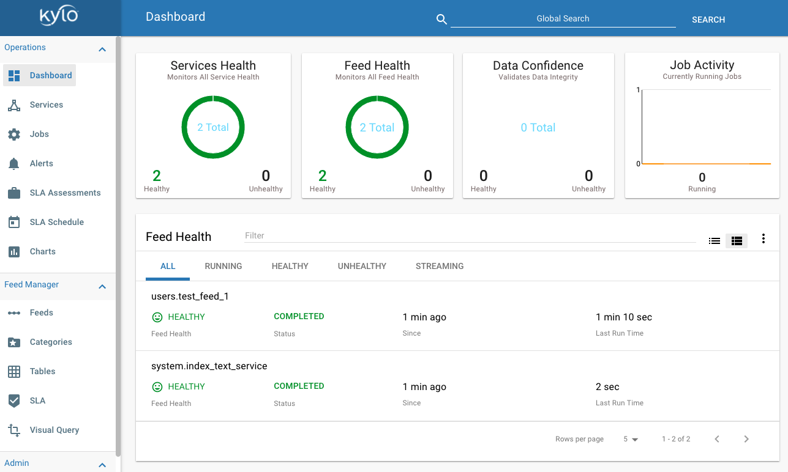

===================
Create Sample Feed
===================
Before performing any more configuration with Kylo you should create and test a simple feed to make sure all of the integration configuration is correct

Below is an example on how to create a simple feed using one of the provided CSV files.

Create a dropzone folder on the edge node for file ingest
---------------------------------------------------------

Perform the following step on the node on which NiFI is installed:

.. code-block:: shell

    $ mkdir -p /var/dropzone

    $ chown nifi /var/dropzone

..

.. note:: Files should be copied into the dropzone such that user nifi can read and remove. Do not copy files with permissions set as root.

Create a category in Kylo
-------------------------
If you have not created a category in Kylo you can do so by going to the "Categories" page in the Feed Manager

    1. Click on the plus icon.

    2. Create a category called "users" and save it.

Create a data ingest feed
--------------------------
Next we need to create a feed under the "users" category.

    1. Go to the "Feeds" page in Feed Manager

    2. Click the plus icon and choose the "Data Ingest" feed type.

    3. Under "General Info" give the feed a name. For example, "Test Feed 1".

    4. Choose the "users" category then click "Continue to Step 2".

    5. Leave the source type as "Filesystem" but change the file filter to be "userdata1.csv". The click "Continue to Step 3".

    6. "Sample File" should be selected. Click on "Choose File" and find the userdata1.csv file. It is located in two places:

        .. code-block:: properties

        - <kylo_project>/samples/sample-data/csv/userdata1.csv
        - /opt/kylo/setup/data/sample-data/csv/userdata1.csv

    ..

    7. Click the upload button to upload the file

    8. Change the data type for the "registration_dttm" field name to be "timestamp" instead of "string".

    9. Change the data type for the "cc" field name to be "String". Then continue to Step 4 .

    10. Under field policies check the "index" box for the "id", "first_name", and "last_name" fields to index the data in Elasticsearch. Click "Continue to Step 6"

    11. Continue to step 7. Change the Timer to be 5 seconds instead of 5 minutes. Then click the "Create" button

Run the sample feed
-------------------
Now lets try running the feed.

    1. Copy the file to the drop zone folder

    .. code-block:: console

        cp -p <PATH_TO_FILE>/userdata1.csv /var/dropzone/

    ..

    2. You can watch the feed from both the Operations Manger page in Kylo and in NiFi to verify the file is being processed.

    |image1|

Next we will show you can to validate all of the integration is configured correctly in Kylo

