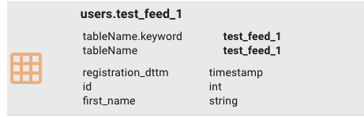
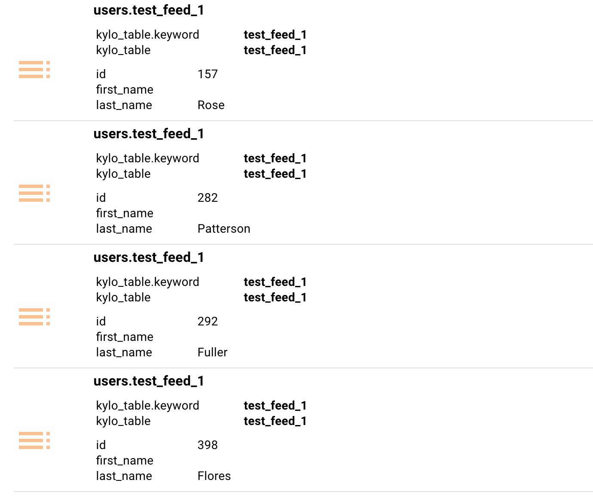

======================
Validate Configuration
======================
Kylo has many integration points. For example, Hive, NiFi, MySQL, Spark, ActiveMQ, Elasticsearch, etc. Now that we ran a feed through
we can test Kylo's integration with all of these components.

By successfully running Kylo you have validated the MySQL configuration, as well as integration with ActiveMQ and NiFi.

Validate Hive Thrift Connection
-------------------------------

    1. Test profile statistics:

        a. Go to the  "Feeds" page in feed manager and click on your test feed.

        b. Go to the "PROFILE" tab and click "view" for one of the rows.

        c. Go to the "VALID" and "INVALID" tabs and verify data is being returned.

    2. Test the Tables page:

        a. Go to the "Tables" page in Feed Manager.

        b. Click on the table for your test feed. In our example it is "test_feed_1".

        c. Click the "PREVIEW" and "QUERY" tabs to ensure data is being returned.

Validate Spark Shell
--------------------

    1. Go to the "Visual Query" page in Feed Manager.

    2. In the search box type "test_feed_1" then click "add table".

    3. Click "Continue to step 2". Validate you can see data.

    4. Apply a transformation. An easy way to do this is to click on the "id" column, choose Filter -> "> 600". Validate you only see numbers greater than 600

Validate Search
---------------

    1. Validate the schema information is there:

        a. Enter the feed name in the global search box at the top. For example, "test_feed_1". Then click enter

        b. Verify the schema metadata exists.

        |image1|

    2. Validate the indexed data is there:

        a. Enter the feed name in the global search box at the top. For example, "test_feed_1". Then click enter.

        b. Verify the data you selected to index exists. If you remember we chose the id, first_name, and last_name columns.

        |image2|

