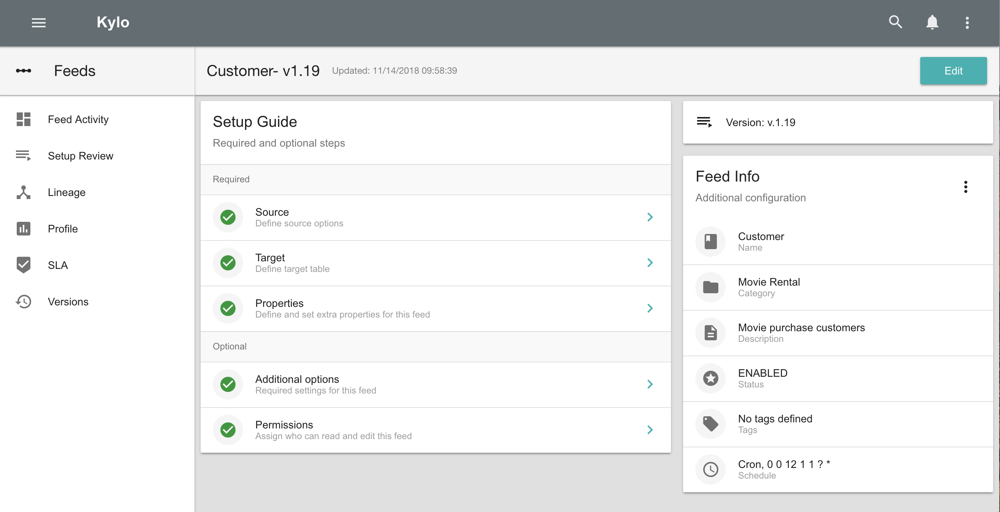
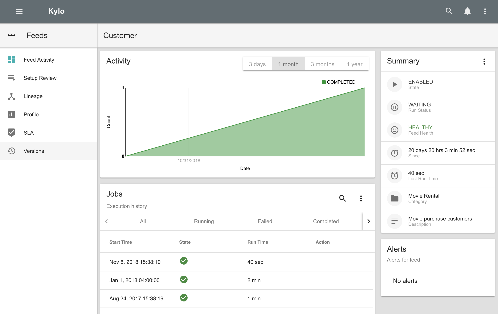
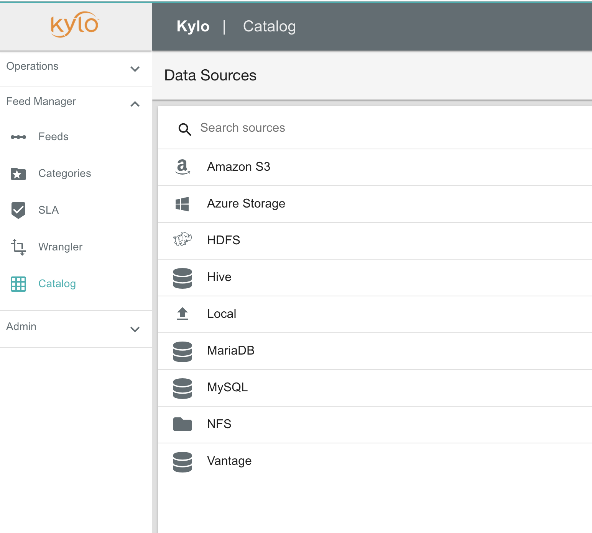
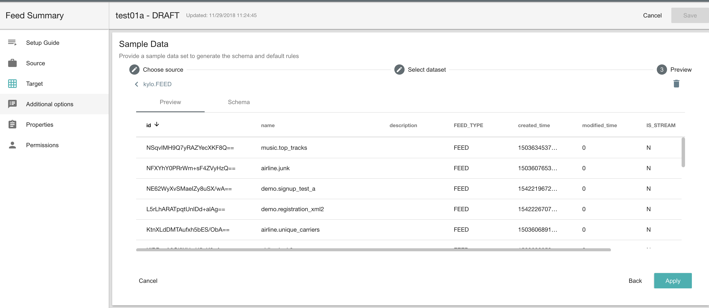
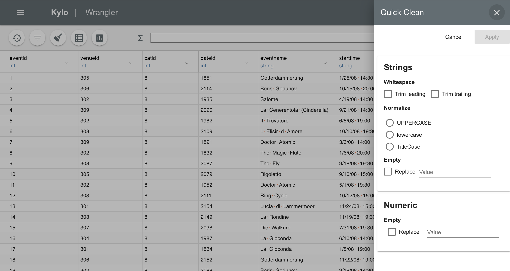
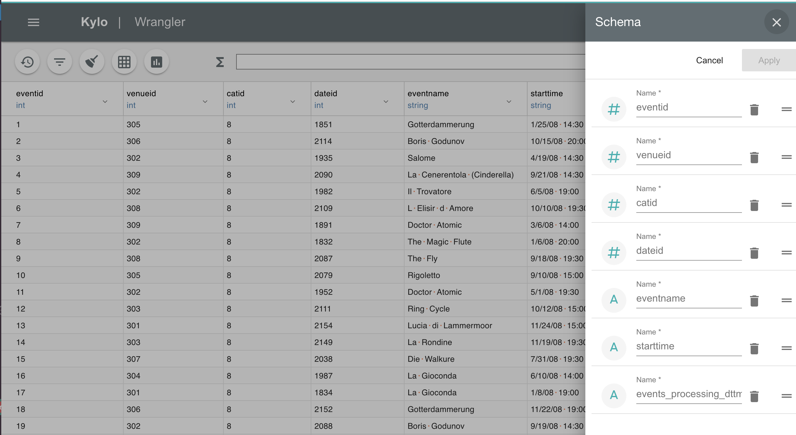
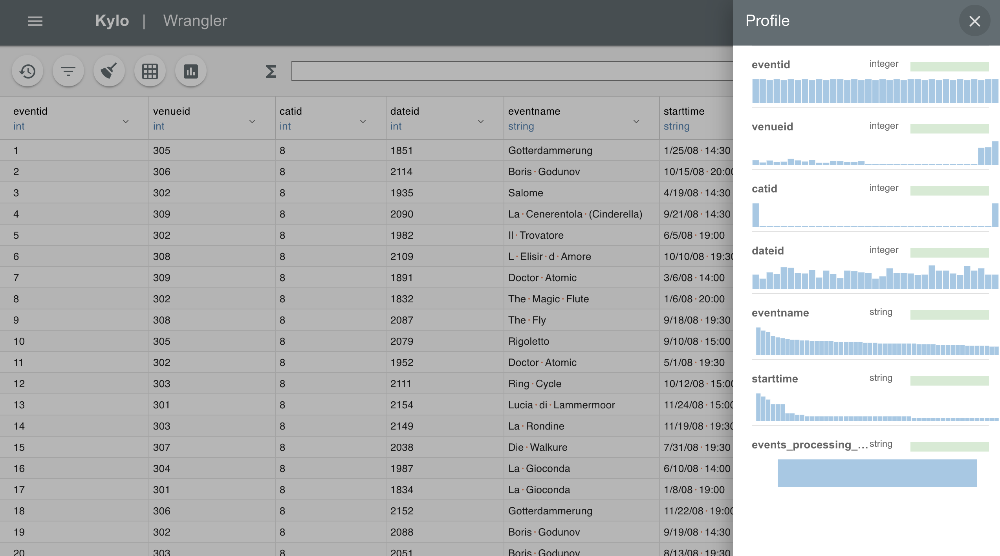
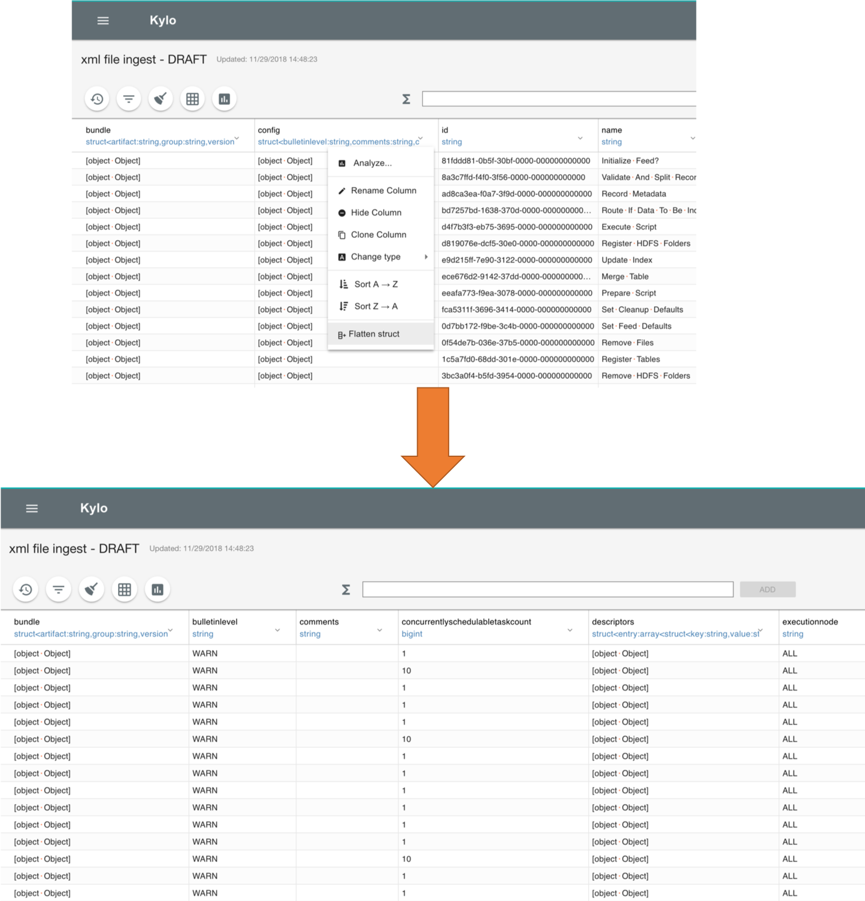
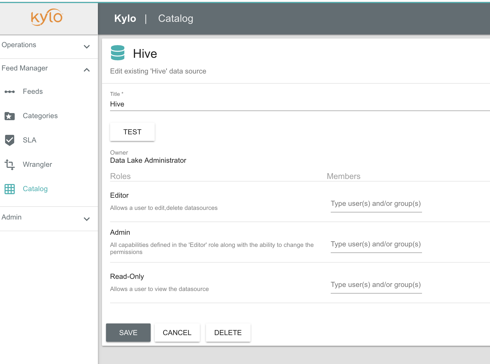
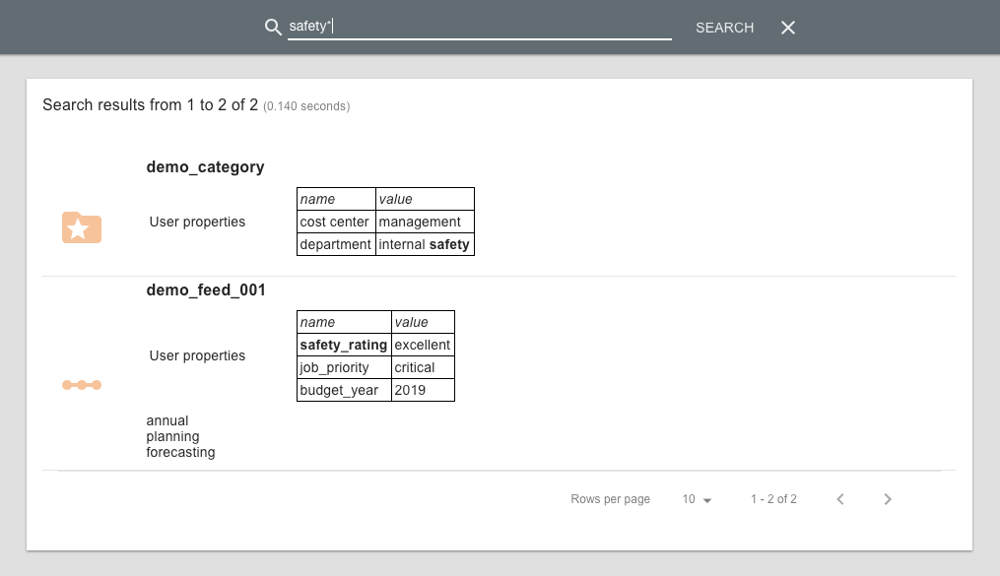

Release 0.10.0 (November 29, 2018)
==================================

Highlights
----------
 1. :ref:`New user interface <new_ui_highlight>`. Improved look-and-feel, performance, and modernized color scheme. Simplified setup guide for creating new feeds.
 2. :ref:`Template Manager <repository_highlight>` New template management that enables admins to quickly update when new versions of templates become available or publish templates for the enterprise.
 3. :ref:`Wrangler improvements <wrangler_highlight>`. Many new features have been added to the wrangler to make data scientists more productive. Features includes: quick data clean; improved schema manipulation; new data transformations, including imputing new values; column statistics view.
 4. :ref:`Data Catalog <catalog_highlight>`. New virtual catalog to access remote datasets to wrangle, preview, and feed setup. Kylo 0.10 includes the following connectors: Amazon S3, Azure, HDFS, Hive, JDBC, Local Files, NAS Filesystem
 5. :ref:`Search custom properties <search_properties_es_highlight>`. Any custom properties defined for feeds and categories are indexed and available via the global metadata search feature.

Download Links
--------------
- Visit the :doc:`Downloads <../about/Downloads>` page for links.

Important Changes
-----------------

Kylo UI Plugin Changes
~~~~~~~~~~~~~~~~~~~~~~

 - Kylo UI plugins 0.9.x or earlier will not work with 0.10.0.  If you had custom kylo ui code please refer to this doc to migrate your code to a 0.10.0 compatible plugin: |ui_plugin_upgrade_link|

 - Kylo UI custom |feed_stepper_plugin_link| are not supported. Do not upgrade if you need this functionality.

Catalog Changes
~~~~~~~~~~~~~~~

 - The Catalog page used to allow you to query and preview data.  This has been removed.  You will now need to go to the wrangler to preview catalog data sets

Upgrade Instructions from v0.9.1
--------------------------------

.. note:: Before getting started we suggest backing up your Kylo database.

1. Backup any custom Kylo plugins

  When Kylo is uninstalled it will backup configuration files, but not the `/plugin` jar files.
  If you have any custom plugins in either `kylo-services/plugin`  or `kylo-ui/plugin` then you will want to manually back them up to a different location.

  .. note:: Kylo ui plugins 0.9.x or earlier will not work with 0.10.0.  If you had custom kylo ui code please refer to this doc to migrate your code to a 0.10.0 compatible plugin: |ui_plugin_upgrade_link|

2. Uninstall Kylo:

 .. code-block:: shell

   /opt/kylo/remove-kylo.sh

 ..

3. Install the new RPM:

 .. code-block:: shell

     rpm –ivh <RPM_FILE>

 ..

4. Restore previous application.properties files. If you have customized the the application.properties, copy the backup from the 0.9.1 install.

     4.1 Find the /bkup-config/TIMESTAMP/kylo-services/application.properties file

        - Kylo will backup the application.properties file to the following location, */opt/kylo/bkup-config/YYYY_MM_DD_HH_MM_millis/kylo-services/application.properties*, replacing the "YYYY_MM_DD_HH_MM_millis" with a valid time:

     4.2 Copy the backup file over to the /opt/kylo/kylo-services/conf folder

        .. code-block:: shell

          ### move the application.properties shipped with the .rpm to a backup file
          mv /opt/kylo/kylo-services/conf/application.properties /opt/kylo/kylo-services/conf/application.properties.0_10_0_template
          ### copy the backup properties  (Replace the YYYY_MM_DD_HH_MM_millis  with the valid timestamp)
          cp /opt/kylo/bkup-config/YYYY_MM_DD_HH_MM_millis/kylo-services/application.properties /opt/kylo/kylo-services/conf

        ..

     4.3 If you copied the backup version of application.properties in step 4.2 you will need to make a couple of other changes based on the 0.10.0 version of the properties file

        A new spring profile of 'kylo-shell' is needed.  Below is an example

        .. code-block:: shell

         vi /opt/kylo/kylo-services/conf/application.properties

          ## add in the 'kylo-shell' profile (example below)
          spring.profiles.include=native,nifi-v1.2,auth-kylo,auth-file,search-esr,jms-activemq,auth-spark,kylo-shell

        ..

        Add the following new properties below:

        .. code-block:: shell

          #default location where Kylo looks for templates. This is a read-only location and Kylo UI won't be able to publish to this location.
          #Additional repositories can be setup using config/repositories.json where templates can be published
          kylo.template.repository.default=/opt/kylo/setup/data/templates/nifi-1.0

          kylo.install.template.notification=true

        ..

     4.4 Repeat previous copy step (4.2 above) for other relevant backup files to the /opt/kylo/kylo-services/conf folder. Some examples of files:

        - spark.properties
        - ambari.properties
        - elasticsearch-rest.properties
        - log4j.properties
        - sla.email.properties

        **NOTE:**  Be careful not to overwrite configuration files used exclusively by Kylo

     4.5 Copy the /bkup-config/TIMESTAMP/kylo-ui/application.properties file to `/opt/kylo/kylo-ui/conf`

       Ensure the new property 'zuul.routes.api.sensitiveHeaders' exists.  Example below

       .. code-block:: shell

           vi /opt/kylo/kylo-ui/conf/application.properties

             zuul.prefix=/proxy
             zuul.routes.api.path=/**
             zuul.routes.api.url=http://localhost:8420/api

             ## add this line below for 0.10.0
             zuul.routes.api.sensitiveHeaders
       ..

       The `multipart.maxFileSize` and `multipart.maxRequestSize` properties have changed.  Update these 2 properties to be the following:

       .. code-block:: shell

          ### allow large file uploads
          spring.http.multipart.maxFileSize=100MB
          spring.http.multipart.maxRequestSize=-1

       ..

     4.6 Ensure the property ``security.jwt.key`` in both kylo-services and kylo-ui application.properties file match.  They property below needs to match in both of these files:

        - */opt/kylo/kylo-ui/conf/application.properties*
        - */opt/kylo/kylo-services/conf/application.properties*

          .. code-block:: properties

            security.jwt.key=

          ..

    4.7 (If using Elasticsearch for search) Create/Update Kylo Indexes

        Execute a script to create/update kylo indexes. If these already exist, Elasticsearch will report an ``index_already_exists_exception``. It is safe to ignore this and continue.
        Change the host and port if necessary.

            .. code-block:: shell

                /opt/kylo/bin/create-kylo-indexes-es.sh localhost 9200 1 1

            ..

5. Update NiFi

   Stop NiFi

   .. code-block:: shell

      service nifi stop

   ..

   Run the following shell script to copy over the new NiFi nars/jars to get new changes to NiFi processors and services.

   .. code-block:: shell

      /opt/kylo/setup/nifi/update-nars-jars.sh <NIFI_HOME> <KYLO_SETUP_FOLDER> <NIFI_LINUX_USER> <NIFI_LINUX_GROUP>

      Example:  /opt/kylo/setup/nifi/update-nars-jars.sh /opt/nifi /opt/kylo/setup nifi users

   ..
   
   Configure NiFi with Kylo's shared :doc:`../security/EncryptingConfigurationProperties`
   
      1. Copy the Kylo encryption key file to the NiFi extention config directory

   .. code-block:: shell

      cp /opt/kylo/encrypt.key /opt/nifi/ext-config
   ..
      
      2. Change the ownership and permissions of the key file to ensure only nifi can read it

   .. code-block:: shell

      chown nifi /opt/nifi/ext-config/encrypt.key
      chmod 400 /opt/nifi/ext-config/encrypt.key

   ..
   
      3. Edit the ``/opt/nifi/current/bin/nifi-env.sh`` file and add the ENCRYPT_KEY variable with the key value

   .. code-block:: shell

      export ENCRYPT_KEY="$(< /opt/nifi/ext-config/encrypt.key)"
      
   ..

   Start NiFi

   .. code-block:: shell

      service nifi start

   ..

6. :ref:`Install XML support <install-xml-support>` if not using Hortonworks.

7. Start Kylo to begin the upgrade

 .. code-block:: shell

   kylo-service start

 ..
 .. note:: NiFi must be started and available during the Kylo upgrade process.

8. If entity access is enabled, the Hive data source will no longer be accessible to all users by default. To grant permissions to Hive go to the Catalog page and click the pencil icon to the left of the Hive data source. This page will provide options for granting access to Hive or granting permissions to edit the data source details.

   |hive_grant_image|

  .. note:: If, after the upgrade, you experience any UI issues in your browser then you may need to empty your browser's cache.

Mandatory Template Updates
--------------------------
    Once Kylo is running the following templates need to to be updated.

      - Advanced Ingest
      - Data Ingest
      - Data Transformation
      - S3 Data Ingest  (:doc:`S3 Data Ingest documentation <../how-to-guides/S3DataIngestTemplate>`)
      - XML Ingest

    Use the new :ref:`Repository <repository>` feature within Kylo to import the latest templates.

Highlight Details
-----------------

.. _new_ui_highlight:

New User Interface
~~~~~~~~~~~~~~~~~~

       - Kylo now has a new user interface for creating and editing feeds.

           |new_ui_image01|

       - Editing feeds is separate from deploying to NiFi.  This allows you to edit and save your feed state and when ready deploy it.

       - Centralized feed information. The feed activity view of the running feed jobs is now integrated with the feed setup.

           |new_ui_image02|

.. _catalog_highlight:

Catalog
~~~~~~~

    - Kylo allows you to create and browse various catalog sources. Kylo ships with the following datasource connectors:  Amazon S3, Azure, HDFS, Hive, JDBC, Local Files

         |catalog_image01|

    - During feed creation and data wrangling you can browse the catalog to preview and select specific sources to work with:

       |catalog_image02|

    - *Note:* Kylo Datasources  have been upgraded to a new Catalog feature.  All legacy JDBC and Hive datasources will be automatically converted to catalog data source entries.

.. _wrangler_highlight:

Wrangler
~~~~~~~~

     The Wrangler has been upgraded with many new features.

      |wrangler_image01|

     - New quick clean feature allows you to modify the entire dataset

      |wrangler_image02|

     - New schema view allows you to rename, delete, and move columns

       |wrangler_image03|

     -  New column profile view shows graphical stats about each column

        |wrangler_image04|

     - Users can also perform transformations and flattening operations on complex JSON and XML files

        |wrangler_image05|

.. _repository_highlight:

Repository
~~~~~~~~~~

   Kylo now has customizable repository locations to store feed and template exports.  The repository is an easy way to browse for new feeds/templates and import directly into Kylo.
   Kylo creates a default repository exposing the sample templates.

     |repository_image01|

.. _search_properties_es_highlight:

Search
~~~~~~

    - Custom properties defined for categories and feeds can be searched via Global Search, when using Elasticsearch engine.

        |search_category_and_feed_properties_es.png|

.. |ui_plugin_upgrade_link| raw:: html

   <a href="https://github.com/Germanaz0/kylo-sample-module" target="_blank">Kylo UI Plugin Upgrade</a>

.. |feed_stepper_plugin_link| raw:: html

   <a href="https://github.com/Teradata/kylo/tree/master/samples/plugins/example-ui-feed-stepper-plugin">feed stepper plugin's</a>

.. |JIRA_Issues_Link| raw:: html

   <a href="https://kylo-io.atlassian.net/issues/?jql=project%20%3D%20KYLO%20AND%20status%20%3D%20Done%20AND%20fixVersion%20%3D%200.10.0%20ORDER%20BY%20summary%20ASC%2C%20lastViewed%20DESC" target="_blank">Jira Issues</a>

.. |repository_image01| image:: ../media/release-notes/release-0.10.0/repository_image01.png
   :width: 2766px
   :height: 1500px
   :scale: 15%

