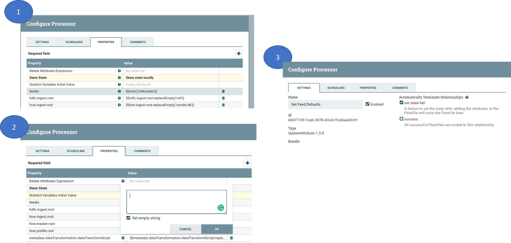

Release 0.8.2 (TBD)
===================

Highlights
----------
- Redesigned Provenance Event Capturing and new Kylo Streaming User Interface
- Ability to customize the user interface.  More details can be found here: :doc:`../developer-guides/PluginApiIndex`
- NiFi 1.3.0 support
- Support SOLR or Elastic Search along with a redesigned Search page
- Automatic indexing of Feeds,Categories,tags into SOLR or Elastic Search
- SPENGO highlight... TBD
- Wrangler user impersonation highlight TBD
- Official TAR file installation support. This allows installation in different folder locations and to be ran as different linux users/groups

Upgrade Instructions
--------------------
1. Update NiFi to use the new KyloPersistentProvenanceRepository.   Kylo no longer uses the NiFi reporting task to capture provenance events.  Instead it uses a modified ProvenanceRepository.

   1.1. In NiFi stop and delete the Kylo Reporting Task and its associated Controller Service.

   1.2. Stop NiFi

   1.3. Follow the guide :doc:`../how-to-guides/NiFiKyloProvenance` to setup the KyloPersistentProvenanceRepository

2. Copy the application.properties file from the 0.8.1 install.  If you have customized the application.properties file you will want to copy the 0.8.1 version and add the new properties that were added for this release.

     2.1 Find the /bkup-config/TIMESTAMP/kylo-services/application.properties file

        - Kylo will backup the application.properties file to the following location, */opt/kylo/bkup-config/YYYY_MM_DD_HH_MM_millis/kylo-services/application.properties*, replacing the "YYYY_MM_DD_HH_MM_millis" with a valid time:

     2.2 Copy the backup file over to the /opt/kylo/kylo-services/conf folder

        .. code-block:: shell

          ### move the application.properties shipped with the .rpm to a backup file
          mv /opt/kylo/kylo-services/application.properties application.properties.0_8_2_template
          ### copy the backup properties  (Replace the YYYY_MM_DD_HH_MM_millis  with the valid timestamp)
          cp /opt/kylo/bkup-config/YYYY_MM_DD_HH_MM_millis/kylo-services/application.properties /opt/kylo/kylo-services/conf

        ..

     2.3 Add in the new properties to the /opt/kylo/kylo-services/application.properties file

         - ActiveMQ properties: Redelivery processing properties are now available for configuration.  If Kylo receives provenance events and they have errors are are unable to attach NiFi feed information (i.e. if NiFi goes down and Kylo doesnt have the feed information in its cache) then the JMS message will be returned for redelivery based upon the following parameters.  Refer to the ActiveMQ documentation, http://activemq.apache.org/redelivery-policy.html, for assigning these values:

              .. code-block:: shell

                ## retry for xx times before sending to DLQ (Dead Letter Queue) set -1 for unlimited redeliveries
                jms.maximumRedeliveries=100
                ##The initial redelivery delay in milliseconds.
                jms.initialRedeliveryDelay=1000
                ##retry every xx seconds
                jms.redeliveryDelay=5000
                ##Sets the maximum delivery delay that will be applied if the useExponentialBackOff option is set (use value -1 for no max)
                jms.maximumRedeliveryDelay=600000
                ##The back-off multiplier.
                jms.backOffMultiplier=5
                ##Should exponential back-off be used, i.e., to exponentially increase the timeout.
                jms.useExponentialBackOff=false

              ..
         - NiFi 1.3 support
            If you are using NiFi 1.2 or 1.3 you need to update the spring profile to point to the correct nifi version.

            Example NiFi 1.2 or 1.3 support

            .. code-block:: shell

              ### Indicate the NiFi version you are using with the correct spring profile.
              ###  - For NiFi 1.0.x or 1.1.x:    nifi-v1
              ###  - For NiFi 1.2.x or 1.3.x:    nifi-v1.2
              spring.profiles.include=native,nifi-v1.2,auth-kylo,auth-file

            ..

            Example NiFi 1.0 or 1.1 support

            .. code-block:: shell

              spring.profiles.include=native,nifi-v1,auth-kylo,auth-file

            ..

     2.4 Ensure the property ``security.jwt.key`` in both kylo-services and kylo-ui application.properties file match.  They property below needs to match in both of these files:

         - */opt/kylo/kylo-ui/conf/application.properties*
         - */opt/kylo/kylo-services/conf/application.properties*.

       .. code-block:: properties

         security.jwt.key=

       ..

3. Backup the Kylo database.  Run the following code against your kylp database to export the 'kylo' schema to a file.  Replace the  PASSWORD with the correct login to your kylo database.

  .. code-block:: shell

     mysqldump -u root -pPASSWORD --databases kylo >kylo-0_8_1_backup.sql

  ..

4. Database updates.  Kylo uses liquibase to perform database updates.  Two modes are supported.

 - Automatic updates

     By default Kylo is set up to automatically upgrade its database on Kylo services startup. As such,
     there isn't anything specific an end user has to do. When Kylo services startup the kylo database will be automatically upgraded to latest version if required.
     This is configured via an application.properties setting

     .. code-block:: properties

         liquibase.enabled=true
     ..

 - Manual updates

     Sometimes, however you may choose to disable liquibase and manually apply the upgrade scripts.  By disabling liquibase you are in control of how the scripts are applied.  This is needed if the kylo database user doesnt have priviledges to make schema changes to the kylo database.
     Please follow this :doc:`../how-to-guides/DatabaseUpgrades` on how to manually apply the additional database updates.

5. **Update configuration for using Elasticsearch as the search engine**

    1. **Provide cluster properties**

        1. Update cluster properties in ``/opt/kylo/kylo-services/conf/elasticsearch.properties`` if different from the defaults provided below.

        .. code-block:: shell

            search.host=localhost
            search.clusterName=demo-cluster
            search.restPort=9200
            search.transportPort=9300

        ..

        Kylo services must be restarted if the above file has been changed to pick up the new values.

        .. code-block:: shell

            service kylo-services restart

        ..

    2. **Steps to import updated Index Schema Service feed**

        1. Feed Manager -> Feeds -> + orange button -> Import from file -> Choose file

        2. Pick the ``index_schema_service_elasticsearch.feed.zip`` file available at ``/opt/kylo/setup/data/feeds/nifi-1.0``

        3. Leave *Change the Category* field blank (It defaults to *System*)

        4. Click *Yes* for these two options (1) *Overwrite Feed* (2) *Replace Feed Template*

        5. (optional) Click *Yes* for option (3) *Disable Feed upon import* only if you wish to keep the indexing feed disabled upon import (You can explicitly enable it later if required)

        6. Click *Import Feed*.

        7. Verify that the feed imports successfully.

    3. **Steps to import updated Index Text Service feed**

        1. Feed Manager -> Feeds -> + orange button -> Import from file -> Choose file

        2. Pick the ``index_text_service_elasticsearch.feed.zip`` file available at ``/opt/kylo/setup/data/feeds/nifi-1.0``

        3. Leave *Change the Category* field blank (It defaults to *System*)

        4. Click *Yes* for these two options (1) *Overwrite Feed* (2) *Replace Feed Template*

        5. (optional) Click *Yes* for option (3) *Disable Feed upon import* only if you wish to keep the indexing feed disabled upon import (You can explicitly enable it later if required)

        6. Click *Import Feed*.

        7. Verify that the feed imports successfully.

7. Re-import the templates.

    - Re-import Data Ingest template (data_ingest.zip)

    - Re-import Data Transformation template (data_transformation.zip)

    - Re-import Data Confidence template (data_confidence_invalid_records.zip)

8. NiFi 1.2/1.3 breaking change.

   - NiFi introduced a change to their UpdateAttributes processor that prevents empty strings from being set to the dynamic properties unless the state is saved.

   - The templates (in step 7 above) already have this change made.  Any feeds you have from a previous NiFi version that have empty strings in the UpdateAttributes processors will be broken and need fixed.  You can fix them by importing the new templates and then saving the feed, or you will neeed to manually fix the feed/template.
     If you need to manually fix feed flows in NiFi do the following:

       1. Modify the UpdateAttributes processors and change the "Store State" property to be "Store state locally"

       2. Change the "Stateful Variables Initial Value" and check the box "Set empty string"

       3. Go to the Settings for the processor and Auto terminate the "set state fail" route.

       |image0|

