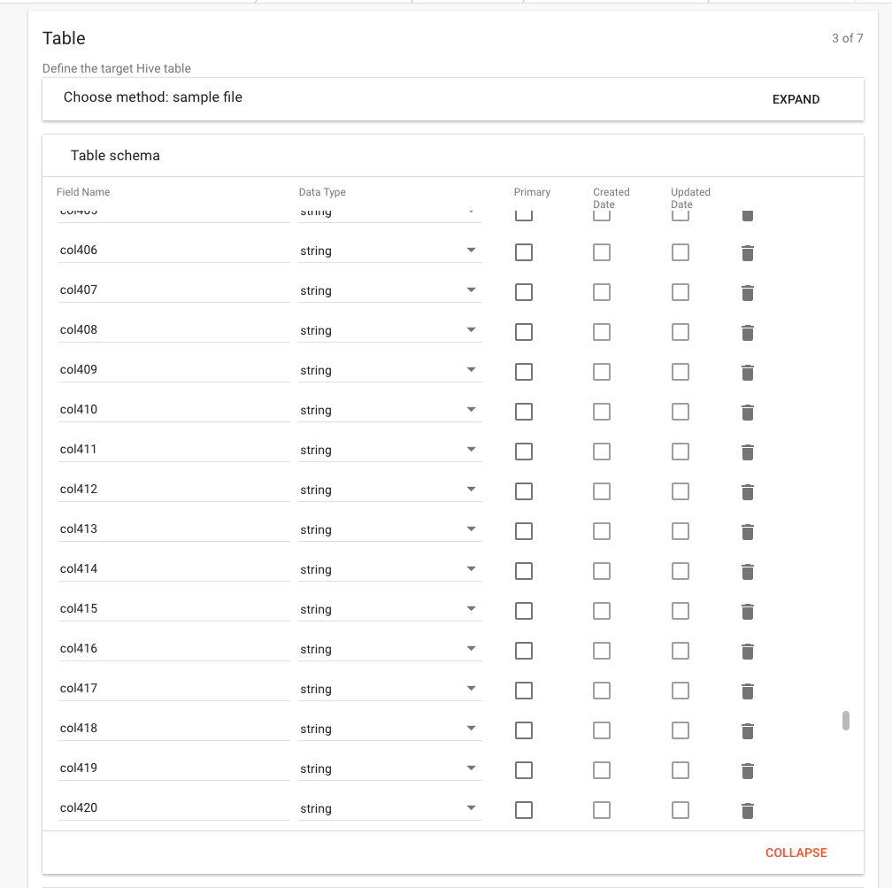
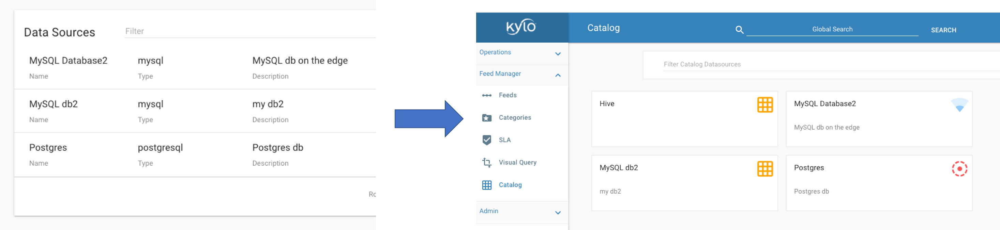
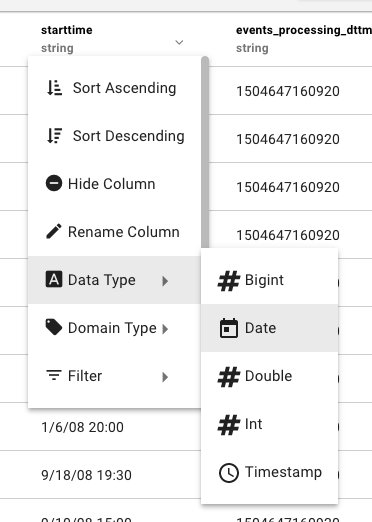
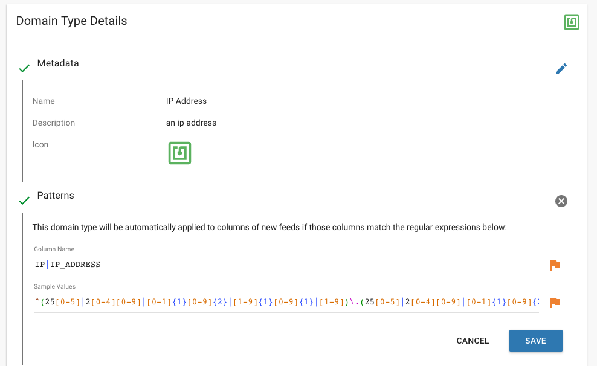
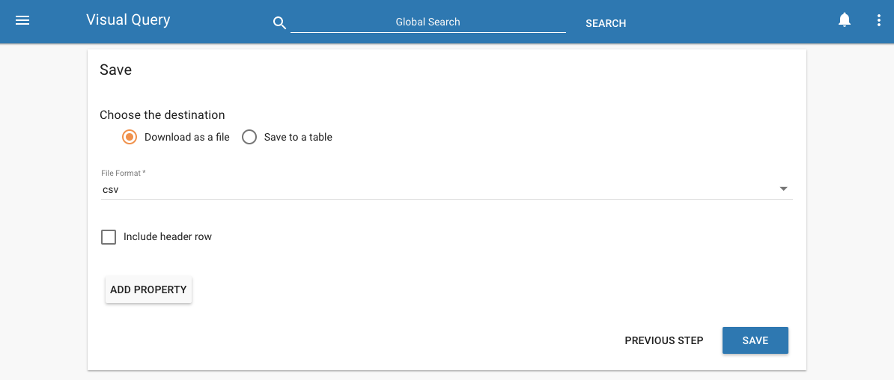
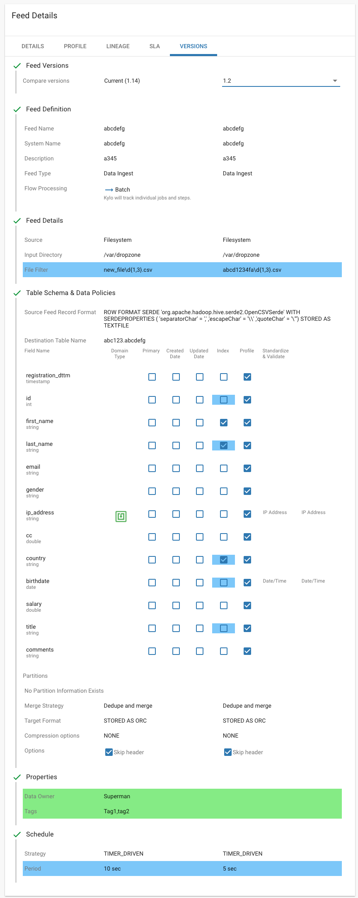

Release 0.9.0 (February 19, 2018)
=================================

Highlights
----------
- :ref:`UI improvements with large data feeds <ui_improvements>`
- :ref:`Improved Datasource Browsing <catalogs>`
- :ref:`Wrangler enhancements with data type conversions and domain type detection <wrangler>`
- :ref:`Exporting Visual Query to file or Hive table <visual_query>`
- :ref:`Kylo Localization support <localization>`
- :ref:`NiFi 1.5.0 support <nifi_support>`
- :doc:`Connect Reusable templates together <../how-to-guides/ConnectReusableTemplates>`
- :ref:`Improved Provenance handling for streaming feeds <streaming>`
- :ref:`Security enhancements <security>`
- :doc:`Entity Access Control for Elasticsearch <../how-to-guides/EntityAccessControlForElasticsearch>`
- :doc:`Ability to reindex historical feed data for Elasticsearch and Solr <../how-to-guides/ReindexHistoricalFeedData>`
- :doc:`New high-water mark policy to automatically cancel unreleased water marks (restores stuck feeds) <../how-to-guides/NiFiProcessorsDocs`
- Feed Versioning
- Save Point processor
- :doc:`n Issues fixed. <ReleaseNotes9.0.issues>`

Download Links
--------------
- Visit the :doc:`Downloads <../about/Downloads>` page for links.

Upgrade Instructions from v0.8.4.1
----------------------------------

1. Backup any Kylo plugins

  When Kylo is uninstalled it will backup configuration files, but not the `/plugin` jar files.
  If you have any custom plugins in either `kylo-services/plugin`  or `kylo-ui/plugin` then you will want to manually back them up to a different location.

2. Uninstall Kylo:

 .. code-block:: shell

   /opt/kylo/remove-kylo.sh

 ..

3. Install the new RPM:

 .. code-block:: shell

     rpm –ivh <RPM_FILE>

 ..

4. Restore previous application.properties files. If you have customized the the application.properties, copy the backup from the 0.8.3 install.

     4.1 Find the /bkup-config/TIMESTAMP/kylo-services/application.properties file

        - Kylo will backup the application.properties file to the following location, */opt/kylo/bkup-config/YYYY_MM_DD_HH_MM_millis/kylo-services/application.properties*, replacing the "YYYY_MM_DD_HH_MM_millis" with a valid time:

     4.2 Copy the backup file over to the /opt/kylo/kylo-services/conf folder

        .. code-block:: shell

          ### move the application.properties shipped with the .rpm to a backup file
          mv /opt/kylo/kylo-services/conf/application.properties /opt/kylo/kylo-services/conf/application.properties.0_8_3_template
          ### copy the backup properties  (Replace the YYYY_MM_DD_HH_MM_millis  with the valid timestamp)
          cp /opt/kylo/bkup-config/YYYY_MM_DD_HH_MM_millis/kylo-services/application.properties /opt/kylo/kylo-services/conf

        ..

     4.3 Copy the /bkup-config/TIMESTAMP/kylo-ui/application.properties file to `/opt/kylo/kylo-ui/conf`

     4.4 Ensure the property ``security.jwt.key`` in both kylo-services and kylo-ui application.properties file match.  They property below needs to match in both of these files:

        - */opt/kylo/kylo-ui/conf/application.properties*
        - */opt/kylo/kylo-services/conf/application.properties*

          .. code-block:: properties

            security.jwt.key=

          ..

5.  **NOTE:** Kylo no longer ships with the default **dladmin** user. You will need to re-add this user only if you're using the default authentication configuration:

   - Uncomment the following line in :code:`/opt/kylo/kylo-services/conf/application.properties` and :code:`/opt/kylo/kylo-ui/conf/application.properties` :

    .. code-block:: properties

        security.auth.file.users=file:///opt/kylo/users.properties
        security.auth.file.groups=file:///opt/kylo/groups.properties

    ..

   - Create a file called :code:`users.properties` file that is owned by kylo and replace **dladmin** with a new username and **thinkbig** with a new password:

    .. code-block:: shell

        echo "dladmin=thinkbig" > /opt/kylo/users.properties
        chown kylo:users /opt/kylo/users.properties
        chmod 600 /opt/kylo/users.properties

    ..

   - Create a file called :code:`groups.properties` file that is owned by kylo and set the default groups:

    .. code-block:: shell

        vi /opt/kylo/groups.properties

    .. code-block:: properties

        dladmin=admin,user
        analyst=analyst,user
        designer=designer,user
        operator=operations,user

    .. code-block:: shell

        chown kylo:users /opt/kylo/groups.properties
        chmod 600 /opt/kylo/groups.properties

6. To enable reindexing of a feed's historical data:

    1. Verify option in ``/opt/kylo/kylo-services/conf/application.properties`` for Kylo services. This is **true** by default.

        .. code-block:: shell

            search.history.data.reindexing.enabled=true
        ..

    2. If using Solr instead of Elasticsearch as the search engine, add one property to ``/opt/kylo/kylo-services/conf/solrsearch.properties`` file.

        .. code-block:: shell

            config.http.solr.url=http://${search.host}:${search.port}

        ..

7. Start Kylo

 .. code-block:: shell

   /opt/kylo/start-kylo-apps.sh

 ..

8. Once Kylo is up, to enable reindexing of a feed's historical data, complete these remaining steps:

    1. Import the updated Index Text Service feed via these steps:

        1. Feed Manager -> Feeds -> + orange button -> Import from file -> Choose file

        2. Pick the ``index_text_service_hs_v<version_number>.feed.zip`` file available at ``/opt/kylo/setup/data/feeds/nifi-1.3/history-reindexing/``

        3. Leave *Change the Category* field blank (It defaults to *System*)

        4. Click *Yes* for these three options (1) *Overwrite Feed* (2) *Replace Feed Template* (3) *Replace Reusable Template*

        5. Click *Import Feed*.

        6. Verify that the feed imports successfully.

    2. Import the History Reindex Text Service feed via these steps:

        1. Feed Manager -> Feeds -> + orange button -> Import from file -> Choose file

        2. Pick the ``history_reindex_text_service_hs_v<version_number>.feed.zip`` file available at ``/opt/kylo/setup/data/feeds/nifi-1.3/history-reindexing/``

        3. Leave *Change the Category* field blank (It defaults to *System*)

        4. Click *Yes* for these three options (1) *Overwrite Feed* (2) *Replace Feed Template* (3) *Replace Reusable Template*

        5. Click *Import Feed*.

        6. Verify that the feed imports successfully.

Highlight Details
-----------------

.. _ui_improvements:

   - UI improvements with large data feeds

      - Kylo's user interface now handles feeds with large column sets during feed creation, editing, and table/profile browsing

      |image0|

.. _catalogs:

   - Improved Datasource Browsing

      - The `Tables` link on the left is now called `Catalog`.  You can browse data from Hive as well as other Data Sources you have registered.

        |image1|

.. _wrangler:

   - Wrangler enhancements

      - Ability to quickly convert data types to other types

       |image3|

      - Detect domain types by column name as well as data

       |image4|

.. _visual_query:

   - Exporting Visual Query to file or Hive table

     |image5|

.. _localization:

   - Kylo Localization support

      - Kylo's UI is capable of supporting localization.  Contact |Think_Big_Analytics_Contact_Link| for translation options available under Kylo's Enterprise subscription support.

.. _nifi_support:

  - NiFi 1.5.0 support

      - Kylo now works with NiFi 1.5.0.  If you have NiFi 1.5.0, You should still use the spring profile ``nifi-v1.2`` in the ``kylo-services/conf/application.properties`` file.

  - :doc:`Connect Reusable templates together <../how-to-guides/ConnectReusableTemplates>`

.. _streaming:

   - Improved Provenance handling for streaming feeds

      - Streaming feed evetns will process much faster in JMS.  Streaming feeds are now derived within NiFi and the events will no longer be sent to  the `thinkbig.feed-manager` batch JMS queue.

.. _security:

  - Security enhancements

  - :doc:`Entity Access Control for Elasticsearch <../how-to-guides/EntityAccessControlForElasticsearch>`
  - :doc:`Ability to reindex historical feed data for Elasticsearch and Solr <../how-to-guides/ReindexHistoricalFeedData>`
  - Improved Release Highwatermark so flows wont get stuck

.. _versions:

   - Compare feed versions

      - You can now compare the current feed version against other saved versions and see what properties have changed over time.

      |image6|

- Save Point processor

  - A newly added Savepoint NiFi processor and ControllerService allows you to configure flows and retry failures within Kylo Operations Manager.

.. |Think_Big_Analytics_Contact_Link| raw:: html

   <a href="https://www.thinkbiganalytics.com/contact/" target="_blank">Think Big Analytics</a>