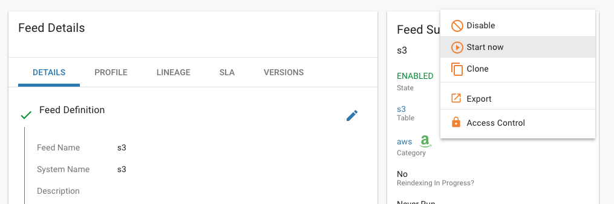

Release 0.9.1 (May 23, 2018)
============================

Highlights
----------
- Various issues fixed - |JIRA_Issues_Link|
- :ref:`NiFi 1.6.0 support <nifi_support>`
- :ref:`Spark  Shell default is now managed mode <spark_shell_managed_mode>`
- :ref:`Manually start a feed, irrespective of its schedule <start_now>`
- :doc:`NiFi Remote Process Group support <../how-to-guides/RemoteProcessGroups>`
- :ref:`New wrangler transformation features, profiling, performance, and improved user interface <wrangler_improvements>`
- :doc:`Hive to Teradata Ingest via TDCH <../how-to-guides/DataIngestTeradataTDCHTemplate>`
- :ref:`New advanced ingest templates for batch and streaming sources <advanced_ingest>`
- :ref:`XML ingest with nested struct and array transformation <xml_ingest>`

Download Links
--------------
- Visit the :doc:`Downloads <../about/Downloads>` page for links.

Upgrade Instructions from v0.9.0
----------------------------------

1. Backup any Kylo plugins

  When Kylo is uninstalled it will backup configuration files, but not the `/plugin` jar files.
  If you have any custom plugins in either `kylo-services/plugin`  or `kylo-ui/plugin` then you will want to manually back them up to a different location.

2. Uninstall Kylo:

 .. code-block:: shell

   /opt/kylo/remove-kylo.sh

 ..

3. Install the new RPM:

 .. code-block:: shell

     rpm –ivh <RPM_FILE>

 ..

4. Restore previous application.properties files. If you have customized the the application.properties, copy the backup from the 0.9.0 install.

     4.1 Find the /bkup-config/TIMESTAMP/kylo-services/application.properties file

        - Kylo will backup the application.properties file to the following location, */opt/kylo/bkup-config/YYYY_MM_DD_HH_MM_millis/kylo-services/application.properties*, replacing the "YYYY_MM_DD_HH_MM_millis" with a valid time:

     4.2 Copy the backup file over to the /opt/kylo/kylo-services/conf folder

        .. code-block:: shell

          ### move the application.properties shipped with the .rpm to a backup file
          mv /opt/kylo/kylo-services/conf/application.properties /opt/kylo/kylo-services/conf/application.properties.0_9_1_template
          ### copy the backup properties  (Replace the YYYY_MM_DD_HH_MM_millis  with the valid timestamp)
          cp /opt/kylo/bkup-config/YYYY_MM_DD_HH_MM_millis/kylo-services/application.properties /opt/kylo/kylo-services/conf

        ..

     4.3 If you copied the backup version of application.properties in step 4.2 you will need to make a couple of other changes based on the 0.9.1 version of the properties file

        .. code-block:: shell

          vi /opt/kylo/kylo-services/conf/application.properties

          # Add the auth-spark profile
          spring.profiles.include=native,nifi-v1.2,auth-kylo,auth-file,search-esr,jms-activemq,auth-spark

          # Add the new property
          kylo.feed.mgr.hive.target.syncColumnDescriptions=true

          # Add the new property to support the updated templates
          config.nifi.kylo.applicationJarDirectory=/opt/nifi/current/lib/app

          # Add new property to support remote process groups in a NiFi non-clustered environment
          kylo.template.remote-process-groups.enabled=false

          # Add this section to support Teradata ingest via Kylo template (using TDCH)
          ################################ Teradata Ingest via Kylo Template ################################################
          # When using data_ingest__teradata.template.zip, set these properties, start Kylo, and import the template
          # These values are defaults. Modify them as per your environment.
          #
          # StandardTdchConnectionService parameters
          # Ensure that the TDCH and Hive paths are correct
          nifi.service.standardtdchconnectionservice.jdbc_driver_class=com.teradata.jdbc.TeraDriver
          nifi.service.standardtdchconnectionservice.jdbc_connection_url=jdbc:teradata://localhost
          nifi.service.standardtdchconnectionservice.username=dbc
          nifi.service.standardtdchconnectionservice.password=
          nifi.service.standardtdchconnectionservice.tdch_jar_path=/usr/lib/tdch/1.5/lib/teradata-connector-1.5.4.jar
          nifi.service.standardtdchconnectionservice.hive_conf_path=/usr/hdp/current/hive-client/conf
          nifi.service.standardtdchconnectionservice.hive_lib_path=/usr/hdp/current/hive-client/lib

          # Kylo-Teradata-DBC connection parameters
          # Ensure that the driver paths are correct
          nifi.service.kylo-teradata-dbc.database_driver_location(s)=file:///opt/nifi/teradata/terajdbc4.jar,file:///opt/nifi/teradata/tdgssconfig.jar

          # The below parameters will use the values supplied for StandardTdchConnectionService above. Update them if needed (by default, you can leave them as such)
          nifi.service.kylo-teradata-dbc.database_connection_url=${nifi.service.standardtdchconnectionservice.jdbc_connection_url}
          nifi.service.kylo-teradata-dbc.database_driver_class_name=${nifi.service.standardtdchconnectionservice.jdbc_driver_class}
          nifi.service.kylo-teradata-dbc.database_user=${nifi.service.standardtdchconnectionservice.username}
          nifi.service.kylo-teradata-dbc.password=${nifi.service.standardtdchconnectionservice.password}
          ###################################################################################################################

        ..

     4.4 Repeat previous copy step for other relevant backup files to the /opt/kylo/kylo-services/conf folder. Some examples of files:

        - spark.properties
        - ambari.properties
        - elasticsearch-rest.properties
        - log4j.properties
        - sla.email.properties

        **NOTE:**  Be careful not to overwrite configuration files used exclusively by Kylo

     4.5 Copy the /bkup-config/TIMESTAMP/kylo-ui/application.properties file to `/opt/kylo/kylo-ui/conf`

     4.6 Ensure the property ``security.jwt.key`` in both kylo-services and kylo-ui application.properties file match.  They property below needs to match in both of these files:

        - */opt/kylo/kylo-ui/conf/application.properties*
        - */opt/kylo/kylo-services/conf/application.properties*

          .. code-block:: properties

            security.jwt.key=

          ..

5.  **NOTE IF UPGRADING FROM 0.8.3 (or below):** Kylo no longer ships with the default **dladmin** user. You will need to re-add this user only if you're using the default authentication
configuration:

   - Uncomment the following line in :code:`/opt/kylo/kylo-services/conf/application.properties` and :code:`/opt/kylo/kylo-ui/conf/application.properties` :

    .. code-block:: properties

        security.auth.file.users=file:///opt/kylo/users.properties
        security.auth.file.groups=file:///opt/kylo/groups.properties

    ..

   - Create a file called :code:`users.properties` file that is owned by kylo and replace **dladmin** with a new username and **thinkbig** with a new password:

    .. code-block:: shell

        echo "dladmin=thinkbig" > /opt/kylo/users.properties
        chown kylo:users /opt/kylo/users.properties
        chmod 600 /opt/kylo/users.properties

    ..

   - Create a file called :code:`groups.properties` file that is owned by kylo and set the default groups:

    .. code-block:: shell

        vi /opt/kylo/groups.properties

    .. code-block:: properties

        dladmin=admin,user
        analyst=analyst,user
        designer=designer,user
        operator=operations,user

    .. code-block:: shell

        chown kylo:users /opt/kylo/groups.properties
        chmod 600 /opt/kylo/groups.properties

6. Update the NiFi nars.

   Stop NiFi

   .. code-block:: shell

      service nifi stop

   ..

   Run the following shell script to copy over the new NiFi nars/jars to get new changes to NiFi processors and services.

   .. code-block:: shell

      /opt/kylo/setup/nifi/update-nars-jars.sh <NIFI_HOME> <KYLO_SETUP_FOLDER> <NIFI_LINUX_USER> <NIFI_LINUX_GROUP>

      Example:  /opt/kylo/setup/nifi/update-nars-jars.sh /opt/nifi /opt/kylo/setup nifi users

   ..

   Start NiFi

   .. code-block:: shell

      service nifi start

   ..

8. Remove kylo-service script. It has been moved

 .. code-block:: shell

   rm /opt/kylo/kylo-service

 ..

9. Start Kylo

 .. code-block:: shell

   kylo-service start

 ..

10. (Optional) Re-import default templates:

 - `Data Ingest <https://github.com/Teradata/kylo/blob/release/0.9.1/samples/templates/nifi-1.0/data_ingest.zip>`_
 - `Data Transformation <https://github.com/Teradata/kylo/blob/release/0.9.1/samples/templates/nifi-1.0/data_transformation.template.zip>`_
 - Import via (Admin | Templates -> + icon -> Import from a file -> Choose file -> Check yes to 'overwrite' feed template -> Check yes to 'Replace the reusable template' -> Import template)

11. (Optional) Import new templates:

 - `XML Ingest <https://github.com/Teradata/kylo/blob/release/0.9.1/samples/templates/nifi-1.0/xml_ingest.template.zip>`_
 - Import via (Admin | Templates -> + icon -> Import from a file -> Choose file -> Check yes to 'overwrite' feed template -> Check yes to 'Replace the reusable template' -> Import template)

12. (Optional) Import new batch and streaming ingest templates (NiFi 1.5+ required):

 - `Advanced Ingest <https://github.com/Teradata/kylo/blob/release/0.9.1/samples/templates/nifi-1.5/advanced_ingest.template.zip>`_
 - `Streaming Ingest <https://github.com/Teradata/kylo/blob/release/0.9.1/samples/templates/nifi-1.5/streaming_ingest.template.zip>`_
 - Import via (Admin | Templates -> + icon -> Import from a file -> Choose file -> Check yes to 'overwrite' feed template -> Check yes to 'Replace the reusable template' -> Import template)

**NOTE:** You will no longer see the kylo-spark-shell service start. The spark shell is now launched by kylo-services (managed mode)

Highlight Details
-----------------

.. _nifi_support:

  - NiFi 1.6.0 support

      - Kylo now works with NiFi 1.6.0.  If you have NiFi 1.6.0, You should still use the spring profile ``nifi-v1.2`` in the ``kylo-services/conf/application.properties`` file.

.. _spark_shell_managed_mode:

  - Spark Shell Service

      - The spark shell process has been removed and managed mode is now the default mode

.. _wrangler_improvements:

  - Wrangler/Visual Query improvements

      - Ability to upload a file from the desktop. In data source list, see upload file option.
      - New server-side paging provides improved user experience and ability to work with very large datasets
      - New column analysis (column dropdown) provides categorical and histogram statistics (numeric)
      - Many new functions available from column dropdown: Explode array, Flatten Struct, Impute Missing, Replace Missing,Crosstab,Array to Cols,One hot encode, index labels, Vectorize,and more.
      - New context menu options for operating on text selections and values (clear, split, strip, delete, etc)

.. _xml_ingest:

  - XML Ingest

      - New XML Ingest template provides the ability to setup a feed to ingest and transform XML into a tabular layout

.. _advanced_ingest:

  - Advanced Batch Ingest template

      - Adds additional datasources Azure Blob, S3, HDFS, REST, SFTP, Filesystem, and RDBMS
      - Uses new savepoint and retry features to improve restartability and robustness of pipelines

  - Streaming Ingest template

      - Streaming sources such as JMS, Kafka, HTTP Listener, MQTT, RELP, SQS
      - Streams into HBase with a Hive table access
      - JSON formats flattened into schema, otherwise stpred as key, clob value
      - Hive/HBase configuration required (An example of a guide: `hbase-via-hive <https://hortonworks.com/blog/hbase-via-hive-part-1/>`_)

.. _start_now:

   - Manually start a feed irrespective of its schedule

       |image0|

.. |Think_Big_Analytics_Contact_Link| raw:: html

   <a href="https://www.thinkbiganalytics.com/contact/" target="_blank">Think Big Analytics</a>

.. |JIRA_Issues_Link| raw:: html

   <a href="https://kylo-io.atlassian.net/issues/?jql=project%20%3D%20KYLO%20AND%20status%20%3D%20Done%20AND%20fixVersion%20%3D%200.9.1%20ORDER%20BY%20summary%20ASC%2C%20lastViewed%20DESC" target="_blank">Jira Issues</a>

