============
NiFi and SSL
============

This guide describes how to enable SSL for NiFi and configure Kylo to communicate with NiFi over SSL. As part of enabling SSL, NiFi will also automatically enable authentication requiring all users to provide a client certificate to access the NiFi UI unless an additional authentication method is configured. Information on additional authentication methods can be found in the NiFi System Administrator's Guide under |nifi_user_authentication|. Please see |hdp_link| for additional instructions on enabling SSL for NiFi.

To enable SSL for Kylo and configure NiFi to communicate with Kylo over SSL, please see the :doc:`KyloUIWithSSL` guide.

Certificates
============

Client certificates are used to authenticate the default admin user (aka Initial Admin Identity) and other NiFi nodes. It can either be a self-signed certificate or one signed by a CA (certificate authority). A self-signed certificate is the most common option and is the easiest to install, but a certificate signed by a CA provides an additional chain of trust for those that need it. Kylo should be configured to use this client certificate to communicate with NiFi.

It is recommended to start with a self-signed certificate and verify that everything works. It can then be replaced with a certificate signed by a CA.

Option: Self-Signed
-------------------

NiFi provides a toolkit for generating a self-signed CA and the certificates necessary for SSL communication and authentication. However, web browsers will display an "untrusted certificate" error when accessing the NiFi UI and will only allow access after acknowledging the risk. Adding the CA to the web browser's trust store will prevent the error from being displayed.

1. Download the NiFi toolkit from `https://nifi.apache.org/download.html <https://nifi.apache.org/download.html>`__

2. Upload it to the server (if necessary) and extract the contents:

.. code-block:: shell

   # For a tar.gz file:
   tar xzvf nifi-toolkit-1.6.0-bin.tar.gz -C /opt/nifi/

   # For a zip file:
   unzip nifi-toolkit-1.6.0-bin.zip -d /opt/nifi/

3. Prepare a directory for the certificates:

.. code-block:: shell

   mkdir /opt/nifi/data/ssl
   chown nifi /opt/nifi/data/ssl

4. Determine the hostnames that will be used to access NiFi from web browsers and from Kylo. Then generate the certificates using tls-toolkit:

.. code-block:: shell

   export JAVA_HOME=/opt/java/current

   # Replace <hostname> with the comma-separate list of hostnames used to access NiFi
   /opt/nifi/nifi-toolkit-1.6.0/bin/tls-toolkit.sh standalone -n '<hostname>' -C 'CN=kylo, OU=NIFI' -o .

5. Protect the files by ensuring that only Kylo and NiFi have access to them:

.. code-block:: shell

    chmod 755 /opt/nifi/data/ssl/
    chmod 600 /opt/nifi/data/ssl/CN\=kylo_OU\=NIFI.*
    chown kylo /opt/nifi/data/ssl/CN\=kylo_OU\=NIFI.*

    chmod 700 /opt/nifi/data/ssl/<hostname>/
    chown nifi -R /opt/nifi/data/ssl/<hostname>/

6. Remember the following properties and continue to the `Configuration`_ section:

.. code-block:: properties

   # Find the values for these properties in /opt/nifi/data/ssl/<hostname>/nifi.properties:
   nifi.security.keystore=/opt/nifi/data/ssl/<hostname>/keystore.jks
   nifi.security.keystoreType=jks
   nifi.security.keystorePasswd=...
   nifi.security.truststore=/opt/nifi/data/ssl/<hostname>/truststore.jks
   nifi.security.truststoreType=jks
   nifi.security.truststorePasswd=...

   # Additional properties (not in nifi.properties):
   # Replace <hostname> with the host Kylo will use to communicate with NiFi
   # Replace <kylo-keystore-password> with the contents of /opt/nifi/data/ssl/CN=kylo_OU=NIFI.password
   nifi.rest.host=<hostname>
   nifi.rest.keystorePath=/opt/nifi/data/ssl/CN=kylo_OU=NIFI.p12
   nifi.rest.keystorePassword=<kylo-keystore-password>
   nifi.rest.keystoreType=PKCS12

Option: CA Signed SSL
---------------------

An SSL certificate signed by a CA (certificate authority) will ensure that all web browsers display NiFi as a trusted site. This section assumes that you've already completed `Option: Self-Signed`_.

1. Generate a CSR (certificate signing request) with the CN (common name) set to the hostname that will be used to access the NiFi UI. Send the CSR to the CA and have it signed.

2. Download the SSL certificate bundle (.p7b or .p12 file) from the CA and convert it to a JKS file:

.. code-block:: shell

   # Replace /path/to/host.p12 with the certificate file provided by the CA
   # Enter a new password when prompted to enter a keystore password
   # If prompted to trust this certificate type 'yes'
   /opt/java/current/bin/keytool -import -trustcacerts -alias nifi-key -file /path/to/host.p12 -keystore /opt/nifi/data/conf/keystore.jks

3. Download the CA's intermediate certificate (.crt file) and convert it to a JKS file:

.. code-block:: shell

   # Replace /path/to/ca.p12 with the intermediate certificate file provided by the CA
   # Enter the nifi.security.truststorePasswd value when prompted to enter a keystore password
   # If prompted to trust this certificate type 'yes'
   /opt/java/current/bin/keytool -importcert -trustcacerts -alias ca-cert -file /path/to/ca.crt -keystore /opt/nifi/data/ssl/<hostname>/truststore.jks

4. Remember the following properties and continue to the `Configuration`_ section:

.. code-block:: properties

   nifi.security.keystore=/opt/nifi/data/conf/keystore.jks
   nifi.security.keystoreType=jks
   # Replace value with password entered in step 2:
   nifi.security.keystorePasswd=...

Option: CA Signed Client
------------------------

A client certificate signed by a CA (certificate authority) provides an additional chain of trust for Kylo to communicate with NiFi. This section assumes that you've already completed `Option: CA Signed SSL`_.

1. Generate a CSR (certificate signing request) with the subject set to :code:`/OU=NIFI/CN=kylo` and the DNS hostname set to the hostname that will be used by Kylo to access NiFi. Send the CSR to the CA and have it signed.

2. Download the SSL certificate bundle (a .p12 file) and place it in a known location such as /opt/kylo/kylo-services/conf/nifi-cert.p12

3. Remember the following properties and continue to the `Configuration`_ section:

.. code-block:: properties

   # Replace <hostname> with the host Kylo will use to communicate with NiFi
   nifi.rest.host=<hostname>
   nifi.rest.keystorePath=/opt/kylo/kylo-services/conf/nifi-cert.p12
   # Replace with the password to the certificate bundle:
   nifi.rest.keystorePassword=...
   nifi.rest.keystoreType=PKCS12

Configuration
=============

Kylo and NiFi will need to be configured to use the certificates created in the previous section.

1. If a self-signed certificate was generated, replace the following properties in /opt/nifi/current/conf/nifi.properties with the values from /opt/nifi/data/ssl/<hostname>/nifi.properties:

.. code-block:: properties

    # Site to Site properties
    nifi.remote.input.host
    nifi.remote.input.secure
    nifi.remote.input.socket.port
    nifi.remote.input.http.enabled
    nifi.remote.input.http.transaction.ttl

    # web properties #
    nifi.web.war.directory
    nifi.web.http.host
    nifi.web.http.port
    nifi.web.https.host
    nifi.web.https.port
    nifi.web.jetty.working.directory
    nifi.web.jetty.threads

    # security properties #
    nifi.sensitive.props.key
    nifi.sensitive.props.key.protected
    nifi.sensitive.props.algorithm
    nifi.sensitive.props.provider
    nifi.sensitive.props.additional.keys

    nifi.security.keystoreType
    nifi.security.truststoreType
    nifi.security.needClientAuth
    nifi.security.user.authorizer
    nifi.security.user.login.identity.provider
    nifi.security.ocsp.responder.url
    nifi.security.ocsp.responder.certificate

    # cluster common properties (all nodes must have same values)
    nifi.cluster.protocol.is.secure
    
2. Replace the following properties in /opt/nifi/current/conf/nifi.properties with your remembered properties:

.. code-block:: properties

    nifi.security.keystore
    nifi.security.keystorePasswd
    # Set to the save value as nifi.security.keystorePasswd:
    nifi.security.keyPasswd
    nifi.security.truststore
    nifi.security.truststorePasswd

3. Configure NiFi to give admin access to the client certificate by editing /opt/nifi/data/conf/authorizers.xml and adding the `Initial Admin Identity` property. Here is an example:

.. note:: The `Initial Admin Identity` must exactly match the subject of the client certificate as displayed by keytool. NiFi will automatically add a matching user to /opt/nifi/current/conf/users.xml. If the client certificate is updated with a different CN, then users.xml will also need to be updated.

.. code-block:: xml

    <authorizer>
        <identifier>file-provider</identifier>
        <class>org.apache.nifi.authorization.FileAuthorizer</class>
        <property name="Authorizations File">./conf/authorizations.xml</property>
        <property name="Users File">./conf/users.xml</property>
        <property name="Initial Admin Identity">CN=kylo, OU=NIFI</property>
        <property name="Legacy Authorized Users File"></property>

        <!-- Provide the identity (typically a DN) of each node when clustered, see above description of Node Identity.
        <property name="Node Identity 1"></property>
        <property name="Node Identity 2"></property>
        -->
    </authorizer>

4. Restart NiFi if any files were changed.

5. Validate that NiFi is using the correct certificate for SSL communication:

.. code-block:: shell

   # The displayed certificate should have a CN that matches the hostname,
   # and the issuer should be NIFI for self-signed certificates or the CA
   openssl s_client -showcerts -servername <hostname> -connect <hostname>:9443 2>/dev/null \
   | openssl x509 -inform pem -noout -text

6. Validate that NiFi accepts the client certificate:

.. code-block:: shell

   # Extract the certificate and key from the nifi.rest.keystorePath .p12 bundle:
   openssl pkcs12 -in <nifi.rest.keystorePath> -out nifi-rest.key -nocerts -nodes
   openssl pkcs12 -in <nifi.rest.keystorePath> -out nifi-rest.crt -clcerts -nokeys

   # The output should be a JSON object that includes the `Initial Admin Identity` used above
   curl -k --key ./nifi-rest.key --cert ./nifi-rest.crt https://<hostname>:<port>/

7. Replace the following properties in /opt/kylo/kylo-services/conf/application.properties with your remembered properties:

.. code-block:: properties

   # Use the following exact values for these properties:
   nifi.rest.https=true
   nifi.rest.useConnectionPooling=false
   nifi.rest.truststoreType=JKS
   nifi.rest.keystoreType=PKCS12

   # Set to nifi.web.https.port from nifi.properties:
   nifi.rest.port
   # Set to nifi.security.truststore from nifi.properties:
   nifi.rest.truststorePath
   # Set to nifi.security.truststorePasswd from nifi.properties:
   nifi.rest.truststorePassword

   # Use the remembered values for these properties:
   nifi.rest.host
   nifi.rest.keystorePath
   nifi.rest.keystorePassword

8. Restart kylo-services and add a new feed to verify that Kylo can communicate with NiFi

Web Browsers
============

Web browsers can also be configured to use the client certificate to access NiFi.

.. rubric:: Importing the Client Cert on the Mac

1. Copy the .p12 file that you created above (nifi.rest.keystorePath) to your Mac.

2. Open Keychain Access.

3. Create a new keychain with a name.  The client cert is copied into this new keychain, which in the example here is named "nifi-cert". If you add it directly to the System, the browser will ask you for the login/pass every time NiFi does a request.

   a. In the left pane, right-click "Keychains" and select "New Keychain".

      |image1|

   b. Give it the name "nifi-cert" and a password.

+------------+------------+
| |image2|   | |image3|   |
+------------+------------+

4. Once the keychain is created, click on it and select File -> import
   Items, and then find the .p12 file that you copied over in step 1.

+------------+------------+
| |image4|   | |image5|   |
+------------+------------+

   Once complete you should have something that looks like this:

   |image6|

.. rubric:: Accessing NiFi under SSL

Open the port defined in the NiFi.properties above: 9443.

The first time you connect to NiFi (https://localhost:9443/nifi) you
will be instructed to verify the certificate.  This will only happen
once.

1. Click **OK** at the dialog prompt.

   |image7|

2. Enter the Password that you supplied for the keychain.  This is the password that you created for the keychain in "Importing the Client Cert on the Mac" Step 3b.

   |image8|

3. Click Always Verify.

   |image9|

4. Click AdvancKyloConfiguration.rsted and then Click Proceed.  It will show up as "not private" because it is a self-signed cert.

   |image10|

5. NiFi under SSL.  Notice the User name matches the one supplied via the certificate that we created:  "CN=kylo, OU=NIFI".

   |image11|

   Refer to the Hortonworks documentation on Enabling SSL for NiFi:

      |hdp_link|

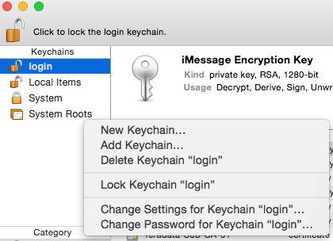
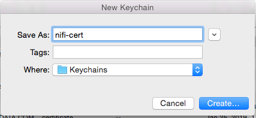
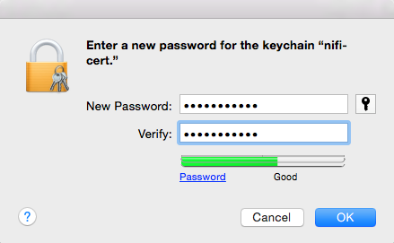
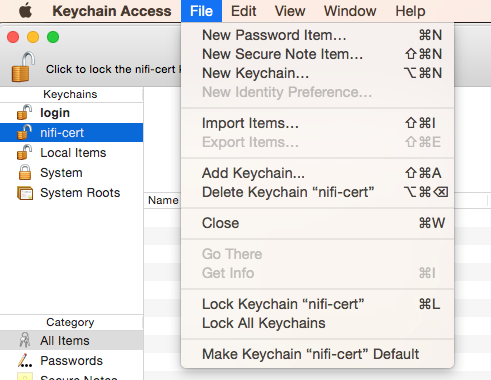
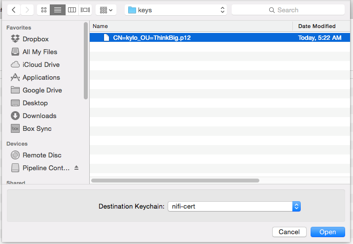
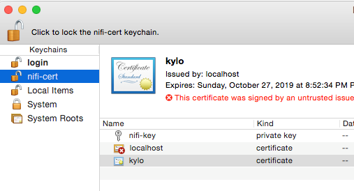
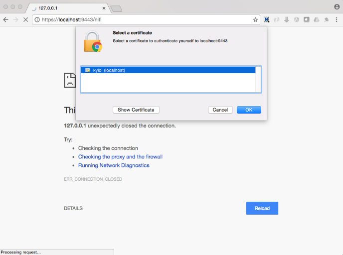
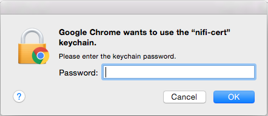
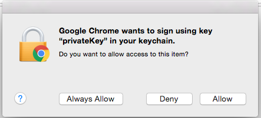
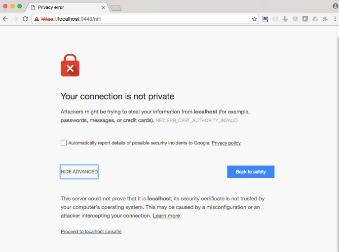
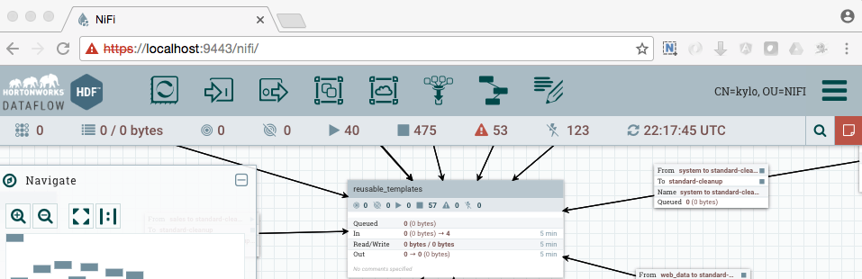
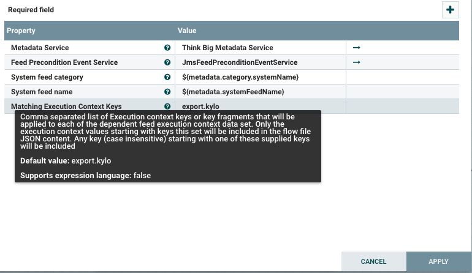
.. |image13| image:: ../media/kylo-config/KC13.png
   :width: 3.12500in
   :height: 1.41667in
.. |image14| image:: ../media/kylo-config/KC14.png
   :width: 3.12500in
   :height: 2.32292in
.. |image15| image:: ../media/kylo-config/KC15.png
   :width: 5.92426in
   :height: 1.91146in
.. |nifi_user_authentication| raw:: html

    <a href="https://nifi.apache.org/docs/nifi-docs/html/administration-guide.html#user_authentication" target="_blank">User Authentication</a>

.. |hdp_link| raw:: html

    <a href="https://docs.hortonworks.com/HDPDocuments/HDF2/HDF-2.0.0/bk_ambari-installation/content/ch_enabling-ssl-for-nifi.html" target="_blank">Enabling SSL for NiFi</a>
