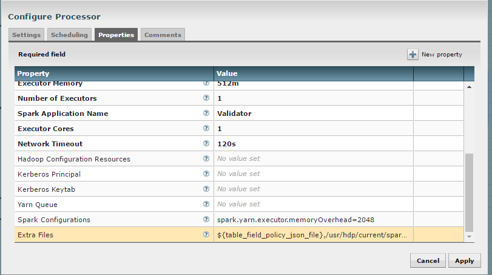

======================
Troubleshooting & Tips
======================
  

Tuning the ExecuteSparkJob Processor
====================================

Problem
-------

By default, the ExecuteSparkJob processor is configured to run in
*local* or *yarn-client* mode. When a Hadoop cluster is available, it is
recommended that the properties be updated to make full use of the
cluster.

Solution
--------

Your files and jars should be made available to Spark for distributing
across the cluster. Additional configuration may be required for Spark
to run in *yarn-cluster* mode.

1. Add the DataNucleus jars to the “Extra Jars” parameter:

   a. /usr/hdp/current/spark-client/lib/datanucleus-api-jdo-x.x.x.jar

   b. /usr/hdp/current/spark-client/lib/datanucleus-core-x.x.x.jar

   c. /usr/hdp/current/spark-client/lib/datanucleus-rdbms-x.x.x.jar

2. Add the hive-site.xml file to the “Extra Files” parameter:

   a. For Cloudera, this file is at
      /etc/hive/conf.cloudera.hive/hive-site.xml.

   b. For Hortonworks, this file is at
      /usr/hdp/current/spark-client/conf/hive-site.xml.

3. The "Validate and Split Records" and "Profile Data" processors from
   standard-ingest require access to the json policy file. Add
   “${table_field_policy_json_file}” to the “Extra Files”
   properties to make this file available.

    |image1|

4. The “Execute Script” processor from the data-transformation reusable
   template requires access to the Scala script.

   a. Change “MainArgs” to:
      ``${transform_script_file:substringAfterLast('/')}``

   b. Add the following to “Extra Files”: ``${transform_script_file}``

Additionally, you can update your Spark configuration with the
following:

1. It is ideal to have 3 executors per node minus 1 used by the manager:

   a. num-executor = 3 * (number of nodes) - 1

2. Executor cores should be either 4, 5, or 6 depending on the total number
   of available cores. This should be tested. Starting with 6 tends
   to work well:

   a. spark.executor.cores = 6

3. Determine the total memory using the following equation:

   a. total.memory (GB) = yarn.nodemanager.resource.memory-mb *
      (spark.executor.cores / yarn.nodemanager.resource.cpu-vcores)

4. Use total.memory and split it between spark.executor.memory and
   spark.yarn.executor.memoryOverhead (15-20% of total memory):

   a. spark.yarn.executor.memoryOverhead = total.memory * (0.15)

   b. spark.executor.memory = total.memory
      - spark.yarn.executor.memoryOverhead

Dealing with non-standard file formats
======================================

Problem
-------

You need to ingest a file with a non-standard format.

Solution
--------

There are two possible solutions:

1. You may write a custom SerDe and register that SerDe in HDFS. Then
   specify the use of the SerDe in the source format field of the
   schema tab during feed creation.

   a. Here’s an example SerDe that reads ADSB files:
      https://github.com/gm310509/ADSBSerDe

   b. The dependencies in the pom.xml file may need to be changed to
      match your Hadoop environment.

2. You can use two feeds: 1) ingest; 2) use the wrangler to
   manipulate the fields into columns:

   a. Create an ingest field, manually define the schema as a single
      field of type string. You can just call that field "data".

   b. Make sure the format specification doesn't conflict with data in
      the file, i.e., tabs or commas which might cause it to get split.

   c. Once ingested, create a data transform feed to wrangle the data
      using the transform functionsHi.

   d. Here's an example of converting the weird ADSB format into JSON
      then converting into fields:

.. code-block:: js
   :linenos:

    select(regexp_replace(data, "([\\w-.]+)\t([\\w-.]+)", "\"$1\":\"$2\"").as("data"))
    select(regexp_replace(data, "\" *\t\"", "\",\"").as("data"))
    select(concat("{", data, "}").as("data"))
    select(json_tuple(data, "clock", "hexid", "ident", "squawk", "alt", "speed", "airGround", "lat", "lon", "heading"))
    select(c0.as("clock"), c1.as("hexid"), c2.as("ident"), c3.as("squawk"), c4.as("alt"), c5.as("speed"), c6.as("airGround"), c7.as("lat"), c8.as("lon"), c9.as("heading"))

Merge Table fails when storing as Parquet using HDP
===================================================

Problem
-------

There is a bug with Hortonworks where a query against a Parquet backed
table fails while using single or double quotes in the value names. For
example: 

.. code-block:: none

    hive> select * from users_valid where processing_dttm='1481571457830';
    OK
    SLF4J: Failed to load class "org.slf4j.impl.StaticLoggerBinder".
    SLF4J: Defaulting to no-operation (NOP) logger implementation
    SLF4J: See http://www.slf4j.org/codes.html#StaticLoggerBinder for further details.
    Failed with exception java.io.IOException:java.lang.IllegalArgumentException: Column [processing_dttm] was not found in schema!

Solution
--------

You need to set some Hive properties for queries to work in Hive. These
forum threads explain how to set the correct property:

1. https://community.hortonworks.com/questions/47897/illegalargumentexception-when-select-with-where-cl.html

2. https://community.hortonworks.com/questions/40445/querying-a-partition-table.html

3. On the Hive command line you can set the following property to allow
   quotes:

.. code-block:: properties

   set hive.optimize.ppd = false;

NiFi becomes non-responsive
===========================

Problem
-------

NiFi appears to be up but the UI is no longer functioning. NiFi may be
running low on memory.  There may be PID files in the /opt/nifi/current
directory.

Solution
--------

Increase memory to NiFi by editing
/opt/nifi/current/conf/boostrap.conf and setting the following line:

.. code-block:: properties

   java.arg.3=-Xmx3g

Additionally, it may also be necessary to create swap space but this is
not recommended by NiFi for performance reasons.

Automated Feed and Template Importing
=====================================

Problem
-------

Feeds and templates should be automatically imported into the staging or
production environment as part of a continuous integration process.

Solution
--------

The Kylo REST API can be used to automate the importing of feeds and
templates.

Templates can be imported either as an XML or a ZIP file. Set
the `overwrite` parameter to `true` to indicate that existing templates
should be replaced otherwise an error will be returned. Set
the `createReusableFlow` parameter to true if the template is an XML file
that should be imported as a reusable template.
The `importConnectingReusableFlow` parameter indicates how to handle a ZIP
file that contains both a template and its reusable flow.
The `NOT_SET` value will cause an error to be returned if the template
requires a reusable flow. The `YES` value will cause the reusable flow to
be imported along with the template. The `NO` value will cause the
reusable flow to be ignored and the template to be imported as normal.

.. code-block:: properties

  curl -F file=@<path-to-template-xml-or-zip> -F overwrite=false -F createReusableFlow=false -F importConnectingReusableFlow=NOT_SET -u <kylo-user>:<kylo-password> http://<kylo-host>:8400/proxy/v1/feedmgr/admin/import-template

..

Feeds can be imported as a ZIP file containing the feed metadata and
NiFi template. Set the `overwrite` parameter to `true` to indicate that an
existing feed and corresponding template should be replaced otherwise an
error will be returned. The `importConnectingReusableFlow` parameter
functions the same as the corresponding parameter for importing a
template.

.. code-block:: properties

      curl -F file=@<path-to-feed-zip> -F overwrite=false -F importConnectingReusableFlow=NOT_SET -u <kylo-user>:<kylo-password> http://<kylo-host>:8400/proxy/v1/feedmgr/admin/import-feed

..

Spark job failing on sandbox with large file
============================================

Problem
-------

If running on a sandbox (or small cluster) the spark executor may get
killed due to OOM when processing large files in the standard ingest
flow. The flow will route to failed flow but there will be no error
message.  Look for Exit Code 137 in /var/log/nifi/nifi-app.log.  This
indicates an OOM issue.

Solution
--------

On a single-node sandbox it is better to run Spark in *local* mode than
*yarn-client* mode and simply give Spark enough memory to perform its
task. This eliminates all the YARN scheduler complications.

1. In the standard-ingest flow, stop and alter the ExecuteSparkJob
   processors:   

   a. Set the SparkMaster property to *local* instead of *yarn-client*.

   b. Increase the Executor Memory property to at least 1024m.

2. Start the processors.

NiFi hangs executing Spark task step
====================================

Problem
-------

Apache NiFi flow appears to be stuck inside the Spark task such as
"Validate and Split Records" step. This symptom can be verified by
viewing the YARN jobs. The Spark job appears to be running and there is
a Hive job queued to run but never launched: http://localhost:8088/cluster

So what is happening?  Spark is executing a Hive job to insert data into
a Hive table but the Hive job never gets YARN resources. This is a
configuration problem that leads to a deadlock. Spark will never
complete because the Hive job will never get launched. The Hive job is
blocked by the Spark job.

Solution
--------

First you will need to clean up the stuck job then re-configure the YARN
scheduler.

To clean up the stuck job, from the command-line as root:

1. Obtain the PID of the Spark job:

.. code-block:: shell

    ps -ef | grep Spark | grep Validator

2. Kill the Spark job:

.. code-block:: shell

    kill <pid>

Configure YARN to handle additional concurrent jobs:

1. Increase the maximum percent with the following parameter
   (see: https://hadoop.apache.org/docs/r0.23.11/hadoop-yarn/hadoop-yarn-site/CapacityScheduler.html):

.. code-block:: properties

    yarn.scheduler.capacity.maximum-am-resource-percent=0.8

2. Restart the cluster or all affected services.

3. Restart Apache NiFi to re-initialized Thrift connection pool:

.. code-block:: shell

    service nifi restart

.. note:: In Ambari, find this under Yarn | Configs (advanced) | Scheduler.

Spark SQL fails on empty ORC and Parquet tables
================================================

Problem
-------

Your spark job fails when running in HDP 2.4 or 2.5 while interacting
with an empty ORC table. A likely error that you will see is:

.. code-block:: properties

    ExecuteSparkJob[id=1fb1b9a0-e7b5-4d85-87d2-90d7103557f6] java.util.NoSuchElementException: next on empty iterator

..

This is due to a change Hortonworks added that modified how it loads the
schema for the table. 

Solution
--------

To fix the issue, you can take these steps:

1. On the edge node,
   edit the file: /usr/hdp/current/spark-client/conf/spark-defaults.conf

2. Add these configuration entries to the file:

.. code-block:: none

    spark.sql.hive.convertMetastoreOrc false
    spark.sql.hive.convertMetastoreParquet false

See |Spark SQL Fails on Empty ORC Table HDP 242_Link|

High Performance NiFi Setup
===========================

Problem
-------

The NiFi team published an article on how to extract the most
performance from Apache NiFi.

Solution
--------

See |How to Setup a High Performance NiFi_Link|

RPM install fails with 'cpio: read' error
=========================================

Problem
-------

Kylo rpm install fails giving a 'cpio: read' error.

Solution
--------

This problem occurs if the rpm file is corrupt or not downloaded
properly. Try re-downloading the Kylo rpm from the Kylo website.

Accessing Hive tables from Spark
================================

Problem
-------

You receive a NoSuchTableException when trying to access a Hive table
from Spark.

Solution
--------

Copy the hive-site.xml file from Hive to Spark.

For Cloudera, run the following command:

.. code-block:: shell

    cp /etc/hive/conf/hive-site.xml /usr/lib/spark/conf/

..

Compression codec not found for PutHDFS folder
==============================================

Problem
-------

The PutHDFS processor throws an exception like:

.. code-block:: none

    java.lang.IllegalArgumentException: Compression codec com.hadoop.compression.lzo.LzoCodec not found.

..

Solution
--------

Edit the /etc/hadoop/conf/core-site.xml file and remove the failing
codec from the io.compression.codecs property.

Creating a cleanup flow
=======================

Problem
-------

When deleting a feed it is sometimes useful to run a separate NiFi flow
that will remove any HDFS folders or Hive tables that were created by
the feed.

Solution
--------

1. You will need to have a controller service of type
   JmsCleanupEventService. This service has a Spring Context Service
   property that should be connected to another service of type
   SpringContextLoaderService.

2. In your NiFi template, create a new input processor of type
   TriggerCleanup. This processor will be run automatically when a
   feed is deleted.

3. Connect additional processors such as RemoveHDFSFolder or
   DropFeedTables as needed.

Accessing S3 from the data wrangler
===================================

Problem
-------

You would like to access S3 or another Hadoop-compatible filesystem from
the data wrangler.

Solution
--------

The Spark configuration needs to be updated with the path to the JARs
for the filesystem.

To access S3 on HDP, the following must be added to the spark-env.sh
file:

.. code-block:: shell

   export SPARK_DIST_CLASSPATH=$(hadoop classpath)

.. 

Additional information is available from the |Apache Spark project_Link|.

Dealing with XML files
======================

Problem
-------

You need to ingest an XML file and parse into Hive columns.

Solution
--------

1. You can use two feeds: 1) ingest; 2) use the wrangler to
   manipulate the fields into columns:

   a. Create an ingest field and manually define the schema as a single
      field of type string.  You can just call that field "data".

   b. Make sure the format specification doesn't conflict with data in
      the file, i.e. tabs or commas which might cause it to get split.

   c. Once ingested, create a data transform feed to wrangle the data
      using the transform functions.

   d. Here's an example of converting XML to columns using wrangler
      functions:

XML Explode
-----------

.. code-block:: js
   :linenos:

    select(regexp_replace(contents, "(?s).*<TicketDetails>\\s*<TicketDetail>\\s*", "").as("xml"))
    select(regexp_replace(xml, "(?s)</TicketDetails>.*", "").as("xml"))
    select(split(xml, "<TicketDetail>\\s*").as("TicketDetails"))
    select(explode(TicketDetails).as("TicketDetail"))
    select(concat("<TicketDetail>", TicketDetail).as("TicketDetail"))
    xpath_int(TicketDetail, "//Qty").as("Qty")
    xpath_int(TicketDetail, "//Price").as("Price")
    xpath_int(TicketDetail, "//Amount").as("Amount")
    xpath_int(TicketDetail, "//NetAmount").as("NetAmount")
    xpath_string(TicketDetail, "//TransDateTime").as("TransDateTime")
    drop("TicketDetail")

Dealing with fixed width files
==============================

Problem
-------

You need to load a fixed-width text file.

Solution
--------

This is possible to configure with the schema tab of the feed creation
wizard. You can set the SerDe and properties:

1. Create an ingest feed.

2. When at the schema tab look for the field (near bottom) specifying
   the source format.

3. Manually build the schema since Kylo won’t detect the width.

4. Place text as follows in the field substituting regex based on the
   actual columns:

.. code-block:: none

    ROW FORMAT SERDE 'org.apache.hadoop.hive.contrib.serde2.RegexSerDe'
    WITH SERDEPROPERTIES ("input.regex" = "(.{10})(.{20})(.{20})(.{20})(.{5}).\*")

..

Dealing with custom SerDe or CSV files with quotes and escape characters
========================================================================

Problem
-------

You need to load a CSV file with surrounding quotes and don't want those
quotes removed.

Solution
--------

This is possible to configure within the schema tab of the ingest feed
creation, you can set the SerDe and properties:

1. Create an ingest feed.

2. When at the schema tab look for the field (near bottom) specify the
   source format.

3. See the Apache wiki |CSV+Serde for Configuring CSV Options_Link|.

4. Place text as follows in the field:

.. code-block:: none

      ROW FORMAT SERDE 'org.apache.hadoop.hive.serde2.OpenCSVSerde'
      WITH SERDEPROPERTIES (
         "separatorChar" = ",",
         "quoteChar"     = "\\\\"",
         "escapeChar"="\\\\\\\\");
       )

..

Notice the double escape required!

Configuration on a Node with Small Root Filesystem
==================================================

Problem
-------

The node that Kylo will run on has a small root filesystem. There are other mounts that contain larger space but in particular, the following directories contain 30GB or less.

- **/opt** which is used for libraries, executables, configs, etc

- **/var** which is used for logs, storage, etc

- **/tmp** which is used for processing data

For Kylo, these directories get filled up very quickly and this causes all processes on the edge node to freeze.

Solution
--------

In general, the solution is to move all the large files onto the larger data mount. For this solution, the /data directory is considered to be the largest and most ideal location to contain Kylo artifacts (logs, storage, etc).

To alleviate the disk space issues, these steps were taken to move items to the /data directory

**Relocate MySQL**

The default location of MySQL is /var/lib/mysql. MySQL will fill up the root partition with the default configuration so the storage volumes for MySQL must be migrated to /data/mysql.

1. Stop MySQL: **service mysql stop**

2. Copy data over to new location: **rsync -av /var/lib/mysql /data/**

3. Backup the existing data: **mv /var/lib/mysql /var/lib/mysql.bak**

4. Backup the existing my.cnf: **cp /etc/my.cnf /etc/my.cnf.bak**

5. Update MySQL config with new location with the values below: **vi /etc/my.cnf**

   a. Under [mysqld], set datadir = /data/mysql

6. Start MySQL: **service mysql start**

7. Back up old MySQL directory: **tar -zcvf mysql_bak.tar.gz mysql.bak**

**Change properties to point to /data**

#. Kylo

   #. Update /opt/kylo-services/log4j.properties

      #. log4j.appender.file.File=/data/log/kylo-services/kylo-services.log

   #. Update /opt/kylo-services/log4j-spark.properties

      #. log4j.appender.file.File=/data/log/kylo-services/kylo-spark-shell.log

   #. Update /opt/kylo-ui/log4j.properties

      #. log4j.appender.file.File=/data/log/kylo-ui/kylo-ui.log

2. Nifi

   #. Update /opt/nifi/nifi.properties

      #. nifi.flow.configuration.file=/data/opt/nifi/data/conf/flow.xml.gz

      #. nifi.flow.configuration.archive.dir=/data/opt/nifi/data/conf/archive/

      #. nifi.authorizer.configuration.file=/data/opt/nifi/data/conf/authorizers.xml

      #. nifi.login.identity.provider.configuration.file=/data/opt/nifi/data/conf/login-identity-providers.xml

      #. nifi.templates.directory=/data/opt/nifi/data/conf/templates

      #. nifi.flowfile.repository.directory=/data/opt/nifi/data/flowfile_repository

      #. nifi.content.repository.directory.default=/data/opt/nifi/data/content_repository

      #. nifi.provenance.repository.directory.default=/data/opt/nifi/data/provenance_repository

3. Elasticsearch

   #. Update /opt/elasticsearch/elasticsearch.yml

      #. path.data: /data/elasticsearch

      #. path.logs: /data/log/elasticsearch

GetTableData vs ImportSqoop Processor
=====================================

Problem
-------

You need to load data from a structured datastore.

Solution
--------

There are two major NiFi processors provided by Kylo for importing data into Hadoop: GetTableData and ImportSqoop.

a. **GetTableData** leverages JDBC to pull data from the source into the flowfile within NiFi. This content will then need to be pushed to HDFS (via a PutHDFS processor).

b. **ImportSqoop** executes a Sqoop job to pull the content from the source and place it directly to HDFS. For details on how this is done, please refer to `Apache Sqoop <http://sqoop.apache.org/>`_.

In general, it is recommended to use the ImportSqoop processor due to performance. Using the GetTableData processors uses the edge node (where NiFi is running) as a middle-man. The ImportSqoop processor runs a MapReduce job that can be tuned to load the data efficiently. For example, a single mapper will be sufficient if you are loading a reference table but a table with billions of rows would benefit from multiple mappers.

The GetTableData processor should be used when the data being pulled is small. Other use cases are when certain pre-processing steps are required that benefit from being on the edge node. For instance, if the edge node resides behind a firewall and PII (personal identifiable information) fields need to be masked before being pushed to a more open HDFS environment.

Kylo's Data Ingest template comes with out-of-the-box support for the GetTableData processor. To use the ImportSqoop processor instead, the following changes should to be made to the Data Ingest template and the standard-ingest reusable template:

#. Replace the GetTableData processor with the ImportSqoop processor

#. Remove the PutHDFS processor from the flow

#. Update the "Create Feed Partition" processor to point to the target location of the ImportSqoop processor

#. Create a new archive processor which will archive data from HDFS. One option is use the Hadoop streaming tool to take the files residing in the target location of the ImportSqoop processor and compress then store the data to the archive directory. For details on this, please refer to `Hadoop Streaming <http://hadoop.apache.org/docs/current/hadoop-streaming/HadoopStreaming.html>`_.

It is important to note that any other templates that output to standard-ingest would need to be updated because the changes above assumes data resides in HDFS. In general, adding a PutHDFS processor would be sufficient.

.. |How to Setup a High Performance NiFi_Link| raw:: html

   <a href="https://community.hortonworks.com/articles/7882/hdfnifi-best-practices-for-setting-up-a-high-perfo.html" target="blank">How to Setup a High Performance NiFi</a>

.. |Spark SQL Fails on Empty ORC Table HDP 242_Link| raw:: html

   <a href="https://community.hortonworks.com/questions/44637/spark-sql-fails-on-empty-orc-table-hdp-242.html" target="blank">Spark SQL Fails on Empty ORC Table HDP 242</a>

.. |Apache Spark project_Link| raw:: html

   <a href="https://spark.apache.org/docs/latest/hadoop-provided.html" target="blank">Apache Spark project</a>

.. |CSV+Serde for Configuring CSV Options_Link| raw:: html

   <a href="https://cwiki.apache.org/confluence/display/Hive/CSV+Serde" target="blank">CSV+Serde for Configuring CSV Options</a>

Using machine learning functions
================================

Problem
-------

You need to use a machine learning function in a data transformation feed.

Solution
--------

Kylo provides many functions from the Spark ML package. Below is an example of using linear regression to estimate the number of tickets bought based on the price paid. The :code:`run()` function
performs both the fit and transform operations of the linear regression. It requires a DataFrame as a parameter which is used for the fit operation, in the case below it uses :code:`limit(10)`.

.. code-block:: js
    :linenos:

    vectorAssembler(["pricepaid"], "features")
    qtysold.cast("double").as("label")
    LinearRegression().setMaxIter(10).setRegParam(0.01).run(limit(10))

Sqoop requires JDK on Kylo sandbox
==================================

Problem
-------

This issue is known to exist for Kylo sandbox version 0.7.1. The file name for the sandbox is kylo-hdp-sandbox-0.7.1.ova. Sqoop job throws an error "Sqoop requires a JDK that can compile Java code."

Solution
--------
Sqoop requires a JDK to compile Java code. The steps to install a JDK and fix this error are listed below:

1. Install Open JDK 7.

.. code-block:: none

    root@sandbox ~# yum install java-1.7.0-openjdk-devel

2. Verify JDK version.

.. code-block:: none

    root@sandbox ~# javac -version
    javac 1.7.0_131

3. Verify actual location.

.. code-block:: none

    root@sandbox ~# ls -l /usr/lib/jvm/java-1.7.0-openjdk-1.7.0.131-2.6.9.0.el7_3.x86_64/bin/javac
    -rwxr-xr-x 1 root root 7368 Feb 13 17:16 /usr/lib/jvm/java-1.7.0-openjdk-1.7.0.131-2.6.9.0.el7_3.x86_64/bin/javac

4. Update /etc/hadoop/conf/hadoop-env.sh.
(Find existing entry and update it)

.. code-block:: none

    root@sandbox ~# vi /etc/hadoop/conf/hadoop-env.sh
    export JAVA_HOME=/usr/lib/jvm/java-1.7.0-openjdk-1.7.0.131-2.6.9.0.el7_3.x86_64/

5. Re-run Sqoop flow.

Below steps apply for HDP:

6. Now that you have verified that the JDK path is correct per Sqoop, make the change permanent (in Ambari).

   a. Open the *Ambari admin UI*.

   b. Select the *Sqoop client*, on the left side navigation list.

   c. Click the *Configs* tab.

   d. Open the *Advanced sqoop-env* div.

   e. Add the line from Step 4 above to the section, just below the line that reads *Set Hadoop-specific environment...*.

   f. Click *Save* (on the right). Add a comment indicating the nature of the change, when prompted.

   g. Restart the Sqoop client (top right, *Restart button*).

   h. Wait for the restart to complete successfully.

7. Re-run the Sqoop flow.  It should work as it did in Step 5. If you restart the cluster or Sqoop, the changes will be retained.

Validator is unable to process policy JSON file
===============================================

Problem
-------
Validator throws an error while trying to process the policy JSON file. This issue may be caused due to manual editing of the file in an editor and pasting the result back in NiFi.

Solution
--------
Ensure that the policy file is correctly formatted. External editors can sometimes put in invalid characters. One way to do this verification is at: `JSON Pretty Print <http://jsonprettyprint.com/>`_. Paste in the policy file in the text box and click 'Pretty Print JSON'. If the JSON is valid, it will be shown in a more readable format. Otherwise, a ``null`` will be output.

Creating a feed fails due to java.sql.BatchUpdateException
==========================================================

Problem
-------
When using MySQL/MariaDB as the database for Kylo, creating a feed with large number of columns can lead to an exception in the last step (Setting the feed schedule and saving it). Sample exception below:

.. code-block:: none

    java.sql.BatchUpdateException: (conn:330) Could not send query: stream size 1652321 is >= to max_allowed_packet (1048576)

Solution
--------
Increase the *max_allowed_packet* configuration parameter for the database server.

1. Add this entry to file **/etc/my.cnf** under the **[mysqld]** section.

.. code-block:: none

    [mysqld]
    max_allowed_packet=16M

2. Restart the database server. Choose command as per your database.

.. code-block:: none

    service mariadb restart
    service mysql restart

3. Verify the change by executing this in the database client console.

.. code-block:: none

    show variables like 'max_allowed_packet';

4. Save the feed now.

When using Solr, indexing schema with large number of fields throws exception
=============================================================================

Problem
-------
When using Solr as the search engine, indexing of the feed schema can throw an exception similar to below. This happens when the feed contains a large number of columns.

.. code-block:: none

    Exception writing document id a1e41cbc-d550-49cc-bc20-49fc981e767e to the index; possible analysis error: Document contains at least one immense term in field="hiveColumns" (whose UTF8 encoding is longer than the max length 32766), all of which were skipped. Please correct the analyzer to not produce such terms.

Solution
--------
1. Execute this command. Replace **localhost** if necessary.

.. code-block:: none

    curl -X POST -H 'Content-type:application/json' --data-binary '{
    "replace-field":{
     "name":"hiveColumns",
     "type":"text_general" } }' "http://localhost:8983/solr/kylo-datasources/schema?wt=json&indent=true"

2. Restart Solr server.

3. Create the feed again.

Prioritize jobs based on an attribute value
===========================================

Problem
-------

You have many feeds in Kylo that all execute at once but there are a few high-priority feeds that should be executed before the others.

Solution
--------

The connection to a processor can be configured to prioritize flow files using a few different methods:

* **FirstInFirstOutPrioritizer**: Given two FlowFiles, the one that reached the connection first will be processed first.
* **NewestFlowFileFirstPrioritizer**: Given two FlowFiles, the one that is newest in the dataflow will be processed first.
* **OldestFlowFileFirstPrioritizer**: Given two FlowFiles, the one that is oldest in the dataflow will be processed first. This is the default scheme that is used if no prioritizers are selected.
* **PriorityAttributePrioritizer**: Given two FlowFiles that both have a "priority" attribute, the one that has the highest priority value will be processed first. Note that an UpdateAttribute processor should be used to add the "priority" attribute to the FlowFiles before they reach a connection that has this prioritizer set. Values for the "priority" attribute may be alphanumeric, where "a" is a higher priority than "z", and "1" is a higher priority than "9", for example.

See the |PriorizationDoc| for more information.

.. |PriorizationDoc| raw:: html

   <a href="https://nifi.apache.org/docs/nifi-docs/html/user-guide.html#prioritization" target="_blank">NiFi User Guide</a>

EsIndexException in Kylo services logs
======================================

Problem
-------

Kylo services log contains errors similar to this:
*org.modeshape.jcr.index.elasticsearch.EsIndexException: java.io.IOException: Not Found*

Solution
--------
Pre-create the indexes used by Kylo in Elasticsearch. Execute this script:

.. code-block:: none

    /opt/kylo/bin/create-kylo-indexes-es.sh

The script takes 4 parameters.

.. code-block:: none

    <host> <rest-port> <num-shards> <num-replicas>
    Examples values:
     host: localhost
     rest-port: 9200
     num-shards: 1
     num-replicas: 1
     Note: num-shards and num-replicas can be set to 1 for development environment
